# IAM: Usuarios y Grupos

## Introducción Creación de Usuarios IAM

+ IAM (Identity and Access Management), servicio global.
+ Cuenta root / raíz creada por defecto, no debe ser utilizada ni compartida.
+ Los usuarios son personas dentro de tu organización y pueden ser agrupados.
+ Los grupos solo tienen usuarios, no subgrupos.
+ Un usuario puede NO tener asignado un grupo o puede estar metido en varios.

+ A los usuarios o grupos se le pueden asignar documentos JSON llamados políticas (Permisos).
+ A los usuarios en AWS se le aplica el principio de mínimo privilegio, es decir, no dar más permisos de los necesarios.

+ No hay que usar el usuario root por lo que podemos crear en IAM un usuario con nuestro nombre y por ejemplo crear un grupo admin con política de total acceso a la admin de aws.

+ Los usuarios de IAM utilizan sus propias credenciales, como nombre de usuario y contraseña o claves de acceso, para acceder a los servicios de AWS, en lugar de las credenciales de la cuenta root, lo que ayuda a mantener la seguridad y el control sobre los recursos.

+ Datos:
```
Detalles de inicio de sesión en la consola
URL de inicio de sesión de la consola
https://700213287974.signin.aws.amazon.com/console

Nombre de usuario
miguel

Contraseña de la consola
9kkY9O#C
```
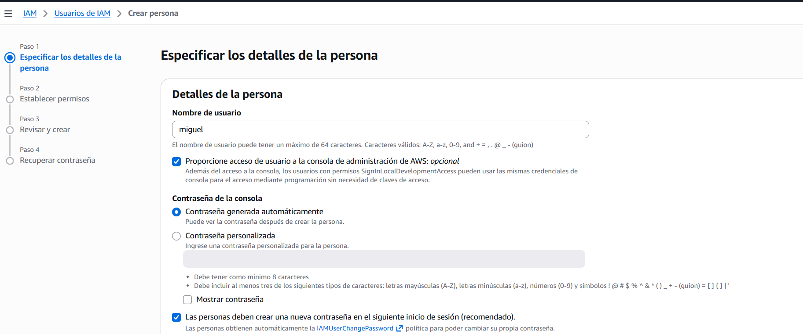  
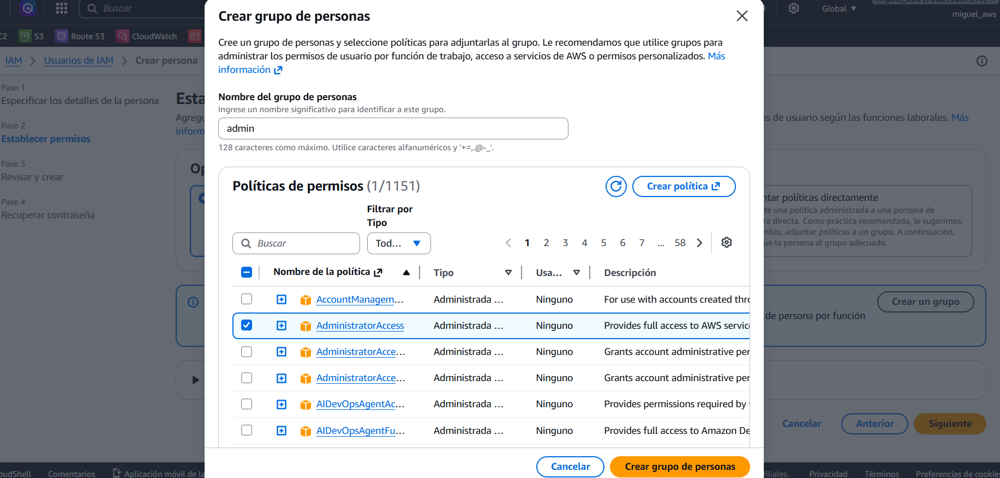  
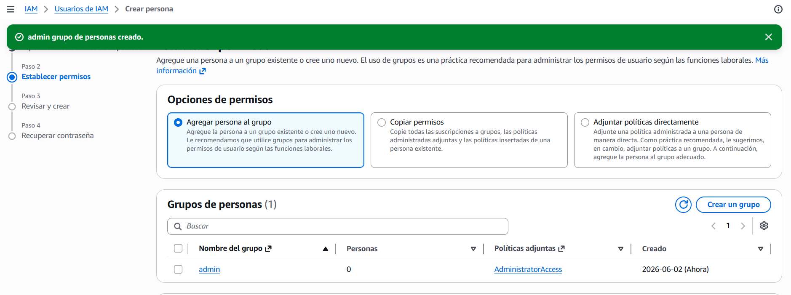  
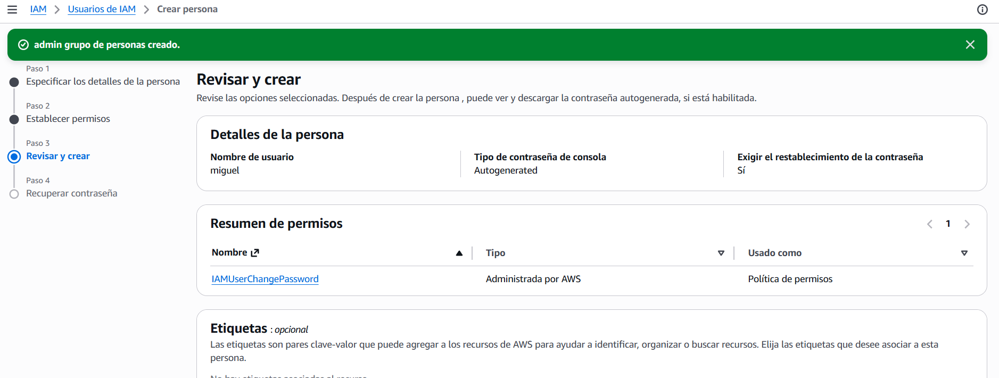  
> Podemos mandar las instrucciones por email a la persona que hemos creado el usuario.  

+ En el panel de IAM, a la derecha podemos crear un Alias de nuestro usuario root para que el enlace salga personalizado y tambien, para que cuando se inicie sesión, no tenga que ser con los dígitos de la cuenta y mejor poniendo este alias más la contraseña.
```
ID de cuenta
700213287974

Alias de cuenta
miguel-formacion

URL de inicio de sesión para los usuarios de IAM de esta cuenta
https://miguel-formacion.signin.aws.amazon.com/console
```

+ Entramos al link, iniciamos sesión con los datos del IAM creado (nos pedirá cambiar el password la primera vez) y entramos al portal con los permisos que nos asignaron:  
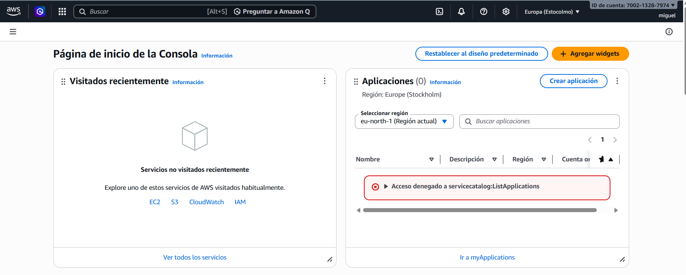  

## Políticas / policies

+ Las políticas IAM son documentos en formato JSON que especifican permisos, permitiendo así que los usuarios, grupos y roles de IAM realicen solicitudes a los servicios de AWS de manera controlada y segura. Esto es fundamental para gestionar el acceso y proteger tus recursos en la nube. 

+ Estructura de los ficheros declarativos JSON para asignar políticas:  
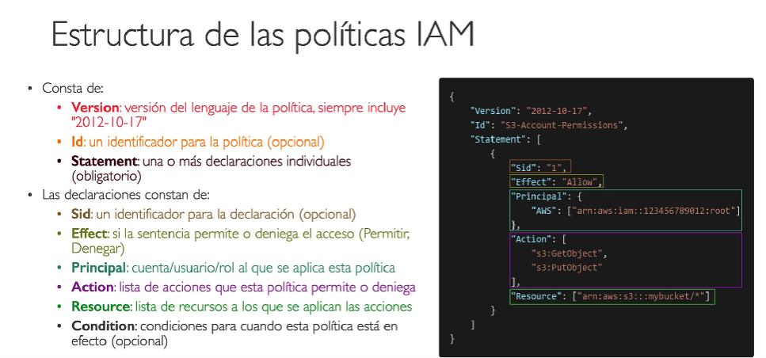  
> En una declaración de una política IAM se incluyen elementos como Sid, Effect, Principal, Action, Resource y Condition, mientras que la versión se refiere a la política en su conjunto y no forma parte de las declaraciones individuales. Esto es esencial para entender cómo se estructuran las políticas en AWS.  

+ Si al usuario Miguel lo quitamos del grupo admin y actualizamos la web, veremos que ya no puedo ver ningun panel, porque no tiene permisos.

+ Si en cambio, le ponemos una política en concreto como por ejemplo **IAMREADONLYACCESS** veremos que verá todos, pero si quiere crear algo como por ejemplo otro grupo de usuarios, da error. 

+ En políticas podemos crear políticas personalizadas de manera JSON o con el Editor Visual, el cual, a medida que vamos agregando declaraciones, se va estructurando el código JSON y podemos ver como sería lo que acabamos de asignar con un código JSON.

+ También existen politicas de contraseñas:
    - Establecer longitud mínima
    - Incluir mayus, minus, numeros, caractereres especiales.
    - Permitir que todos puedan cambiarla
    - Requerir que se cambie cada cierto tiempo
    - Evitar que se vuelva a repetir una contraseña
> Lo podemos ver en IAM - Configuración de cuenta - Editar política de contraseñas  
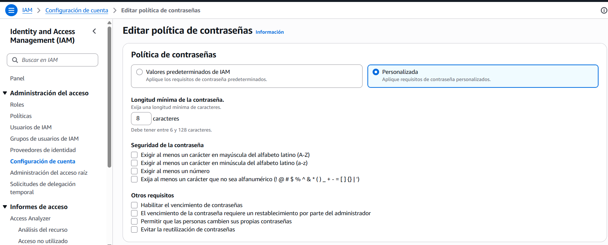  


+ El MFA (Multi Factor Authenticator) es el método para la autentificación de doble factor, como App Authenticator. 
    - Contraseña que conoces
    - Dispositivo de seguridad que tengas
> Esto evita que aunque roben una contraseña , la cuenta no se vea comprometida.  

+ Ejemplos:
    - Authenticator de Google -> Dispositivo virtual MFA
    - Authy (multi-dispositivo) -> Dispositivo virtual MFA
    - YubiKey de Yubico -> Clave de seguridad del segundo factor universal (U2F)
    - Gemalto -> Dispositivo MFA de llavero por hardware
    - SurePassID -> Dispositivo MFA de llavero por hardware para AWS GovCloud (US)
> Lo podemos agregar en nuestro Perfil - Mis credenciales de seguridad y agregamos el MFA. Recomendado Authy.  
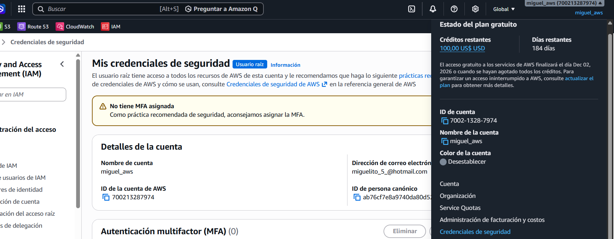  

## ACCESO A AWS

+ 3 maneras:
    - Consola de administración de AWS (contraseña + MFA)
    - Interfaz de linea de comandos AWS (CLI) (por claves de acceso)
    - AWS Software Developer Kit (SDK)
    > Las Claves de acceso se generan en la consola admin de AWS  

+ Estructura (no compartir jamás):
    - ID CLAVE DE ACCESO: nombre de usuario
    - CLAVE DE ACCESO SECRETA: contraseña

+ ¿Qué es el SDK de AWS? 
    • Kit de desarrollo de software de AWS (AWS SDK)
    • APIs específicas para cada lenguaje (conjunto de bibliotecas)
    • Permite acceder y administrar los servicios de AWS mediante
    programación
    • Integrado en la aplicación
    • Admite:
        • SDKs (JavaScript, Python, PHP, .NET, Ruby, Java, Go, Node.js,
        C++)
        • SDKs para móviles (Android, iOS, ...)
        • SDKs para dispositivos IoT (Embedded C, Arduino, ...)
    • Ejemplo: AWS CLI está construido sobre AWS SDK para Python

## CLI: Interfaz de linea de comandos AWS

+ Herramienta que permite interacturar con los servicios de AWS mediante comando en tu shell.
+ Acceso directo a las API publicas de los servicios de AWS.
+ Puedes desarrollar scripts para gestionar tus recursos
+ Es de código abierto en [AWS CLI GITHUB](https://github.com/aws/aws-cli)
+ Alternativa al uso de la consola de administración de AWS

+ [GUIA INSTALACIÓN CLI](https://docs.aws.amazon.com/cli/latest/userguide/getting-started-install.html)  
> comprobamos con `aws --version`  
```
C:\Users\migue>aws --version
aws-cli/2.34.59 Python/3.14.5 Windows/11 exe/AMD64
```

+ Para crear unas claves de acceso por CLI, vamos al panel de IAM, seleccionamos el usuario que queremos y en CREDENCIALES DE SEGURIDAD - CLAVES DE ACCESO creamos unas llaves para que pueda acceder por consola:  
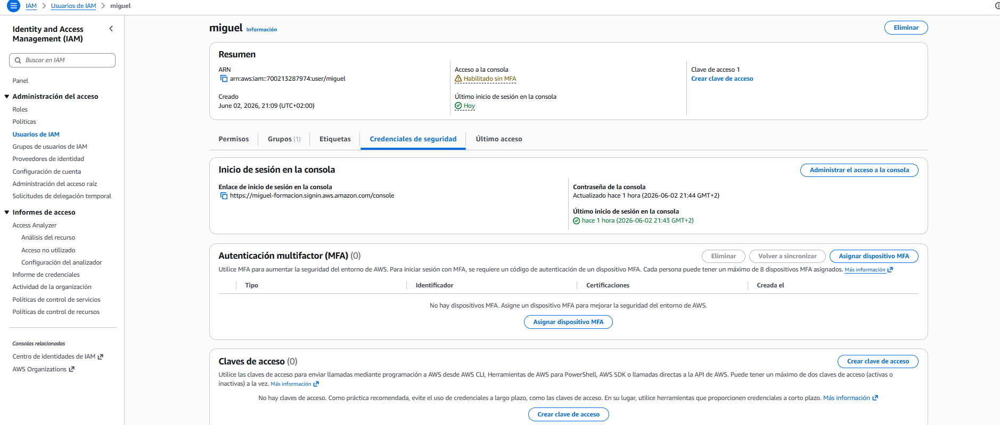  
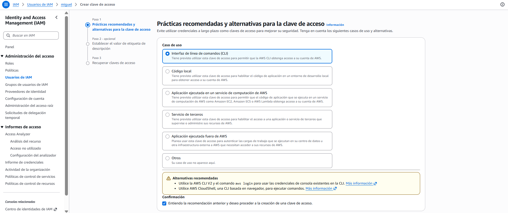  

+ Una vez nos dan las claves lo configuramos por comandos en CMD (windows en mi caso): `aws configure`  

+ Lo comprobamos con el comando: `aws iam list-users`  

+ Disponemos tambien el servicio REGIONAL, no es global para todos, del **AWS CLOUDSHELL** que también te permite una consola por comandos y en la que puedes interactuar con tu propia máquinas para subir o descargar ficheros. 

## ROLES IAM
+ Un rol IAM se utiliza para asignar un conjunto de permisos específicos que permiten a los servicios de AWS realizar acciones en tu nombre, facilitando la gestión de acceso y mejorando la seguridad en tu cuenta de AWS. Esto es fundamental para que puedas controlar cómo y cuándo los servicios acceden a los recursos.
+ Algún servicio de AWS tendrá que realizar acciones en tu nombre.
+ Para ello, asignaremos permisos a los servicios de AWS con Roles IAM
+ Roles comunes:
    - Roles de Instancia EC2
    - Roles de la función Lambda
    - Roles para CloudFormation

+ Para crearlos vamos a IAM - Roles. Asignamos para el tipo de servicio que queremos, los permisos y un nombre: 
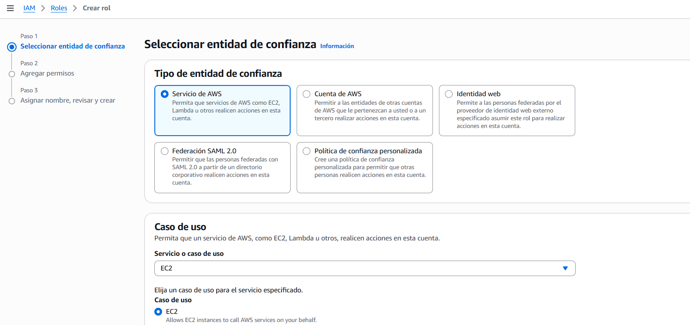  
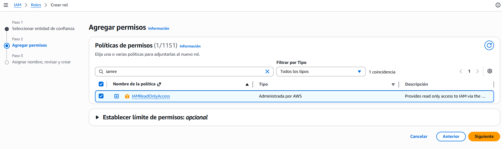  
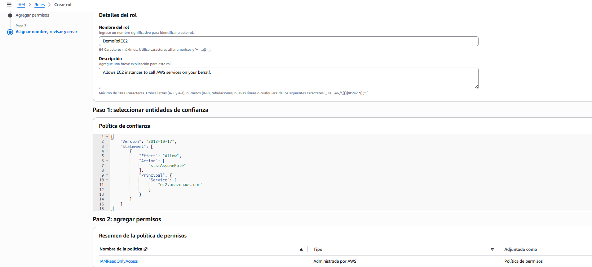  

## HERRAMIENTAS DE SEGURIDAD IAM

+ IAM Credentials Report / Informe de credenciales de IAM
(a nivel de cuenta):  Un informe que enumera todos los usuarios de tu cuenta y el estado de tus diversas credenciales
> Para acceder vamos a IAM - Informe de Credenciales -> Nos permite descargar el informe de todos los usuarios y ver el estado. 

+ IAM Access Advisor / Asesor de acceso de IAM (a nivel de usuario:  Muestra los permisos de servicio concedidos a un usuario y cuando se
accedió a esos servicios por última vez. Puedes utilizar esta información para revisar tus políticas
> Para acceder vamos a IAM - Usuarios - seleccionamos el usuario y vamos a la pestaña Acces Advisor / Último Acceso. Nos permite ver todos los acceso a los servicios.

## BUENAS PRÁCTICAS

+ No utilices la cuenta root excepto para la configuración de la cuenta AWS
+ Un usuario físico = Un usuario AWS
+ Asignar usuarios a grupos y asignar permisos a grupos
+ Crear una política de contraseñas fuerte
+ Utilizar y reforzar el uso de la autenticación multifactor (MFA)
+ Crear y utilizar Roles para dar permisos a los servicios de AWS
+ Utilizar claves de acceso para el acceso programático (CLI / SDK)
+ Revisar los permisos de tu cuenta con el informe de credenciales de IAM o el asesor de acceso de IAM
+ No compartir nunca los usuarios de IAM ni las claves de acceso

## RESUMEN  

+ Usuarios: mapeado a un usuario físico, tiene una contraseña para la consola de AWS
+ Grupos: contiene sólo usuarios
+ Políticas: Documento JSON que describe los permisos para los usuarios o grupos
+ Roles: para instancias EC2 o servicios AWS
+ Seguridad: MFA + Política de contraseñas
+ AWS CLI: gestiona tus servicios de AWS mediante la línea de comandos
+ AWS SDK: gestiona tus servicios de AWS utilizando un lenguaje de programación
+ Claves de acceso: accede a AWS mediante la CLI o el SDK
+ Auditoría: Informes de credenciales de IAM y Asesor de acceso de IAM

+ IAM es global, correcto, pero matiz importante — no "existe en cada región", sino que es un servicio sin región, es decir, los usuarios, grupos y roles que creas en IAM son válidos en toda tu cuenta AWS automáticamente. En el examen esto importa.
+ Los Roles son identidades temporales que asume un servicio o una persona para obtener permisos concretos. La diferencia clave con un usuario es que un rol no tiene contraseña ni claves de acceso permanentes. Un ejemplo concreto: una instancia EC2 que necesita leer archivos de S3 asume un rol IAM — no le creas un usuario para eso.
+ El principio de mínimo privilegio — siempre dar solo los permisos estrictamente necesarios, ni uno más. Es la base de toda la seguridad en AWS y aparece en muchas preguntas.

## PREGUNTAS TIPO EXAMEN REAL

+ **Pregunta 1:**  
Tu empresa tiene 50 desarrolladores que todos necesitan acceso a S3 y EC2. ¿Cuál es la forma correcta de asignarles permisos según las buenas prácticas de IAM?  
    A) Crear un usuario IAM por desarrollador y asignarle la política directamente a cada uno  
    B) Usar la cuenta root para que todos accedan  
    **C) Crear un grupo "Desarrolladores", asignar la política al grupo y meter a todos los usuarios en ese grupo**  
    D) Crear un solo usuario compartido para todos los desarrolladores  
> Asignar políticas directamente a usuarios individuales es un error de gestión — imagina tener que actualizar permisos de 50 personas una a una. El grupo es la forma escalable. En el examen cuando veas "muchos usuarios con los mismos permisos" → siempre grupo.  
> Las otras opciones: A es técnicamente posible pero mala práctica. B es directamente incorrecto — la root nunca. D es un fallo de seguridad grave porque no puedes auditar quién hizo qué.  

+ **Pregunta 2:**  
Una aplicación que corre en una instancia EC2 necesita acceder a una base de datos en RDS. ¿Cómo le das permisos de forma segura?  
    A) Creas un usuario IAM con permisos a RDS y metes las credenciales en el código  
    **B) Asignas un rol IAM a la instancia EC2 con los permisos necesarios**  
    C) Usas la cuenta root para que la aplicación acceda  
    D) No hace falta, EC2 y RDS se comunican sin permisos  
> El rol es la única respuesta correcta aquí. La opción A es un error muy común en la vida real — meter credenciales en el código — y AWS lo penaliza siempre en el examen. Si esas credenciales acaban en GitHub por error, tienes un problema enorme. El rol es temporal, rotatorio y no requiere gestión manual. Esto lo vas a ver mucho: cualquier servicio AWS que necesite acceder a otro servicio AWS → rol IAM, siempre.  

+ **Pregunta 3:**  
¿Cuál de estas afirmaciones sobre la cuenta root es correcta según las buenas prácticas de AWS?  
    A) Debes usarla para las tareas administrativas del día a día  
    B) Debes compartirla con el equipo de administración  
    **C) Debes activar MFA en ella y no usarla salvo para tareas muy específicas como cambiar el plan de soporte**  
    D) Puedes eliminarla si creas un usuario IAM administrador  
> Las tareas específicas donde sí se usa root son contadas: cambiar el plan de soporte, cerrar la cuenta, o configurar ciertos ajustes de billing. Para todo lo demás, usuario IAM con los permisos justos. Y la D es un truco del examen — la cuenta root no se puede eliminar nunca.  