# AWS EC2

## IPs
+ IPs privadas y públicas en formato IPv4 y IPv6
+ En IPv4 las privadas son:
    - Clase A: 10.0.0.0 a 10.255.255.255 \8 (por defecto 8)
    - Clase B: 172.16.0.0 a 172.31.255.255 \12 (por defecto 16)
    - Clase C: 192.168.0.0 a 192.168.255.255 \16 (por defecto 24)
> El número que va después de la barra (como /8, /16 o /24) representa cuántos bits están congelados (fijos) de izquierda a derecha. Cada octeto de una IP tiene exactamente 8 bits.

+ Las empresas suelen evitar la Clase C y eligen rangos de la Clase A (10.X.X.X) o Clase B (172.16.X.X) para sus oficinas. Como casi todo el mundo tiene en su casa la red 192.168.1.X (Clase C), si la empresa usa ese mismo rango, un empleado que teletrabaje por VPN tendrá problemas de conflicto (su ordenador no sabrá si la IP 192.168.1.50 es la impresora de su casa o el servidor de la empresa).

+ IP pública:
    + La IP pública significa que la máquina puede ser identificada en Internet (WWW)
    + Debe ser única en toda la red (no puede haber dos máquinas con la misma IP pública)
    + Se puede geolocalizar fácilmente
+ IP privada:
    + La IP privada significa que la máquina sólo puede ser identificada en una red privada
    + La IP debe ser única en toda la red privada
    + PERO dos redes privadas diferentes (dos empresas) pueden tener las mismas IP.
    + Las máquinas se conectan a la WWW mediante un NAT + Gateway de Internet (un proxy)
    + Sólo se puede utilizar un rango específico de IPs como IP privada

+ IPs elásticas
    + Cuando paras y luego arrancas una instancia EC2, puede cambiar su IP pública.
    + Si necesitas tener una IP pública fija para tu instancia, necesitas una IP elástica
    + Una IP elástica es una IPv4 pública que te pertenece mientras no la elimines
    + Puedes asignarla a una instancia a la vez
    + Con una dirección IP elástica, puedes enmascarar el fallo de una instancia o software
    reasignando rápidamente la dirección a otra instancia de tu cuenta.
    + Sólo puedes tener 5 Elastic IP en tu cuenta (puedes pedir a AWS que lo aumente).
    + En general, intenta evitar el uso de IP elásticas:
        + Suelen reflejar malas decisiones de arquitectura.
        + En su lugar, utiliza una IP pública aleatoria y registra un nombre DNS en ella
        + O, como veremos más adelante, utiliza un Load Balancer y no uses una IP pública

+ Por defecto, tu máquina EC2 viene con:
    + Una IP privada para la red interna de AWS
    + Una IP pública, para la WWW.
+ Cuando estamos haciendo SSH en nuestras máquinas EC2:
    + No podemos usar una IP privada, porque no estamos en la misma red
    + Sólo podemos utilizar la IP pública.
+ Si tu máquina se detiene y luego se inicia, la IP pública puede cambiar

### PRACTICA IPs PÚBLICAS / ELÁSTICAS

+ Creamos un nuevo par de claves en EC2 - Par de claves.
+ Creamos una instancia con el script de página web y nos dará una IP publica y privada.
+ Al descargarlas cambiamos los permisos: 
```
migue@DESKTOP-G47I0DM MINGW64 ~/Documents/AWS SAA/02_EC2
$ chmod 0400 ClaveTutorial.pem
```
+ Nos conectamos con: `ssh -i ClaveTutorial.pem ec2-user@ip-publica`  
+ Con eso hemos entrado. Si ponemos la ip privada quedaría cargando pero no llegaría a conectarse.
+ Si detenemos la instancia y volvemos a iniciar, la privada se mantiene pero la pública cambia.
+ Si se quiere una ip pública fija, se ha de crear una **ELASTIC IP**. Para ello vamos a EC2 - Direcciones IP elásticas.
+ Creamos una según la región donde la queremos y luego, una vez nos da una, asociamos la IP que nos ha asignado AWS a nuestra instancia y su ip privada. Se puede hacer en caliente.
+ Si la paramos e iniciamos, verás que la IP pública se mantiene siempre la misma que hemos asociado.

+ Para eliminar esa IP elástica, tenemos que ir a ELASTIC IP, desasociar la ip con la instancia y una vez quitada, ya se puede eliminar/liberar esa IP elástica, ya que AWS cobra.

## Grupos de ubicación o colocación
+ A veces quieres controlar la estrategia de colocación de la Instancia EC2
+ Esa estrategia puede definirse mediante grupos de colocación
+ Cuando creas un grupo de colocación, especificas una de las siguientes estrategias para el grupo:
    + Cluster: agrupa las instancias en un grupo de baja latencia en una única Zona de Disponibilidad
        + Ventajas: Gran red (10 Gbps de ancho de banda entre instancias con la red mejorada activada - recomendada)
        + Contras: Si el rack falla, todas las instancias fallan al mismo tiempo
        + Caso de uso:
            + Trabajo de Big Data que necesita completarse rápidamente
            + Aplicación que necesita una latencia extremadamente baja y un alto rendimiento de la red

    + Distribuida: coloca estrictamente un pequeño grupo de instancias en distintos equipos de hardware subyacentes para reducir los fallos correlacionados (máximo 7 instancias por grupo por AZ)
    + Ventajas:
        + Puede abarcar varias zonas de disponibilidad (AZ)
        + Se reduce el riesgo de fallos simultáneos
    + Las instancias EC2 están en hardware físico diferente
    + Contras:
         Limitado a 7 instancias por AZ por grupo de colocación
    + Caso de uso:
        + Aplicación que necesita maximizar la alta disponibilidad
        + Aplicaciones críticas en las que cada instancia debe estar aislada de los fallos de las demás

    + Partición: reparte las instancias en muchas particiones diferentes (que dependen de diferentes conjuntos de racks) dentro de una AZ. Escala a cientos de instancias EC2 por grupo (Hadoop, Cassandra, Kafka)
    + Hasta 7 particiones por AZ
    + Puede abarcar varias AZ en la misma región
    + Hasta 100 instancias EC2
    + Las instancias de una partición no comparten Racks con las instancias de las otras particiones
    + Un fallo en la partición puede afectar a muchos EC2 pero no afectará a otras particiones
    + Las instancias EC2 tienen acceso a la información de la partición como metadatos
    + Casos de uso: HDFS, HBase, Cassandra,Kafka
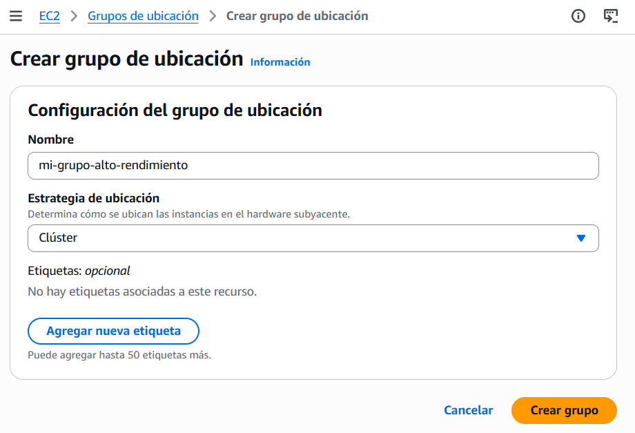  
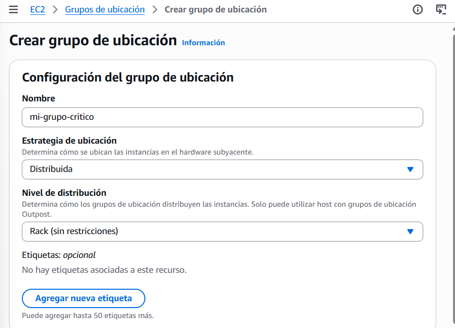  
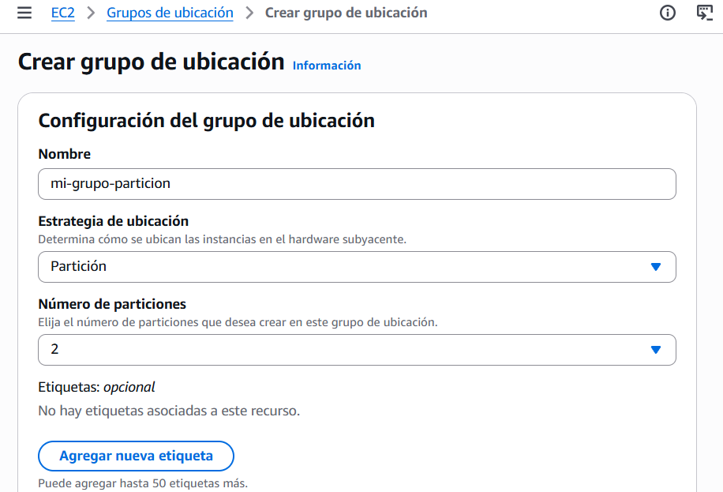  
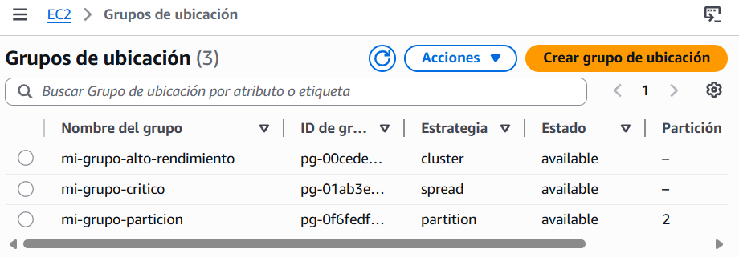  
> Luego, cuando creas una instancia, en DETALLES AVANZADOS hay un apartado de Grupo de Ubicación que puedes asignar el grupo que te interesa para esa instancia.  

## Elastic Network Interfaces (ENI)
+ EC2 - INTERFACES DE RED (Red y seguridad)
+ Componente lógico de una VPC que representa una tarjeta de red virtual
+ La ENI puede tener los siguientes atributos:
    + IPv4 privada primaria, una o más IPv4 secundarias
    + Una IP elástica (IPv4) por IPv4 privada
    + Una IPv4 pública
    + Uno o más grupos de seguridad
    + Una dirección MAC
+ Puedes crear ENI independientes y adjuntarlas sobre la marcha (moverlas) en instancias EC2 para la conmutación por error
+ Vinculadas a una zona de disponibilidad (AZ) específica

### PRACTICA ENI
+ Creamos dos instancias y por defecto, se crea cada una con una ENI.
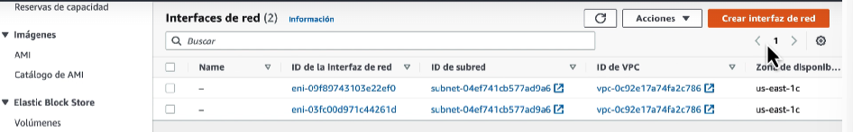  

+ En Interfaces de Red - creamos una interfaz de red, poniendo un nombre, un grupo de seguridad existente y a una subred de la misma ZONA DISPONIBILIDAD (AZ, muy importante) de las instancias que podríamos querer asociar esta ENI.
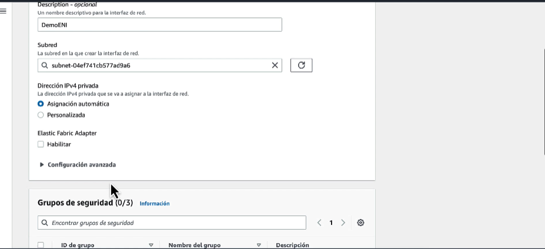  

+ Luego vemos nuestras Interfaces de red, que veremos las dos de las instancias que se crearon más la nueva creada, que estará available. Las que se crean por defecto son primarias y la que asociamos sería secundaria.
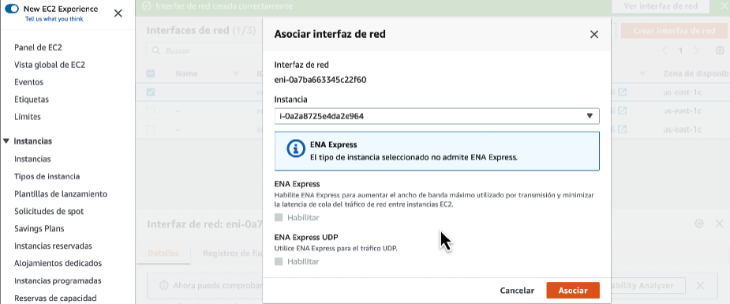  

+ Se pueden asociar/desasociar y mover a otras instancias de la misma AZ en caliente. 

+ [Más INFO de ENI AWS](https://aws.amazon.com/blogs/aws/new-elastic-network-interfaces-in-the-virtual-private-cloud/)  

## Hibernación de EC2
+ Sabemos que podemos parar, terminar las instancias:
    + Parar - los datos del disco (EBS) se mantienen intactos en el siguiente arranque
    + Terminar - se pierden los volúmenes EBS (root) que también están preparados para ser destruidos
+ En el arranque, ocurre lo siguiente
    + Primer arranque: el SO arranca y se ejecuta el script EC2 User Data
    + Siguientes arranques: el SO arranca
    + Después se inicia tu aplicación, se calientan las cachés, ¡y eso puede llevar tiempo!

+ Presentación de EC2 Hibernate:
    + Se conserva el estado en memoria (RAM)
    + El arranque de la instancia es mucho más rápido (el sistema operativo no se detiene/reinicia)
    + Bajo el capó: el estado de la RAM se escribe en un archivo en el volumen EBS raíz
    + El volumen EBS raíz debe estar encriptado
+ Casos de uso:
    + Procesamiento de larga duración
    + Guardar el estado de la RAM
    + Servicios que tardan en inicializarse
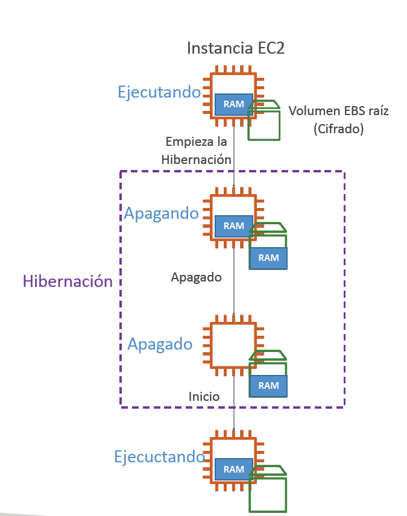  

+ Es bueno saber que:
    + Familias de instancias soportadas - C3, C4, C5, I3, M3, M4, R3, R4, T2, T3, ...
    + Tamaño de la RAM de la instancia - debe ser inferior a 150 GB.
    + Tamaño de la Instancia - no se soporta para instancias bare metal.
    + AMI - Amazon Linux 2, Linux AMI, Ubuntu, RHEL, CentOS y Windows...
    + Volumen root - debe ser EBS, encriptado
    + Disponible para instancias bajo demanda, reservadas y Spot
    + Una instancia NO puede estar hibernada más de 60 días

### PRÁCTICA HIBERNACIÓN
+ Cuando creas una instancia, en Detalles Avanzdos se ha de habilitar la hibernación.
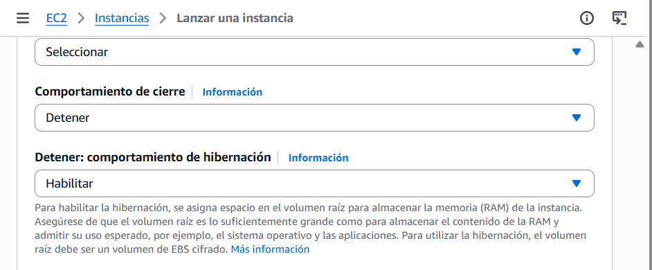  

+ Una vez activado, salimos del submenú de Detalles Avanzados y vamos al de volúmenes EBS. Modificamos el volumen activando que sea CIFRADO (esto siempre obligatorio), ponemos la ruta predeterminada y ojo, en tamaño, tiene que caber el tamaño de la RAM del tipo de instancia que creemos, ya que lo que se hiberna es la RAM de la máquina. La micro es 1gb y este volumen 8, de sobra.
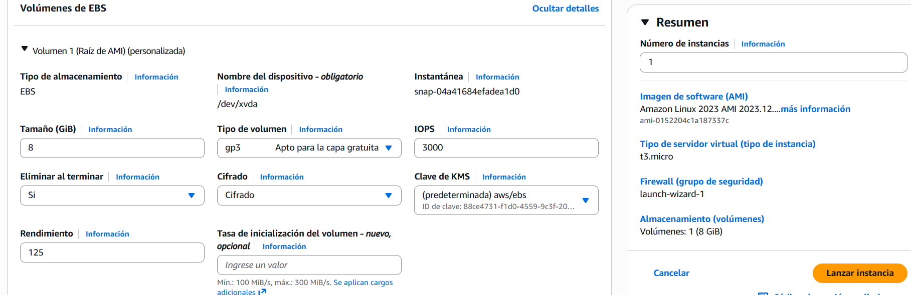  

+ Una vez creada, ahora en estado de Instancia, nos deja darle a hibernar. Una vez se detiene, si la iniciamos y nos volvemos a conectar, si ponemos de nuevo el comando UPTIME para ver el tiempo que lleva encendida la máquina, veremos que no empieza de 0, sino que continua con el estado de antes de la hibernación.  
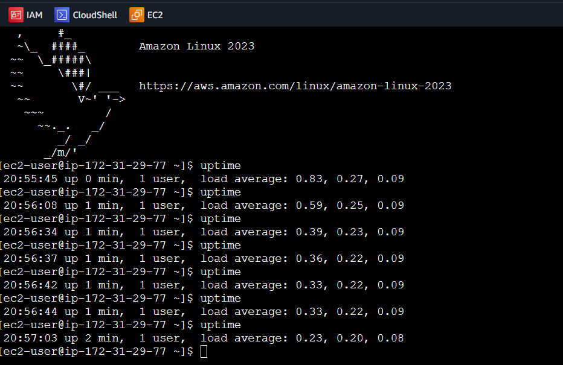  
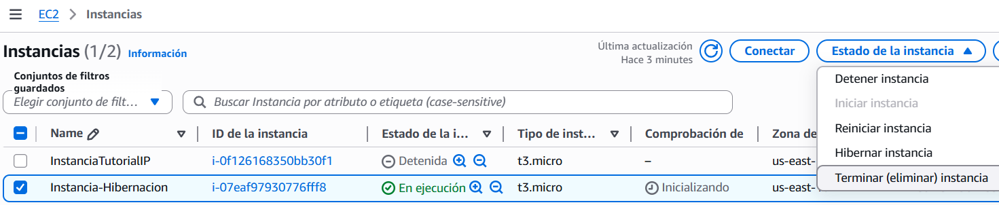  
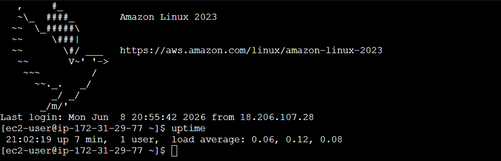  

## CUESTIONARIO - EC2

**Pregunta 1:**  
Has lanzado una instancia EC2 que alojará una aplicación NodeJS. Tras instalar todo el software necesario y configurar tu aplicación, has anotado la IPv4 pública de la instancia EC2 para poder acceder a ella. A continuación, detuviste y luego iniciaste tu instancia EC2 para completar la configuración de la aplicación. Después de reiniciar, no puedes acceder a la instancia EC2, y has descubierto que la IPv4 pública de la instancia EC2 ha sido cambiada. ¿Qué debes hacer para asignar una IPv4 pública fija a tu instancia EC2?  
> Asignar una IP elástica y asignarla a tu instancia EC2: la opción correcta porque una IP elástica te permite tener una dirección IPv4 pública fija que puedes conectar a tu instancia EC2 en cualquier momento, asegurando que puedas acceder a tu aplicación sin preocuparte por cambios en la dirección IP. Esto es esencial para mantener la accesibilidad constante de tu aplicación.  

**Pregunta 2:**  
Tienes una aplicación que realiza análisis de big data alojada en una flota de instancias EC2. Quieres asegurarte de que tus instancias EC2 tienen el máximo rendimiento de red mientras se comunican entre sí. ¿Qué grupo de colocación de EC2 debes elegir?  
> "Grupo de colocación de clústeres" porque al agrupar tus instancias EC2 en el mismo hardware físico, se minimiza la latencia y se maximiza el rendimiento de red, lo cual es crucial para aplicaciones de análisis de big data que requieren alta eficiencia en la comunicación entre instancias. Esto asegura que tu aplicación funcione de manera óptima.  

**Pregunta 3:**  
Tienes una aplicación crítica alojada en una flota de instancias EC2 en la que quieres conseguir la máxima disponibilidad cuando haya un fallo de AZ. ¿Qué Grupo de Colocación EC2 debes elegir?  
> "Grupo de colocación distribuida" porque este tipo de colocación distribuye tus instancias EC2 en diferentes tecnologías de hardware físico y zonas de disponibilidad (AZ), lo que maximiza la disponibilidad y continuidad de tu aplicación crítica en caso de fallos en una AZ. Esto garantiza que tu aplicación se mantenga accesible y operativa.  

**Pregunta 4:**  
La interfaz de red elástica (ENI) se puede conectar a instancias EC2 en otra AZ.
> "Falso" correctamente porque las interfaces de red elásticas (ENI) están limitadas a una única zona de disponibilidad, lo que significa que no puedes conectarlas a instancias EC2 en una zona diferente. Esto es fundamental para entender el funcionamiento y las restricciones de ENI dentro de Amazon Web Services.  

**Pregunta 5:**  
Lo siguiente es cierto con respecto a EC2 Hibernate, EXCEPTO:
> "El volumen raíz de la instancia EC2 debe ser un volumen del almacén de instancias" como falso, porque para habilitar EC2 Hibernate, es necesario que el volumen raíz sea un volumen EBS, que también debe estar encriptado para proteger su contenido sensible. Esto asegura que las funcionalidades de hibernate funcionen correctamente y se mantenga la seguridad de los datos. Son ciertas que soporta instancias bajo demanda y reservadas, RAM inferior a 150 GB y que volumen debe ser EBS.  

## RESUMEN DE DUDAS

+ Piensa en una ENI como una tarjeta de red virtual que existe independientemente de la instancia. Lo clave es que puedes desenchufarla de una instancia y enchufarla a otra. Esto abre casos de uso muy concretos:
    + Escenario 1 — Alta disponibilidad manual: tienes un servidor de base de datos con una IP privada fija que usan 10 aplicaciones. El servidor falla. En vez de reconfigurar las 10 aplicaciones con la nueva IP, simplemente mueves la ENI (con su IP) a una instancia de reemplazo. Todo sigue funcionando.
    + Escenario 2 — Appliance de red: un firewall o proxy que necesita estar en dos subnets a la vez (una pública y una privada). Le añades una segunda ENI y tiene presencia en ambas redes.
    + Escenario 3 — Separación de tráfico: una instancia que maneja tráfico de gestión por una ENI y tráfico de producción por otra, cada una con su propio Security Group.
+ La palabra clave del examen para ENI es: "mover una IP privada entre instancias" o "failover de red sin cambiar IP" → ENI.  

+ CLUSTER: HPC, Big Data, renderizado 3D — instancias juntas físicamente, latencia mínima entre ellas. Riesgo: si el rack falla, caen todas
+ SPREAD/DISTRIBUIDAS: Aplicación crítica con pocas instancias (máx 7 por AZ) — cada instancia en hardware físico distinto. Máxima resistencia a fallos
+ PARTITION: Hadoop, Kafka, Cassandra — grupos de instancias en particiones separadas, cada partición en hardware distinto

+ Spread vs Partition — la diferencia clave:
    - Spread → pocas instancias críticas, cada una en hardware completamente separado. Máximo 7 por AZ.
    - Partition → muchas instancias agrupadas en particiones, cada partición en hardware separado. Sin límite práctico de instancias.
    > Si en el examen ves Hadoop, Kafka, Cassandra o HDFS → Partition siempre. Si ves "6 instancias críticas" o número pequeño → Spread.  

## PRÁCTICA EXAMEN REAL

+ **Pregunta 1:**  
Una empresa tiene un clúster de Hadoop con 200 instancias EC2. Necesitan que si un fallo de hardware afecta a un grupo de instancias, el resto sigan funcionando. ¿Qué grupo de colocación usan?
A) Cluster
B) Spread
**C) Partition**
D) No necesitan grupo de colocación
> Hadoop es un sistema distribuido que trabaja con muchas instancias agrupadas en nodos. Lo que necesita es que si un rack físico falla, solo caiga una parte del clúster, no todo. Partition divide las instancias en grupos (particiones) y cada partición vive en hardware físico distinto. Con 200 instancias, Spread no es viable porque tiene límite de 7 por AZ. Cluster tampoco porque mete todo en el mismo rack — si falla el rack, caen todas. Partition es el único que escala a cientos de instancias con aislamiento de fallos por grupos.  

**Pregunta 2:**  
Una aplicación financiera tiene 6 instancias EC2 críticas. Necesitan que ninguna comparta hardware físico con otra para máximo aislamiento de fallos. ¿Qué grupo de colocación usan?
A) Partition
B) Cluster
**C) Spread**
D) Dedicated Host
> 6 instancias críticas, número pequeño, necesidad de máximo aislamiento individual. Spread garantiza que cada instancia va a un rack físico distinto — hardware completamente separado para cada una. Si falla un rack, solo cae esa instancia, las otras 5 siguen funcionando. Con solo 6 instancias estás muy por debajo del límite de 7 por AZ, así que Spread es perfectamente viable.  

**Pregunta 3:**  
Un equipo de DevOps tiene una instancia EC2 que actúa como firewall. Necesita estar conectada simultáneamente a la subnet pública y a la subnet privada. ¿Qué solución usan?
A) Crear dos instancias EC2, una en cada subnet
B) Usar una Elastic IP
**C) Añadir una segunda ENI a la instancia, una en cada subnet**
D) Usar VPC Peering
> Un firewall necesita "ver" dos redes distintas al mismo tiempo — la pública para recibir tráfico de internet y la privada para inspeccionarlo y reenviarlo hacia dentro. Una instancia EC2 por defecto tiene una sola ENI y por tanto solo puede estar en una subnet. Al añadir una segunda ENI la conectas a otra subnet distinta, y la instancia tiene presencia simultánea en ambas redes con IPs separadas y Security Groups independientes por interfaz.  