# Amazon EBS (Elastic Block Store)

- Descripción: EBS proporciona volúmenes de almacenamiento en bloque persistente para instancias EC2. Se adjuntan a instancias y funcionan como discos duros virtuales.

- Tipos principales de volúmenes:
	- gp3 / gp2: SSD de uso general (gp3 mejora rendimiento/precio y permite ajustar IOPS/bandwidth).
	- io2 / io2 Block Express: SSD para IOPS intensivas (alto rendimiento, consistencia).
	- st1: HDD optimizado para rendimiento secuencial (big data, logs).
	- sc1: HDD de bajo costo para acceso infrecuente.

- Características clave:
	- Persistencia: los datos viven independientemente del ciclo de vida de la instancia.
	- Snapshots: copias incrementales almacenadas en S3; permiten backup, clonación y crear nuevos volúmenes.
	- Encriptación: en reposo y en tránsito entre instancia y volumen; manejo con KMS.
	- Redimensionamiento y cambio de tipo: se pueden ampliar y cambiar tipo sin pérdida de datos (requiere pasos de OS para redimensionar filesystem).
	- Multi-Attach: io2 soporta multi-attach para ciertos casos (varias instancias en modo lectura/escritura coordinado con cluster FS o aplicaciones que gestionen acceso concurrente).

- Rendimiento:
	- IOPS y throughput dependen del tipo de volumen y tamaño.
	- gp3 separa IOPS y throughput del tamaño, permitiendo ajustes independientes.
	- Latencia baja en volúmenes SSD; elegir io2 para latencia y consistencia más estrictas.

- Casos de uso comunes:
	- Sistemas de archivos y bases de datos transaccionales (io2/gp3).
	- Almacenamiento para big data y analytics (st1).
	- Volúmenes de arranque para instancias EC2 (gp3/gp2).

- Buenas prácticas:
	- Usar snapshots automatizados y lifecycle policies.
	- Encriptar volúmenes si hay datos sensibles.
	- Seleccionar tipo de volumen según perfil de I/O y coste.
	- Monitorizar métricas (CloudWatch: IOPS, throughput, burst balance, latency).

- Costes: se paga por GB-provisionado, IOPS/throughput adicionales (según tipo), y por snapshots almacenados en S3.

Referencias rápidas: AWS Docs — Amazon EBS: tipos de volúmenes, snapshots, encriptación y mejores prácticas.

## INTRODUCCION

+ Un volumen EBS (Elastic Block Store) es una unidad de red que puede
adjuntar a las instancias mientras se ejecutan
+ Permite que las instancias persistan los datos, incluso después de su
finalización
+ Sólo pueden montarse en una instancia a la vez (a nivel examen CCP)
+ Pueden montarse de manera multiattach (a nivel examen SAA)
+ Están vinculados a una zona de disponibilidad específica
+ Analogía: Piensa en ellos como una "memoria USB de red"
+ Nivel gratuito: 30 GB de almacenamiento EBS gratuito de tipo Propósito
General (SSD) o Magnético al mes

## CARACTERISTICAS
+ Es una unidad de red (es decir, no es una unidad física)
    + Utiliza la red para comunicar la instancia, lo que significa que puede haber un poco de latencia
    + Se puede separar de una instancia EC2 y conectarla a otra rápidamente
+ Está bloqueado en una Zona de Disponibilidad (AZ)
    + Un volumen EBS en us-east-1a no puede adjuntarse a us-east-1b
    + Para trasladar un volumen, primero hay que hacer un snapshot del mismo
+ Tener una capacidad provisionada (tamaño en GBs, e IOPS)
    + Se facturará toda la capacidad aprovisionada
    + Puede aumentar la capacidad de la unidad con el tiempo

+ Controla el comportamiento de EBS cuando una instancia EC2 termina:
    + Por defecto, se elimina el volumen EBS root / raíz (atributo habilitado)
    + Por defecto, cualquier otro volumen EBS adjunto no se elimina (atributo
    deshabilitado)
+ Esto puede ser controlado por la consola de AWS / AWS CLI
+ Caso de uso: preservar el volumen root / raíz cuando se termina la instancia

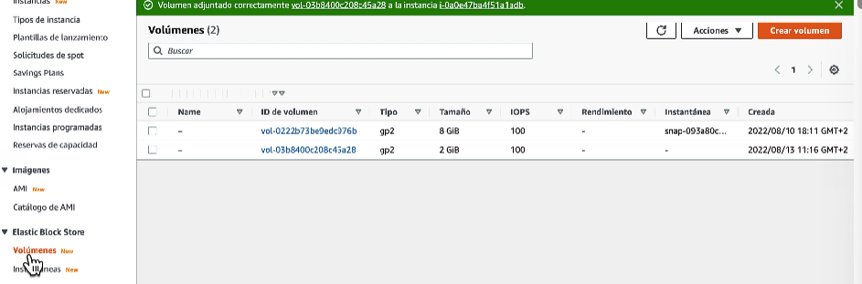  
> EN ELASTIC BLOCK STORE - VOLUMENES, podemos crear volúmenes EBS y después asociarlos a instancias. Pueden estar sin adjuntarse a ninguna y preservar los datos que tenga. Siempre se indica la AZ (Zona de disponibilidad) a la instancia que tenga esa AZ.  

## SNAPSHOTS / INSTANTANEAS EBS  
+ Haz una copia de seguridad (snapshot) de tu volumen EBS en un momento dado. No es necesario separar el volumen para hacer la instantánea, pero se recomienda.
+ Puedes copiar las instantáneas a través de AZ o Región

+ Archivo de Snapshots de EBS
    + Mover un snapshot a un "nivel de archivo" que es un 75% más barato
    + La restauración del archivo tarda entre 24 y 72 horas
+ Papelera de reciclaje para Snapshots EBS
    + Configura reglas para retener los snapshots eliminados para poder recuperarlos después de un borrado accidental
    + Especifica la retención (de 1 día a 1 año)

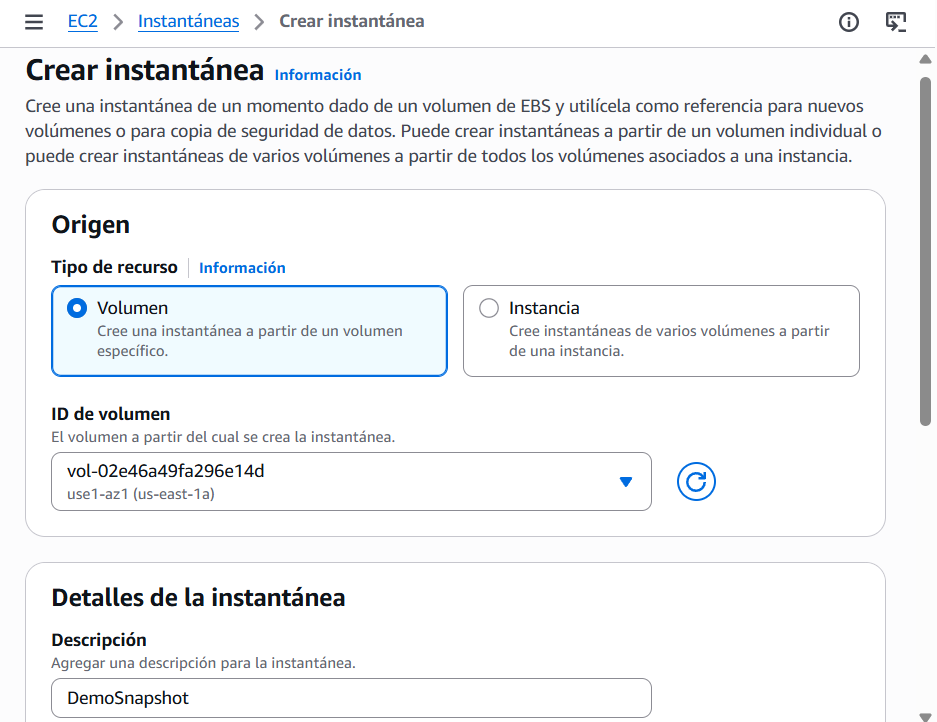  
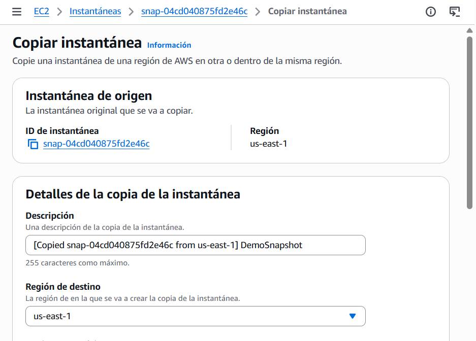  
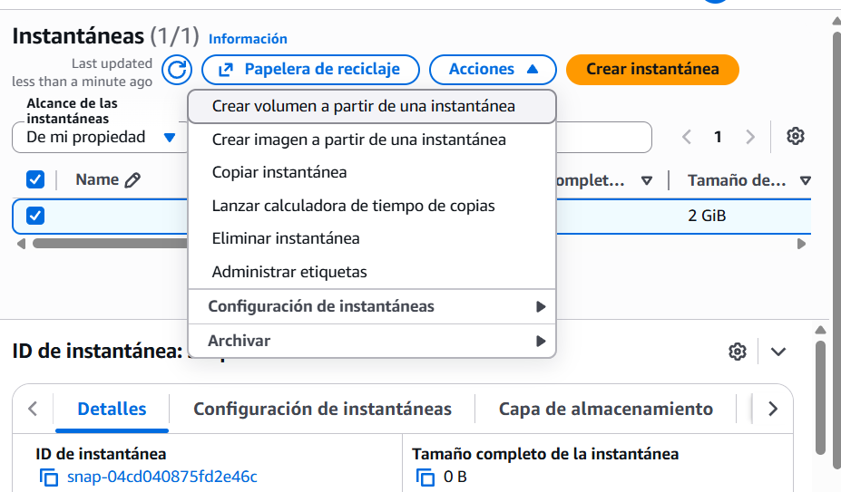  
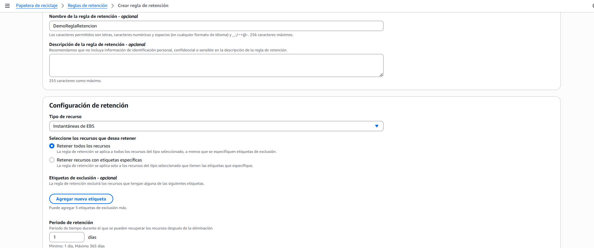  
> Podemos crear instantaneas de volumenes que hayamos creado. También podemos crear un nuevo volumen a partir de una instantanesa.  
> Con esa instantanea, podemos crear una regla de retención de los datos por un período de 1 a 365 dias. Cuando se borra una instantanea se va a la papelera de reciclaje, en la cuales podemos recuperar.  

## AMI

+ AMI = Amazon Machine Image
+ Las AMI son una personalización de una instancia EC2:
    + Añades tu propio software, configuración, sistema operativo, monitorización...
    + Tiempo de arranque/configuración más rápido porque todo el software está preempaquetado
+ Las AMI se construyen para una región específica (y pueden copiarse entre regiones)
+ Puedes lanzar instancias EC2 desde:
    + Una AMI pública: proporcionada por AWS
    + Tu propia AMI: la creas y la mantienes tú mismo
    + Una AMI de AWS Marketplace: una AMI hecha por otra persona (y
    potencialmente vendida)

+ Proceso AMI (desde una instancia EC2): 
    - Iniciar una instancia EC2 y personalizarla
    - Detener la instancia (para la integridad de los datos)
    - Construir una AMI - esto también creará instantáneas de EBS
    - Lanzar instancias desde otras AMIs

### PRÁCTICA
+ Creamos una instancia con el codigo de siempre pero sin la web personalizada de apache.
+ Una vez creada la instancia, la seleccionamos y le damos a AMI - Crear imagen.
+ Con esto creamos una imagen personalizada que se puede usar para otras instancias, es decir, tenemos una linux con apache instalado ya.
+ Una vez creada la AMI, nos saldrá en el listado de AMI
+ Ahora, si creamos una nueva instancia, podemos seleccionar crear a partir de MIS AMIS y seleccionar la imagen que hemos creado. En Detalles avanzados podemos poner la linea de `echo "<h1>Hola Mundo desde $(hostname -f)</h1>" > /var/www/html/index.html` y se creará la instancia con apaché y ahora personaliza solo la web principal.  
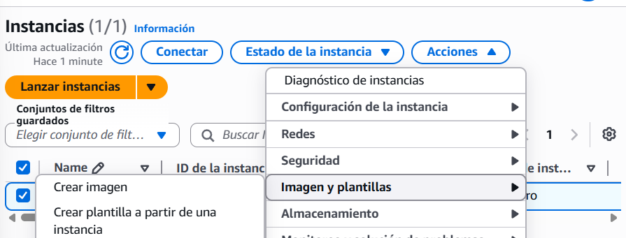  
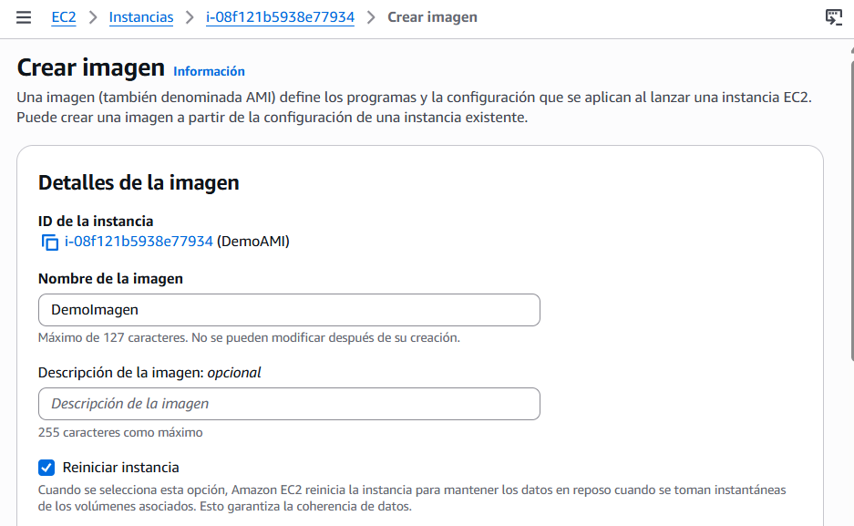  
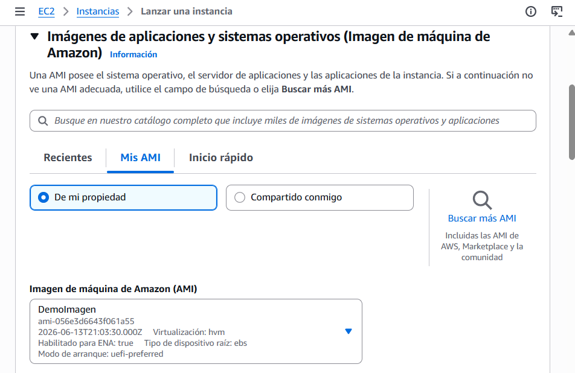  
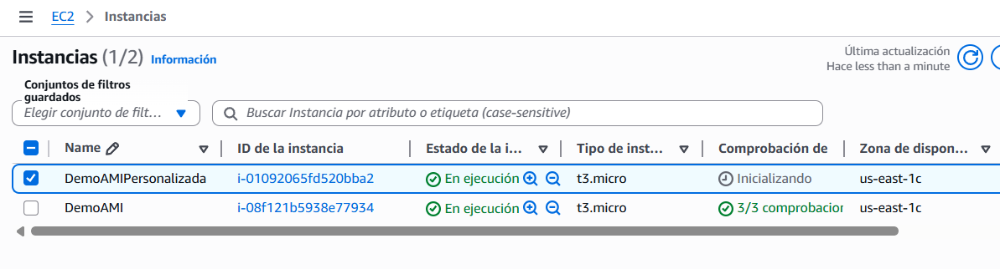  

## ALMACEN DE INSTANCION EC2  
+ Los volúmenes EBS son unidades de red con un rendimiento bueno pero “limitado"
+ Si necesitas un disco de hardware de alto rendimiento, utilizas EC2 Instance Store
+ Mejor rendimiento de E/S
+ Los almacenes de instancias EC2 pierden su almacenamiento si se detienen (son efímeros)
+ Bueno para el buffer / cache / datos de memoria virtual / contenido temporal
+ Riesgo de pérdida de datos si el hardware falla
+ Las copias de seguridad y la replicación son responsabilidad tuya

## Tipos de volúmenes EBS
+ Los volúmenes EBS vienen en 6 tipos
    + gp2 / gp3 (SSD): Volumen SSD de uso general que equilibra el precio y el rendimiento para una amplia variedad de cargas de trabajo
    + io1 / io2 (SSD): El volumen SSD de mayor rendimiento para cargas de trabajo de misión crítica de baja latencia o alto rendimiento
    + st1 (HDD): Volumen de disco duro de bajo coste diseñado para cargas de trabajo de acceso frecuente y alto rendimiento
    + sc1 (HDD): El volumen de disco duro más barato, diseñado para cargas de trabajo de acceso menos frecuente
+ Los volúmenes EBS se caracterizan en Tamaño | Rendimiento | IOPS (I/O Ops Per Sec)
+ En caso de duda, consulta siempre la documentación de AWS: ¡es buena!
+ Sólo se pueden utilizar gp2/gp3 y io1/io2 como volúmenes de arranque

### Casos de uso: SSD de uso general
+ Almacenamiento rentable, baja latencia
+ Volúmenes de arranque del sistema, escritorios virtuales, entornos de desarrollo y prueba
+ 1 GiB - 16 TiB
+ gp3:
    + Línea de base de 3.000 IOPS y rendimiento de 125 MiB/s
    + Puede aumentar las IOPS hasta 16.000 y el rendimiento hasta 1000 MiB/s de forma independiente
+ gp2:
    + Los volúmenes gp2 pequeños pueden reventar las IOPS hasta 3.000
    + El tamaño del volumen y las IOPS están vinculados, las IOPS máximas son 16.000
    + 3 IOPS por GB, lo que significa que con 5.334 GB estamos en el máximo de IOPS

### Casos de uso: IOPS provisionadas (PIOPS) SSD
+ Aplicaciones empresariales críticas con un rendimiento sostenido de IOPS
+ O aplicaciones que necesitan más de 16.000 IOPS
+ Excelente para las cargas de trabajo de las bases de datos (sensibles al rendimiento y la consistencia del almacenamiento)
+ io1/io2 (4 GiB - 16 TiB):
    + PIOPS máximos: 64.000 para instancias Nitro EC2 y 32.000 para otras
    + Puede aumentar los PIOPS independientemente del tamaño del almacenamiento
    + io2 tiene más durabilidad y más IOPS por GiB (al mismo precio que io1)
+ io2 Block Express (4 GiB - 64 TiB):
    + Latencia de menos de un milisegundo
    + PIOPS máximas: 256.000 con una relación IOPS:GiB de 1.000:1
+ Soporta EBS Multi-attach

### Casos de uso: Unidades de disco duro (HDD)
+ No puede ser un volumen de arranque
+ De 125 GiB a 16 TiB
+ Disco duro de rendimiento optimizado (st1)
    + Big Data, almacenes de datos, procesamiento de logs
    + Rendimiento máximo de 500 MiB/s - IOPS máximo de 500
+ Disco duro frío (sc1):
    + Para datos a los que se accede con poca frecuencia
    + Escenarios en los que el menor coste es importante
    + Rendimiento máximo de 250 MiB/s - IOPS máximas de 250

## EBS Multi-Attach - familia io1/io2
+ Adjunta el mismo volumen EBS a varias instancias EC2
en la misma AZ
+ Cada instancia tiene permisos completos de lectura y
escritura en el volumen de alto rendimiento
+ Caso de uso:
    + Conseguir una mayor disponibilidad de las
    aplicaciones en clusters de Linux (por ejemplo,
    Teradata)
    + Las aplicaciones deben gestionar operaciones de
    escritura concurrentes
+ Hasta 16 instancias EC2 a la vez
+ Debe utilizar un sistema de archivos que sea
compatible con el clúster (no XFS, EX4, etc...)

## Encriptación de EBS
+ Cuando creas un volumen EBS encriptado, obtienes lo siguiente:
    + Los datos en reposo están encriptados dentro del volumen
    + Todos los datos en movimiento entre la instancia y el volumen están encriptados
    + Todas las instantáneas están encriptadas
    + Todos los volúmenes creados a partir de la instantánea
+ El cifrado y el descifrado se gestionan de forma transparente (no tienes que hacer nada)
+ El cifrado tiene un impacto mínimo en la latencia
+ El cifrado de EBS aprovecha las claves de KMS (AES-256)
+ La copia de una Snapshot no cifrada permite el cifrado
+ Las instantáneas de los volúmenes encriptados están encriptadas

+ Cifrado: cifrar un volumen EBS:
    + Crea una Snapshot de EBS del volumen
    + Encripta la instantánea EBS ( utilizando la copia de esta instantanea)
    + Crea un nuevo volumen EBS a partir de la instantánea ( el volumen
    también estará encriptado )
    + Ahora puedes adjuntar el volumen encriptado a la instancia original

## AMAZON EFS - Elastic File System
+ NFS gestionado (sistema de archivos de red) que puede montarse en muchas EC2
+ EFS funciona con instancias EC2 en multi-AZ
+ Alta disponibilidad, escalable, caro (3x gp2), pago por uso
+ Casos de uso: gestión de contenidos, servicio web, intercambio de datos, Wordpress
+ Utiliza el protocolo NFSv4.1
+ Utiliza el grupo de seguridad para controlar el acceso al EFS
+ Compatible con AMI basadas en Linux (no en Windows)
+ Cifrado en reposo mediante KMS
+ Sistema de archivos POSIX (~Linux) que tiene una API de archivos estándar
+ El sistema de archivos se escala automáticamente, paga por uso, ¡no hay que planificar la capacidad!

### Clases de rendimiento y almacenamiento
+ Escala EFS
    + 1000s de clientes NFS concurrentes, 10 GB+ /s de rendimiento
    + Crece hasta convertirse en un sistema de archivos en red a escala de petabytes, de forma automática
+ Modo de rendimiento (establecido en el momento de la creación del EFS)
    + Propósito general (por defecto): casos de uso sensibles a la latencia (servidor web, CMS, etc.)
    + E/S máxima: mayor latencia, rendimiento, altamente paralelo (big data, procesamiento de medios)
+ Modo de rendimiento (Throughput)
    + Ráfaga (1 TB = 50MiB/s + ráfaga de hasta 100MiB/s)
    + Aprovisionado: fija tu rendimiento independientemente del tamaño del almacenamiento, por ejemplo: 1 GiB/s para un almacenamiento de 1 TB

### Clases de almacenamiento
+ Niveles de almacenamiento (función de gestión del ciclo de vida: mover el archivo después de N días)
    + Estándar: para archivos de acceso frecuente
    + Acceso infrecuente (EFS-IA): coste de recuperación de los archivos, menor precio de almacenamiento. Habilita EFS-IA con una política de ciclo de vida
+ Disponibilidad y durabilidad
    + Estándar: Multi-AZ, ideal para prod
    + Una zona: Una AZ, genial para dev, copia de seguridad activada por defecto, compatible con IA (EFS One Zone-IA)
+ Más del 90% de ahorro de costes

### PRÁCTICA

+ Creamos un nuevo sistema de ficheros EFS. Le ponemos un nombre, el tipo y en red, de cada zona de AZ le ponemos un grupo de seguridad personalizado (lo creamos antes de empezar).
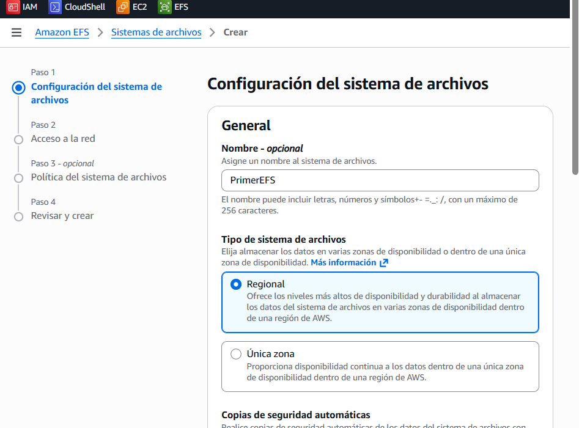  
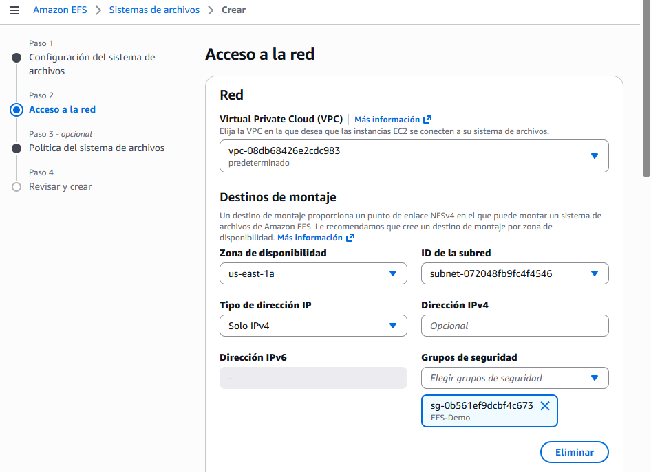  
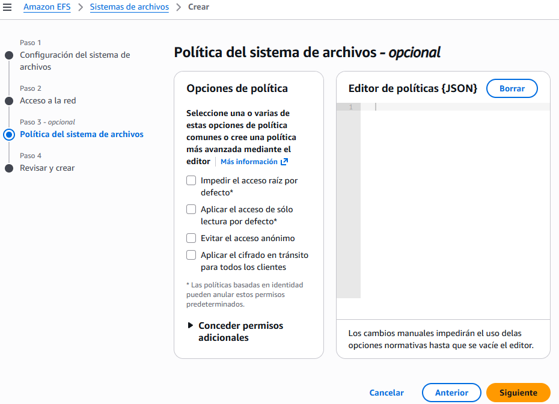  
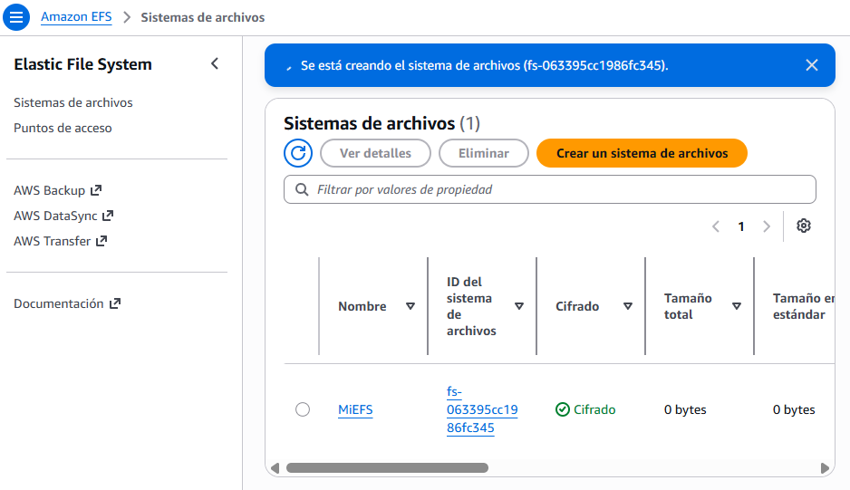  
+ Una vez creado, creamos instancias para poder linkar mi EFS. Para ello:
    - Creamos un grupo de seguridad nuevo
    - En Configurar red, le ponemos que vaya a una Subnet en concreto. Pondremos en diferentes para ver como se conectan diferentes instancias al mismo EFS.
    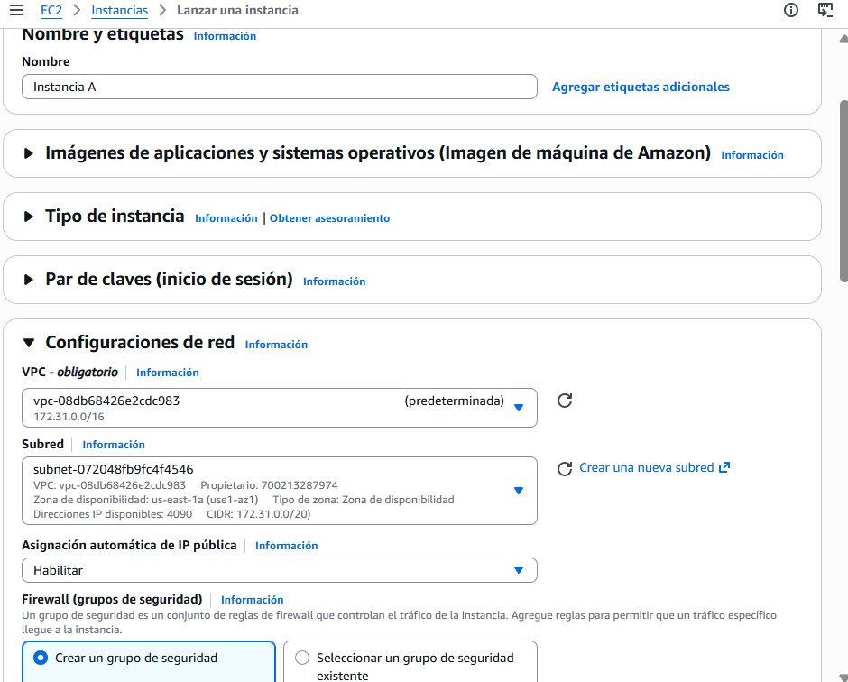  
    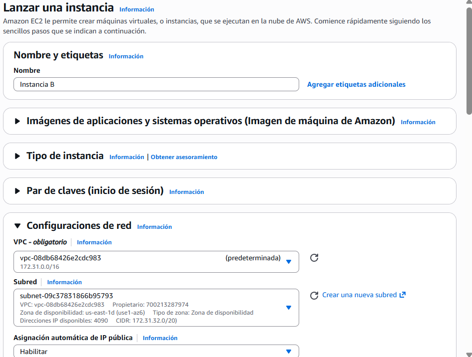  
    - En Configurar almacenamiento, seleccionamos el apartado de `0 x sistemas de archivos` le damos a editar y añadimos el EFS creado.
    - Tener en cuenta la ruta del punto de montaje, ejemplo `/mnt/efs/fs1` 
    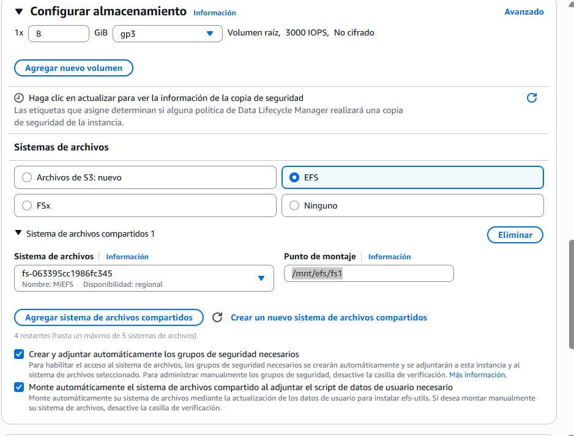  
    - Cuando se crean las instancias, por defecto también se crea un nuevo grupo de seguridad efs para cada instancia, además del que hayamos asignado nosotros.
    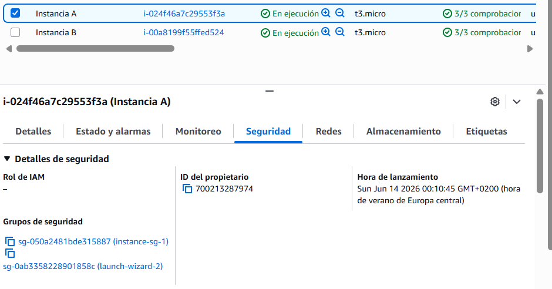  

+ Si ahora nos conectamos a una instancia y creamos un fichero en el punto de montaje de EFS, si luego vamos a la otra instancia y vemos el punto de montajem vemos que comparten el sistema de ficheros aun estando en diferentes AZ: 
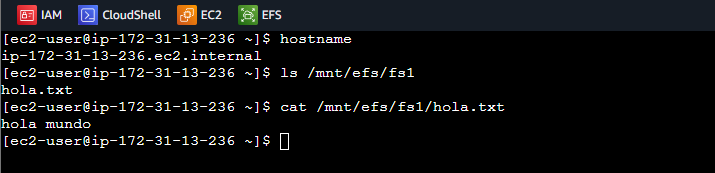  
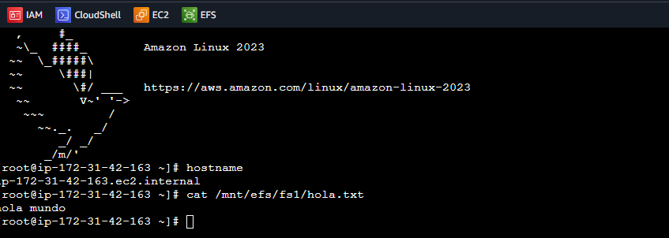  

## EBS vs EFS – Elastic Block Storage
+ Los volúmenes EBS...
    + sólo pueden adjuntarse a una instancia a la vez
    + están bloqueados a nivel de Zona de Disponibilidad (AZ)
    + gp2: la IO aumenta si aumenta el tamaño del disco
    + io1: puede aumentar la IO de forma independiente
+ Para migrar un volumen EBS a través de la AZ
    + Haz una Snapshot
    + Restaura la instantánea en otra AZ
    + Las copias de seguridad de EBS utilizan IO y no deberías ejecutarlas mientras tu aplicación esté manejando mucho tráfico
+ Los volúmenes EBS root de las instancias se terminan por defecto si la instancia EC2 se termina. (puedes desactivarlo)

+ Los volúmenes EFS...
    + Montar 100s de instancias a través de AZ
    + Compartir archivos del sitio web EFS (WordPress)
    + Sólo para instancias Linux (POSIX)
    + EFS tiene un precio más elevado que EBS
    + Puede aprovechar EFS-IA para ahorrar costes
+ Recuerda: EFS vs EBS vs Instance Store

## CUESTIONARIO

+ **Pregunta 1:** Acabas de dar de baja una instancia EC2 en us-east-1a, y su volumen EBS adjunto ya está disponible. Tu compañero de equipo intenta adjuntarlo a una instancia EC2 en us-east-1b pero no puede. ¿Cuál es la posible causa de esto?
> "Los volúmenes EBS están bloqueados en una Zona de Disponibilidad" porque los volúmenes EBS están diseñados para ser utilizados en la AZ en la que fueron creados, y no se pueden adjuntar directamente a instancias en diferentes AZs sin una migración adecuada como los snapshots. Esto es fundamental para entender cómo funciona la arquitectura de AWS.  

+ **Pregunta 2:** Has lanzado una instancia EC2 con dos volúmenes EBS, uno de tipo root y otro de tipo EBS para almacenar los datos. Un mes después estás planeando dar de baja la instancia EC2. ¿Cuál es el comportamiento por defecto que tendrá cada volumen EBS?
> Se eliminará el tipo de volumen root y no se eliminará el tipo de volumen EBS" porque, por defecto, el volumen root está configurado para eliminarse al finalizar la instancia, mientras que el volumen EBS adicional no se elimina, ya que esa opción está desactivada. Esto resalta la diferencia en la gestión de volúmenes al terminar una instancia EC2.  

+ **Pregunta 3:** Puedes utilizar una AMI en la región us-east-1 de N.Virginia para lanzar una instancia EC2 en cualquier región de AWS.
>  "Falso" correctamente porque las AMI están diseñadas para ser específicas de una región en AWS, lo que significa que no se pueden usar directamente en otra región. Debes copiarlas a la región deseada antes de lanzar instancias EC2. 

+ **Pregunta 4:** ¿Cuál de los siguientes tipos de volumen EBS se puede utilizar como volúmenes de arranque al crear instancias EC2?   
> "gp2, gp3, io1, io2" porque estos son los tipos de volúmenes EBS que se pueden utilizar específicamente como volúmenes de arranque al crear instancias EC2, cumpliendo así con los requisitos de la arquitectura de AWS.

+ **Pregunta 5:** ¿Qué es EBS Multi-Attach?
> "Adjunta el mismo volumen EBS a varias instancias EC2 en la misma AZ" porque EBS Multi-Attach permite que un único volumen EBS sea accesible por múltiples instancias EC2 simultáneamente, lo que facilita la colaboración en aplicaciones y la gestión de datos. Esto destaca la flexibilidad y escalabilidad de los servicios de AWS en tu aprendizaje. 

+ **Pregunta 6:** Te gustaría encriptar un volumen EBS no encriptado adjunto a tu instancia EC2. ¿Qué debes hacer?
> "Crea una Snapshot de tu volumen EBS. Copia la Snapshot y marca la opción de cifrar la instantánea copiada. A continuación, utiliza la instantánea cifrada para crear un nuevo volumen EBS" porque este proceso es el método adecuado para cifrar un volumen EBS no cifrado. Al crear una snapshot cifrada, aseguras que los datos estén protegidos, siguiendo las mejores prácticas de seguridad en AWS. 

+ **Pregunta 7:** Tienes una flota de instancias EC2 distribuidas en AZs que procesan un gran conjunto de datos. ¿Qué recomiendas para que los mismos datos sean accesibles como unidad NFS a todas tus instancias EC2?
> "Utilizar EFS" porque Amazon EFS es un sistema de archivos de red (NFS) que permite que varias instancias EC2 accedan al mismo sistema de archivos al mismo tiempo, incluso si están distribuidas en diferentes zonas de disponibilidad. Este enfoque es ideal para escenarios en los que necesitas que los mismos datos sean accesibles y compartidos de manera eficiente entre distintas instancias.

+ **Pregunta 8:** Te gustaría tener una caché local de alto rendimiento para tu aplicación alojada en una instancia EC2. No te importa perder la caché al terminar tu instancia EC2. ¿Qué mecanismo de almacenamiento recomiendas como Arquitecto de Soluciones?
> "Almacén de instancias" porque este tipo de almacenamiento ofrece el mejor rendimiento de E/S, lo que es ideal para una caché local de alto rendimiento en tu aplicación. Al ser almacenamiento local, no se ve afectado por la latencia de red, asegurando un acceso rápido a los datos. 

+ **Pregunta 9:** Estás ejecutando una base de datos de alto rendimiento que requiere una IOPS de 310.000 para su almacenamiento subyacente. ¿Qué recomiendas?
> "Utiliza un almacén de instancias de EC2" porque este tipo de almacenamiento puede proporcionar un rendimiento de IOPS superior a 310.000, lo que es ideal para tu base de datos de alto rendimiento. Aunque puedes perder los datos si la instancia se detiene, tienes la opción de implementar mecanismos de replicación o copias de seguridad para garantizar la disponibilidad en tu arquitectura.

## RESUMEN EXPLICACIÓN
+ La pregunta mental que siempre debes hacerte:
```
¿El almacenamiento necesita sobrevivir si la instancia se apaga o termina?
Sí → EBS o EFS
No, es temporal → EC2 Instance Store

¿Lo necesitan acceder varias instancias a la vez?
Sí → EFS
No, solo una instancia → EBS
```

+ Palabras clave del examen:
    - "almacenamiento temporal de alta velocidad", "caché", "buffer", "scratch data" → Instance Store  
    - "disco persistente para una instancia", "base de datos", "disco de arranque" → EBS
    - "compartido entre varias instancias", "sistema de archivos compartido", "WordPress con varios servidores" → EFS
    - "Windows" + compartido → EFS no vale, aquí entra FSx for Windows (lo verás más adelante)

+ Sobre los tipos de EBS — tampoco hay que memorizar todos, solo los cuatro casos:
    - gp2/gp3: Uso general, la mayoría de casos. gp3 es más barato y mejor que gp2

    - io1/io2: Bases de datos críticas que necesitan altísimo IOPS. También el único que soporta Multi-Attach

    - st1: Big data, logs, acceso secuencial frecuente. Barato y grande

    - sc1: Datos fríos, acceso muy poco frecuente. El más barato de todos
> Palabra clave: "alto IOPS" → io1/io2. "throughput barato" → st1. "datos fríos" → sc1. Todo lo demás → gp3.

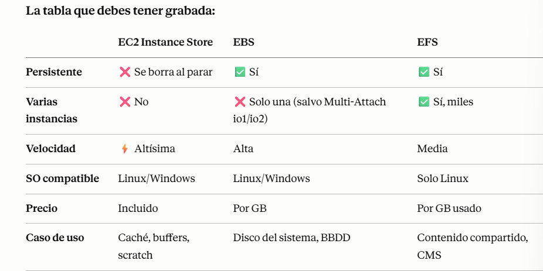  

## PREGUNTAS TIPO EXAMEN
**Pregunta 1**: Una aplicación de machine learning necesita almacenamiento temporal de altísima velocidad para procesar datasets durante el entrenamiento. Los datos no necesitan persistir cuando la instancia termina. ¿Qué eligen?  
A) EBS gp3  
B) EFS  
**C) EC2 Instance Store**  
D) EBS io2  
> C) EC2 Instance Store: La palabra "temporal" + "alta velocidad" es la combinación que grita Instance Store en el examen. Además fíjate que dijiste "cuando la instancia termina" — correcto, pero ojo al matiz: con Instance Store los datos se pierden también si la instancia se para (stop), no solo si se termina. Con EBS los datos sobreviven al stop. Eso el examen lo pregunta.


**Pregunta 2**: Una empresa tiene un CMS WordPress con 5 instancias EC2 detrás de un Load Balancer. Todas las instancias necesitan acceder a los mismos archivos de medios simultáneamente. ¿Qué almacenamiento usan?  
A) EBS gp3 con Multi-Attach  
B) EC2 Instance Store  
**C) EFS**  
D) EBS io2  
> C) EFS: EBS gp3 con Multi-Attach podría parecer válido, pero Multi-Attach solo funciona con io1/io2, no con gp3. Así que aunque alguien intente elegir esa opción, no existe en la práctica. EFS es la única respuesta real para compartir entre múltiples instancias Linux.  

**Pregunta 3**: Una base de datos Oracle en producción necesita 64.000 IOPS garantizados y el volumen debe poder montarse en dos instancias EC2 a la vez. ¿Qué tipo de EBS eligen?  
A) gp3  
B) st1  
C) sc1  
**D) io2 con Multi-Attach**  
> D) io2 con Multi-Attach: alto IOPS y Multi-Attach. Si solo fuera alto IOPS podría ser io1 o io2. Pero Multi-Attach solo existe en io1/io2, y io2 es la versión mejorada con más durabilidad. Cuando el examen pone dos condiciones, necesitas cumplir las dos.  

**Pregunta 4**: Una empresa almacena logs históricos que se consultan menos de una vez al mes. Necesitan el almacenamiento más barato posible. ¿Qué tipo de EBS eligen?  
A) gp3  
B) io1  
C) st1  
**D) sc1**  
> D) sc1: La jerarquía de precio en EBS de más barato a más caro para datos fríos es: sc1 → st1 → gp3 → io2. "Datos fríos" y "acceso poco frecuente" son las palabras exactas que usa AWS para describir sc1.