# Alta disponibilidad y escalabilidad en AWS

## Conceptos clave
- Alta disponibilidad (HA): diseñar sistemas para minimizar el tiempo de inactividad y garantizar que las aplicaciones sigan funcionando ante fallos de componentes.
- Escalabilidad: capacidad de un sistema para manejar aumentos de carga (escalado horizontal o vertical) manteniendo rendimiento.

### Patrones y buenas prácticas
- Multi-AZ: desplegar recursos críticos (bases de datos, instancias) en varias zonas de disponibilidad para tolerancia a fallos.
- Multi-Region: replicar datos y servicios entre regiones para recuperación ante desastres y latencia global.
- Balanceo de carga: usar Elastic Load Balancing (ALB/NLB) para distribuir tráfico entre instancias/servicios.
- Auto Scaling: configurar grupos de Auto Scaling para ajustar automáticamente capacidad según métricas (CPU, latencia, colas).
- Infraestructura como código: usar CloudFormation o Terraform para desplegar arquitectura reproducible y consistente.

### Servicios AWS relacionados
- Amazon EC2 + Auto Scaling: escalado de instancias virtuales.
- Amazon ECS / EKS / Lambda: opciones para contenedores y serverless con capacidad de escalar.
- Amazon RDS Multi-AZ / Read Replicas: alta disponibilidad y escalado de lectura para bases de datos gestionadas.
- Amazon Aurora: alta disponibilidad y escalabilidad integrada (clústeres, réplicas de lectura, failover rápido).
- Amazon S3 + CloudFront: almacenamiento duradero y entrega global con baja latencia.
- Amazon ElastiCache: caching para reducir latencia y carga en la base de datos.
- Amazon Route 53: DNS con health checks y failover entre regiones.
- Amazon CloudWatch: monitorización, alarmas y métricas para activar Auto Scaling y detectar problemas.

### Consideraciones de diseño
- Diseñar para fallos: asumir que los componentes fallarán y automatizar recuperación.
- Consistencia vs disponibilidad: elegir modos de consistencia según requisitos (por ejemplo, RDS vs DynamoDB).
- Estado vs sin estado: preferir aplicaciones sin estado para facilitar escalado horizontal; externalizar estado (S3, RDS, ElastiCache).
- Coste vs rendimiento: equilibrar réplicas y capacidad ociosa con objetivos de SLA.
- Pruebas de resiliencia: ejecutar pruebas (chaos engineering, failover drills) para validar comportamiento.

### Ejemplo rápido de arquitectura HA y escalable
- Frontend: CloudFront frente a ALB (multi-AZ) -> Auto Scaling group de EC2 / ECS Fargate (multi-AZ).
- Capa de datos: Aurora en clúster Multi-AZ + réplicas de lectura.
- Caché: ElastiCache (Redis) replicado.
- Almacenamiento objetos: S3 (versionado y cross-region replication si es necesario).
- DNS/failover: Route 53 con health checks y políticas de failover/latency routing.

### Métricas y SLAs
- Monitorizar latencia, errores (5xx), throughput, utilización de recursos y tiempos de failover.
- Definir objetivos de recuperación (RTO) y de punto de recuperación (RPO) para priorizar estrategia Multi-AZ vs Multi-Region.

### Recursos adicionales
- AWS Well-Architected Framework (pilar de fiabilidad)
- Documentación de Auto Scaling, ELB, RDS/Aurora, Route 53 y CloudFront

## ESCABILIDAD Y ALTA DISPONIBILIDAD
+ La escalabilidad significa que una aplicación/sistema puede manejar mayores cargas adaptándose.
+ Hay dos tipos de escalabilidad:
    - Escalabilidad vertical
    - Escalabilidad horizontal (= elasticidad)
> La escalabilidad está vinculada pero es diferente a la Alta Disponibilidad

+ Escalabilidad vertical:
    - La escalabilidad vertical significa aumentar el tamaño de la instancia 
    - Por ejemplo, tu aplicación se ejecuta en un
    t2.micro
    - Escalar esa aplicación verticalmente significa ejecutarla en un t2.large
    - La escalabilidad vertical es muy común para los sistemas no distribuidos, como una base de datos.
    - RDS, ElastiCache son servicios que pueden escalar verticalmente.
    - Suele haber un límite en cuanto a la escalabilidad vertical (límite de hardware)

+ Escalabilidad horizontal:
    - La escalabilidad horizontal significa aumentar el número de instancias / sistemas de tu aplicación
    - El escalado horizontal implica sistemas distribuidos.
    - Esto es muy común para las aplicaciones web / aplicaciones modernas
    - Es fácil escalar horizontalmente gracias a las ofertas en el Cloud, como Amazon EC2
    > Grupo de Auto Scaling y Load Balancer

+ Alta disponibilidad: 
    - La alta disponibilidad suele ir de la mano del escalado horizontal
    - La alta disponibilidad significa ejecutar tu aplicación/sistema en al menos 2 centros de datos (== Zonas de Disponibilidad)
    - El objetivo de la alta disponibilidad es sobrevivir a la pérdida de un centro de datos
    - La alta disponibilidad puede ser pasiva (para RDS Multi AZ, por ejemplo)
    - La alta disponibilidad puede ser activa (para el escalado horizontal)
    > Auto Scaling Groups multi AZ y Load Balancer multi AZ

## BALANCEADORES DE CARGA / LOAD BALANCERS
+ Los Load Balancers son servidores que reenvían el tráfico a varios
servidores (por ejemplo, instancias EC2) en sentido descendente. Uso:
    - Repartir la carga entre varias instancias descendentes
    - Exponer un único punto de acceso (DNS) a tu aplicación
    - Manejar sin problemas los fallos de las instancias descendentes
    - Realiza comprobaciones periódicas de la salud de tus instancias
    - Proporcionar terminación SSL (HTTPS) para tus sitios web
    - Imponer la adherencia con las cookies
    - Alta disponibilidad entre zonas
    - Separar el tráfico público del privado

+ Un Elastic Load Balancer es un equilibrador de carga gestionado
    + AWS garantiza su funcionamiento
    + AWS se encarga de las actualizaciones, el mantenimiento y la alta disponibilidad
    + AWS sólo proporciona unos pocos mandos de configuración
+ Cuesta poco configurar tu propio balanceador de carga, y te supondrá una mejora en la disponibilidad y escalabilidad
+ Está integrado con muchas ofertas/servicios de AWS
    + EC2, EC2 Auto Scaling Groups, Amazon ECS
    + AWS Certificate Manager (ACM), CloudWatch
    + Route 53, AWS WAF, AWS Global Accelerator

+ Controles de salud:
    - Las comprobaciones de salud son cruciales para los Load Balancer
    - Permiten al Load Balancer saber si las instancias a las que reenvía el tráfico están disponibles para responder a las peticiones
    - La comprobación de salud se realiza en un puerto y una ruta (/health es común)
    - Si la respuesta no es 200 (OK), la instancia no está sana

+ Tipos de Load Balancer en AWS. Tiene 4 tipos de Load Balancer gestionados:
    + Classic Load Balancer (v1 - antigua generación) - 2009 - CLB
        + HTTP, HTTPS, TCP, SSL (TCP seguro)
    + Application Load Balancer (v2 - nueva generación) - 2016 - ALB
        + HTTP, HTTPS, WebSocket
    + Network Load Balancer (v2 - nueva generación) - 2017 - NLB
        + TCP, TLS (TCP seguro), UDP
    + Gateway Load Balancer - 2020 - GWLB
        + Funciona en la capa 3 (capa de red) - Protocolo IP
+ En general, se recomienda utilizar los load balancer de nueva generación, ya que ofrecen más funciones
+ Algunos Load Balancer pueden configurarse como ELB internos (privados) o externos (públicos)

+ Application Load Balancer (v2 - ALB)
    + El Application Load Balancer es de capa 7 (HTTP)
    + Equilibrio de carga para múltiples aplicaciones HTTP en distintas
    máquinas (grupos de destino)
    + Equilibrio de carga para múltiples aplicaciones en la misma máquina (por ejemplo, contenedores)
    + Soporte para HTTP/2 y WebSocket
    + Soporta redireccionamientos (de HTTP a HTTPS, por ejemplo)
    + Los ALB son muy adecuados para los microservicios y las aplicaciones basadas en contenedores (ejemplo: Docker y Amazon ECS)
    + Tiene una función de mapeo de puertos para redirigir a un puerto dinámico en ECS
    + En comparación, necesitaríamos varios Classic Load Balancer por aplicación
    + Los servidores de aplicaciones no ven directamente la IP del cliente
        + La verdadera IP del cliente se inserta en la cabecera X-Forwarded-For
        + También podemos obtener el puerto (X-Forwarded-Port) y el
        protocolo (X-Forwarded-Proto)
```
• Tablas de enrutamiento a diferentes grupos de destino:
    • Enrutamiento basado en la ruta en la URL (example.com/users & example.com/posts)
    • Enrutamiento basado en el nombre de host en la URL (one.example.com & other.example.com)
    • Enrutamiento basado en la cadena de consulta, las cabeceras (example.com/users?id=123&order=false)
```
+ Target Groups (Grupos objetivo): 
    + Instancias EC2 (pueden ser gestionadas por un Auto Scaling Groups) - HTTP
    + Tareas de ECS (gestionadas por el propio ECS) - HTTP
    + Funciones Lambda - La petición HTTP se traduce en un evento JSON
    + Direcciones IP - deben ser IPs privadas
    + El ALB puede enrutar a múltiples grupos de destino
    + Las comprobaciones de salud son a nivel de grupo de destino

### PRÁCTICA LOAD BALANCER APPLICATION (ALB)
```
1. Los clientes hacen solicitudes a su aplicación.
2. Los agentes de escucha del equilibrador de carga reciben solicitudes que coinciden con el protocolo y el puerto que configure.
3. El agente de escucha receptor evalúa la solicitud entrante con respecto a las reglas que especifique y, si procede, dirige la solicitud al grupo de destino adecuado. Puede utilizar un agente de escucha HTTPS para delegar el trabajo de cifrado y descifrado TLS al balanceador de carga.
4. Los destinos con estado correcto de uno o varios grupos de destino reciben tráfico en función del algoritmo de equilibrio de carga y de las reglas de direccionamiento que especifique en el agente de escucha.
```
+ Creamos dos instancias
+ Creamos un balanceador de carga de aplicaciones (ALB)
+ A la hora de crearlo, creamos un grupo de seguridad personalizado que de regla de entrada permita el tráfico http desde cualquier ip.
+ Seleccionamos este grupo de seguridad a la hora de crear el ALB y después creamos un grupo de destino (target group).
+ En este grupo de destino, creamos de tipo instancia y, una vez se seleccionan las dos que hemos creado, hay que darle al botón de incluir
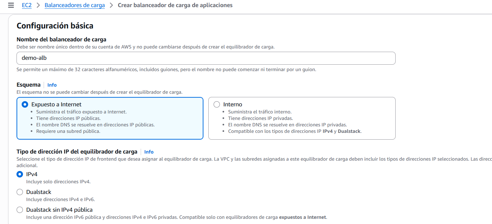  
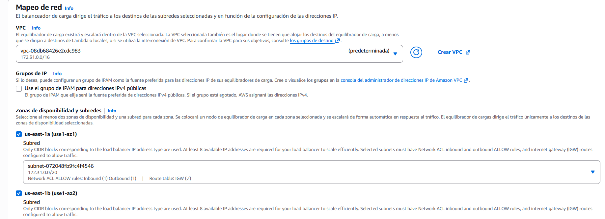  
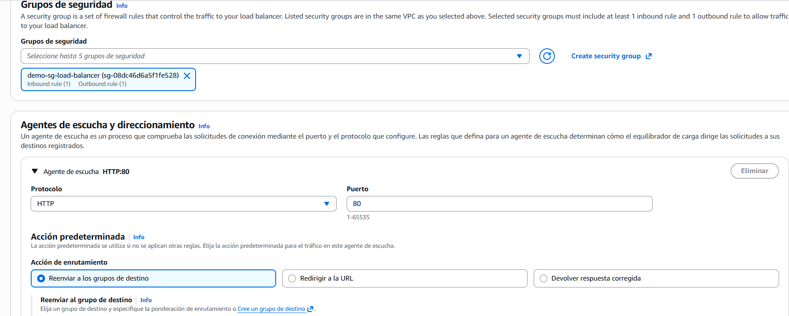  
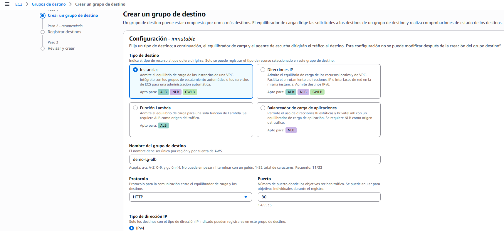  
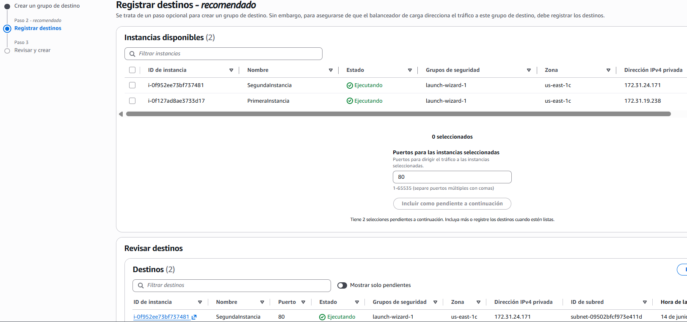  
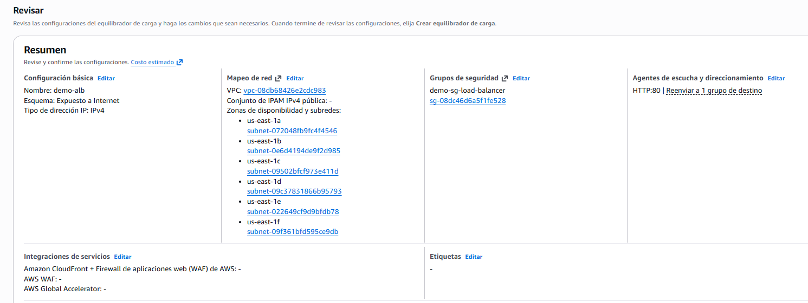  

+ Una vez que ya está creado todo, tenemos un balanceador de carga de tráfico http hacia un grupo de destino de 2 instancias
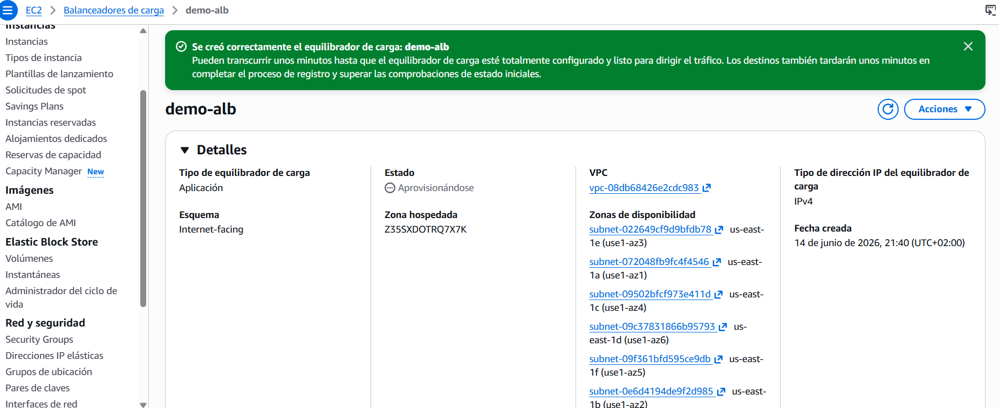  
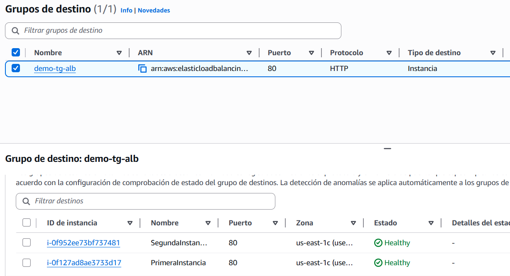

+ Ahora si detenemos una instancia, nos indica que hay una que no está operativa y por lo tanto, solo gestiona tráfico a una de ellas.
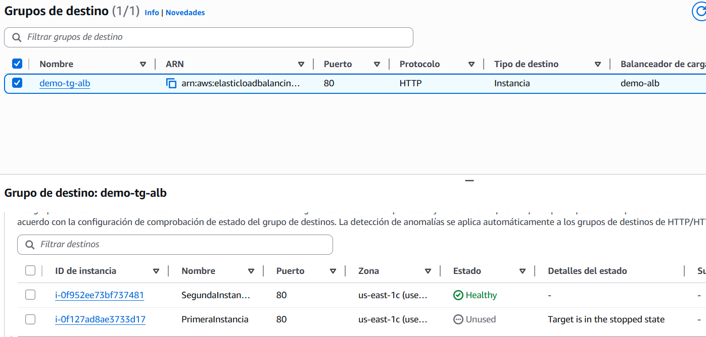  

+ Si vamos al balanceador de carga y copiamos su IP de dns, por ejemplo: `demo-alb-1731595826.us-east-1.elb.amazonaws.com` si vamos actualizando la web, vemos que unas veces nos da el trafico de una instancia y otras de la otra.

+ Podemos restringir el tráfico de nuestras instancias editando el security group. Actualmente está puesto que redirige desde cualquier IP, si ponemos una regla de que solo sea con la IP del balanceador (en la casilla ponemos el nombre del ALB), si vamos a las IPs de las instancias, ahora no carga, pero si vamos a la IP del balanceador sí.

+ Podemos crear nuevas reglas de destino. Para ello vamos al ALB, al listener:80 y añadimos nueva regla. Decimos que sea de ruta, ponemos por ejemplo `/error` y ponemos un mensaje de error si vas a esa ruta.
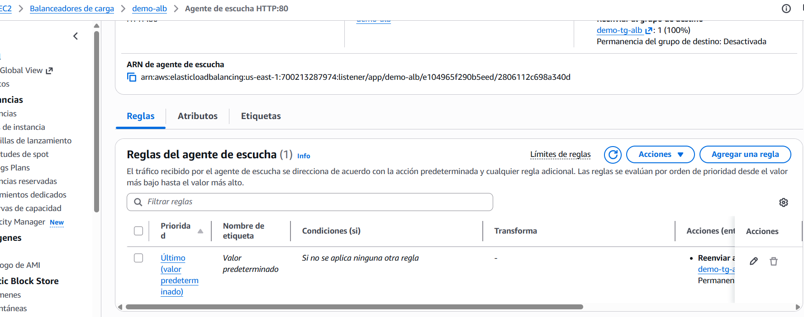  
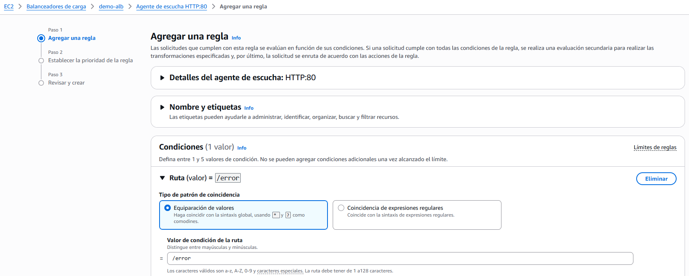  
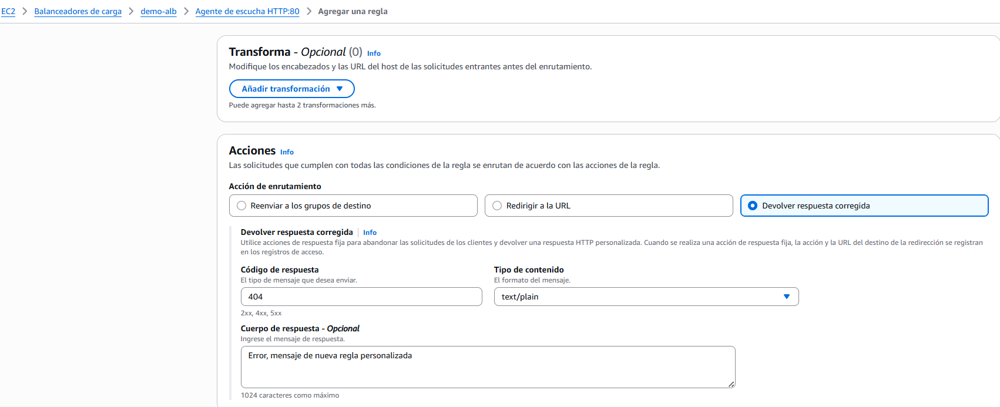  
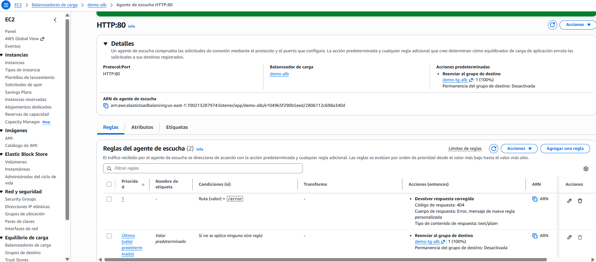  
  

## NETWORK LOAD BALANCER (NLD)
+ Los Network Load Balancer (Capa 4) permiten:
    + Reenviar el tráfico TCP y UDP a tus instancias
    + Manejar millones de peticiones por segundo
    + Menor latencia ~100 ms (frente a los 400 ms del ALB)
+ El NLB tiene una IP estática por AZ, y soporta la asignación de IP elástica (útil para poner en lista blanca una IP específica)
+ Los NLB se utilizan para un rendimiento extremo, tráfico TCP o UDP
+ No está incluido en la capa gratuita de AWS

+ Network Load Balancer - Target Groups (Grupos objetivo)
    - Instancias EC2
    - Direcciones IP - deben ser IPs privadas
    - Application Load Balancer
    - Los controles de salud soportan los protocolos TCP, HTTP y HTTPS

### PRÁCTICA NLD
+ Creamos un balanceador de carga de red.
> Elija un equilibrador de carga de red cuando necesite un rendimiento ultraalto, descarga de TLS a gran escala, implementación centralizada de certificados, compatibilidad con UDP y direcciones IP estáticas para sus aplicaciones. En el nivel de conexión, los equilibradores de carga de red pueden controlar millones de solicitudes por segundo de forma segura a la vez que mantienen latencias ultrabajas.  

+ Creamos un grupo de destino para las dos instancias, con por ejemplo listener de HTTP 80. Seleccionamos que esté disponible en todas las AZ y creamos el NLB
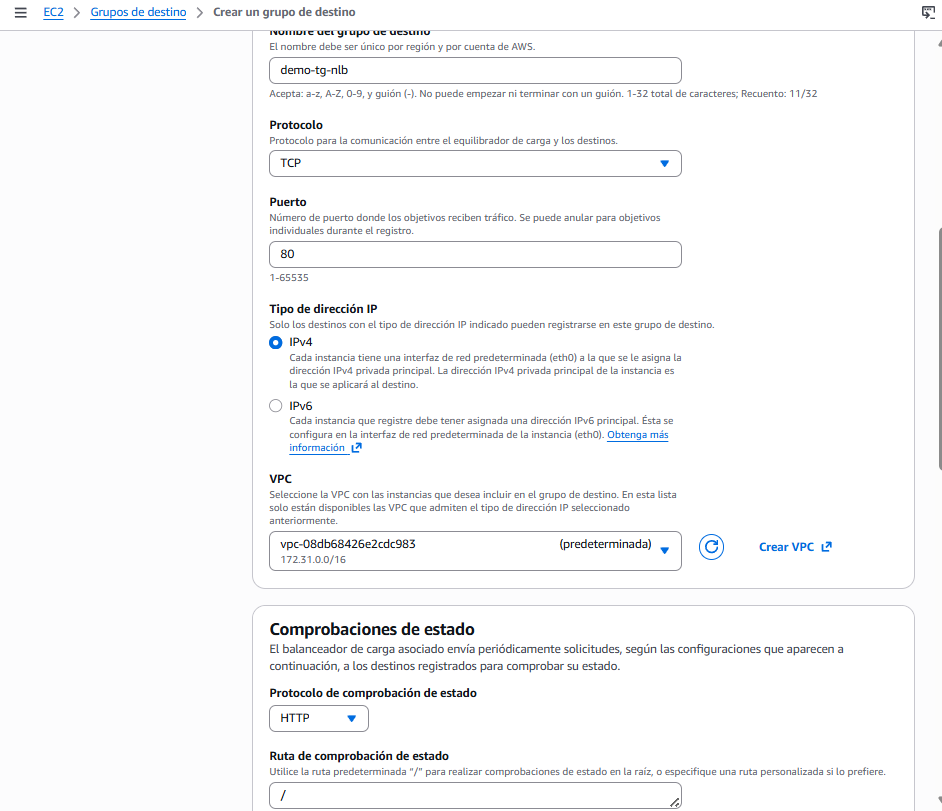  
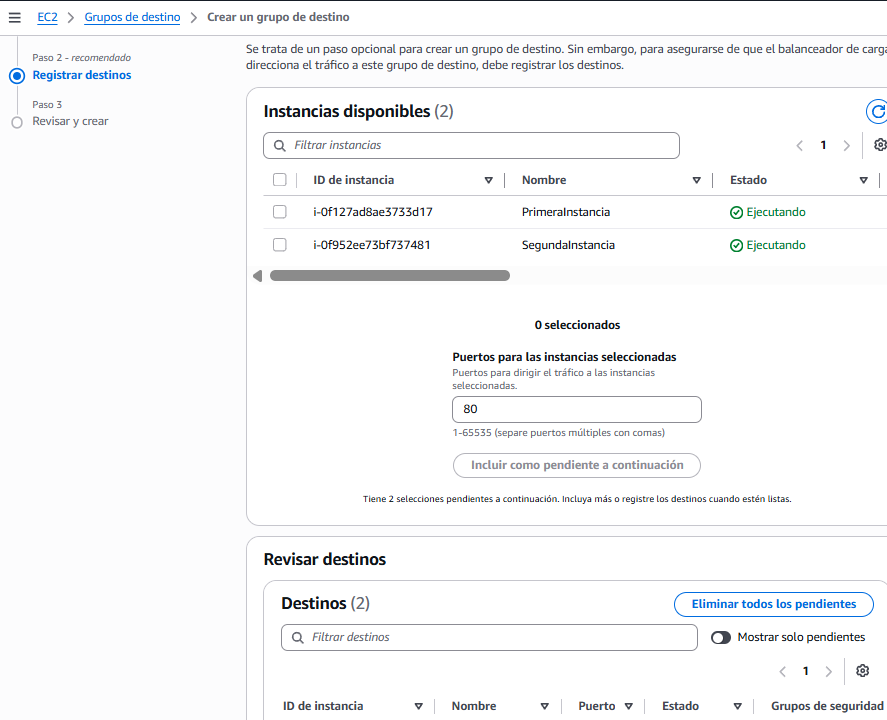  
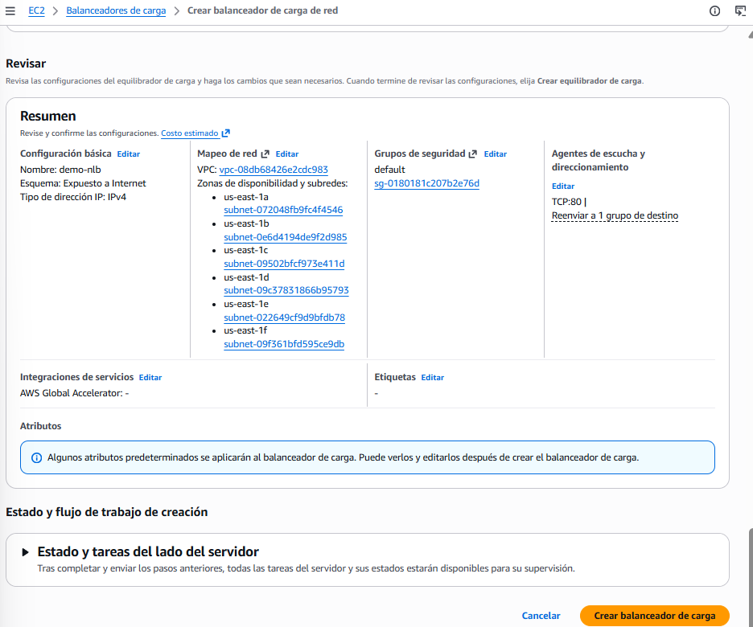  

## Gateway Load Balancer
+ Implementa, escala y administra una flota de dispositivos virtuales de red de terceros en AWS
+ Ejemplo: Firewalls, Sistemas de Detección y Prevención de Intrusiones, Sistemas de Inspección Profunda de Paquetes, manipulación de cargas
útiles, ...
+ Opera en la Capa 3 (Capa de Red) - Paquetes IP
+ Combina las siguientes funciones:
    + Gateway de Red Transparente - entrada/salida única para todo el tráfico
    + Load Balancer - distribuye el tráfico a tus dispositivos virtuales
+ Utiliza el protocolo GENEVE en el puerto 6081

+ Gateway Load Balancer - Target Groups (Grupos objetivo)
    - Instancias EC2
    - Direcciones IP - deben ser IPs privadas

## Sticky Sessions (sesiones persistentes)
+ Es posible implementar la “pegajosidad / adherencia” para que el mismo cliente sea siempre redirigido a lamisma instancia detrás de un balanceador de carga
+ Esto funciona para los Classic Load Balancer y los Application Load Balancer
+ La "cookie" utilizada para la adherencia tiene una fecha de caducidad que tú controlas
+ Caso de uso: asegurarse de que el usuario no pierde sus datos de sesión
+ Activar la adherencia puede provocar un desequilibrio de la carga en las instancias EC2 del backend
> Se puede activar en EDIT del grupo de destino "Stickness".  

+ Nombres de las cookies:
    - Cookies basadas en la aplicación
        - Cookie personalizada
            - Generada por el objetivo
            - Puede incluir cualquier atributo personalizado requerido por la aplicación
            - El nombre de la cookie debe especificarse individualmente para cada grupo de destino
            - No utilices AWSALB, AWSALBAPP o AWSALBTG (reservadas para el uso del ELB)
        - Cookie de la aplicación
            - Generada por el Load Balancer
            - El nombre de la cookie es AWSALBAPP
    - Cookies basadas en la duración
        - Cookie generada por el equilibrador de carga
        - El nombre de la cookie es AWSALB para ALB, AWSELB para CLB

## LOAD BALANCER ENTRE ZONAS
+ Con el Load Balancer de zona cruzada: Cada instancia del Load Balancer distribuye uniformemente entre todas las instancias registradas en todas las AZ.
+ Sin Load Balancer de zona cruzada: Las solicitudes se distribuyen en las instancias del nodo del Elastic Load Balancer.

+ Application Load Balancer
    + Siempre activado (no se puede desactivar)
    + No se cobra por los datos inter AZ
+ Network Load Balancer & Gateway Load Balancer
    + Desactivado por defecto
    + Si está activado, pagas una tarifa ($) por los datos entre zonas geográficas
+ Classic Load Balancer
    + Desactivado por defecto
    + No se cobra por los datos inter AZ si está activado

## SSL/TLS
+ Un certificado SSL permite que el tráfico entre tus clientes y tu Load Balancer esté cifrado en tránsito (cifrado en vuelo)
+ SSL hace referencia a Secure Sockets Layer, que se utiliza para cifrar las conexiones
+ TLS se refiere a Transport Layer Security, que es una versión más reciente
+ Hoy en día, se utilizan principalmente los certificados TLS, pero la gente sigue refiriéndose a ellos como SSL
+ Los certificados SSL públicos son emitidos por las Autoridades de Certificación (CA)
+ Comodo, Symantec, GoDaddy, GlobalSign, Digicert, Letsencrypt, etc.
+ Los certificados SSL tienen una fecha de caducidad (que tú estableces) y deben ser renovados

+ El Load Balancer utiliza un certificado X.509 (certificado de servidor SSL/TLS)
+ Puedes gestionar los certificados mediante ACM (AWS Certificate Manager)
+ También puedes crear y subir tus propios certificados
+ Listener HTTPS:
    + Debes especificar un certificado por defecto
    + Puedes añadir una lista opcional de certificados para dar soporte a múltiples dominios
    + Los clientes pueden utilizar SNI (Server Name Indication) para especificar el nombre de host al que llegan
    + Posibilidad de especificar una política de seguridad para soportar versiones antiguas de SSL / TLS (clientes heredados)

+ Server Name Indication (SNI):
    + SNI resuelve el problema de cargar varios certificados SSL en un servidor web (para servir a varios sitios web)
    + Es un protocolo "más nuevo", y requiere que el cliente indique el nombre del servidor de destino en el apretón de manos SSL inicial (handshake)
    + El servidor encontrará entonces el certificado correcto, o devolverá el predeterminado
    + Nota:
        + Sólo funciona para ALB y NLB (generación más reciente), CloudFront
        + No funciona con CLB (generación anterior)

+ Classic Load Balancer (v1)
    + Soporta sólo un certificado SSL
    + Debe utilizar varios CLB para varios nombres de host con varios certificados SSL
+ Application Load Balancer (v2)
    + Soporta múltiples oyentes con múltiples certificados SSL
    + Utiliza la indicación del nombre del servidor (SNI) para que funcione
+ Network Load Balancer (v2)
    + Soporta múltiples oyentes con múltiples certificados SSL
    + Utiliza la Indicación del Nombre del Servidor (SNI) para hacerlo funcionar

## Connection Draining (Drenaje de la conexión)
+ Nombre de la característica
    + Drenaje de la conexión - para el CLB
    + Retraso en el desregistro - para ALB y NLB
+ Tiempo para completar las "peticiones en vuelo" mientras la instancia se está desregistrando o no está sana
+ Deja de enviar nuevas peticiones a la instancia EC2 que se está desregistrando
+ Entre 1 y 3600 segundos (por defecto: 300 segundos)
+ Se puede desactivar (fijar el valor en 0)
+ Establece un valor bajo si tus peticiones son cortas

## AUTO SCALING GROUP
+ En la vida real, la carga de tus sitios web y aplicaciones puede cambiar
+ En el Cloud, puedes crear y deshacerte de servidores muy rápidamente
+ El objetivo de un Auto Scaling Group (ASG) es:
    + Reducir (añadir instancias EC2) para adaptarse a un aumento de la carga
    + Aumentar (eliminar instancias EC2) para que coincida con una disminución de la carga
    + Asegurar que tenemos un número mínimo y máximo de instancias EC2 en funcionamiento
    + Registrar automáticamente nuevas instancias en un Load Balancer
    + Volver a crear una instancia EC2 en caso de que se elimine una anterior (por ejemplo, si no está sana)
+ Los ASG son gratuitos (sólo pagas por las instancias EC2 subyacentes)

+ Atributos del Auto Scaling Group: Una Plantilla de Lanzamiento (las antiguas "Configuraciones de Lanzamiento" están obsoletas):
    + AMI + Tipo de Instancia
    + Datos de usuario de EC2
    + Volúmenes EBS
    + Grupos de seguridad
    + Par de claves SSH
    + Roles IAM para tus instancias EC2
    + Información sobre la red y las subredes
    + Información del Load Balancer
+ Tamaño mínimo / Tamaño máximo / Capacidad inicial
+ Políticas de escalado

+ Alarmas y escalado de CloudWatch:
    - Es posible escalar un ASG basándose en las alarmas de CloudWatch
    - Una alarma monitoriza una métrica (como la CPU media, o una métrica personalizada)
    - Las métricas, como la CPU media, se calculan para todas las instancias del ASG
    - Basándonos en la alarma:
        - Podemos crear políticas de escalado (aumentar el número de instancias)
        - Podemos crear políticas de ampliación (reducir el número de instancias)

+ Políticas de escalado dinámico:
    - Escala de seguimiento de objetivos
        - Lo más sencillo y fácil de configurar
        - Ejemplo: Quiero que la media de la CPU de ASG se mantenga en torno al 40%
    - Escalado simple / escalonado
        - Cuando se active una alarma de CloudWatch (por ejemplo, CPU > 70%), añade 2 unidades
        - Cuando se active una alarma de CloudWatch (ejemplo CPU < 30%), entonces elimina 1
    - Acciones programadas
        - Anticipa un escalado basado en patrones de uso conocidos
        - Ejemplo: aumentar la capacidad mínima a 10 a las 17 horas de los viernes

+ Escalado predictivo: previsión continua de la carga y programación del escalado por adelantado

+ Buenas métricas para escalar
    - CPUUtilization: Utilización media de la CPU en tus instancias
    - RequestCountPerTarget: para asegurarse de que el número de peticiones por instancias EC2 es estable
    - Promedio de entrada/salida de red (si tu aplicación está vinculada a la red)
    - Cualquier métrica personalizada (que impulses con CloudWatch)

+ Enfriamiento de la escala
    - Después de que se produzca una actividad de escalado, estarás en el periodo de enfriamiento (por defecto, 300
    segundos)
    - Durante el periodo de enfriamiento, el ASG no lanzará ni terminará instancias adicionales (para permitir que las métricas se estabilicen)
    - Consejo: Utiliza una AMI lista para usar para reducir el tiempo de configuración y así poder servir las peticiones más rápidamente y reducir el periodo de enfriamiento

## RESUMEN

+ ELB y ASG no son lo mismo aunque vayan juntos casi siempre:
    - ELB → reparte el tráfico que ya existe entre las instancias disponibles. No crea ni elimina instancias, solo distribuye.
    - ASG → crea y elimina instancias según la demanda. No reparte tráfico, solo gestiona cuántas instancias hay.
> Juntos forman el combo perfecto: ASG decide cuántas instancias hay, ELB reparte el tráfico entre ellas.

+ Cuándo usar cada tipo de Load Balancer — simplificado:
    - Si el escenario dice...HTTP/HTTPS, aplicación web, microservicios, routing por URL o por cabecera -> Usa `ALB`
    - Si el escenario dice...Rendimiento extremo, millones de requests por segundo, TCP/UDP, IP estática fija -> Usa `NLB`
    - Si el escenario dice...Firewall de terceros, inspección de tráfico, seguridad de red -> Usa `GWLB`
> La regla práctica: web normal → ALB siempre. NLB solo cuando el escenario menciona rendimiento extremo o protocolo TCP/UDP puro. GWLB solo cuando menciona appliances de seguridad o inspección de paquetes.

+ Cuándo usar ASG:
    - Ejemplo de picos de tráfico web 
    - Procesamiento de colas: tienes SQS con mensajes acumulándose → ASG escala según el número de mensajes en cola
    - Ahorro de costes nocturno: de noche hay poco tráfico → ASG reduce instancias automáticamente
    - Reemplazo automático: una instancia falla su health check → ASG la termina y lanza una nueva sin intervención humana
> Ese último caso es importante — ASG no es solo para escalar, también es para autorepararse.

+ Sticky Sessions → el LB siempre manda al mismo usuario a la misma instancia. Útil para sesiones de usuario. Riesgo: si esa instancia falla, el usuario pierde su sesión.

+ Connection Draining (Drenaje) → cuando una instancia se va a terminar, el LB espera a que las conexiones activas terminen antes de eliminarla. El examen lo llama "Deregistration Delay". Por defecto 300 segundos.

+ Cross-Zone Load Balancing → reparte tráfico equitativamente entre instancias de todas las AZs, no solo las de la AZ del LB. En ALB viene activado por defecto, en NLB y GWLB no.

## CUESTIONARIO
**Pregunta 1:**  
Escalar una instancia EC2 de r4.large a r4.4xlarge se llama .....................
> Escalabilidad vertical se refiere a aumentar la capacidad de una instancia EC2, como pasar de r4.large a r4.4xlarge, lo que involucra añadir más recursos a la misma máquina. Esto se alinea con el objetivo de entender cómo gestionar el rendimiento y recursos en la nube. 

**Pregunta 2:**  
Ejecutar una aplicación en un Auto Scaling Groups que escala el número de instancias EC2 de entrada y salida se llama .....................
> La "escalabilidad horizontal" se refiere a aumentar la capacidad de una aplicación añadiendo más instancias EC2 en lugar de aumentar los recursos de una sola instancia. Esto es fundamental para gestionar un mayor número de solicitudes y garantizar el rendimiento de la aplicación en un entorno de Auto Scaling.

**Pregunta 3:**  
Los Elastic Load Balancers proporcionan un .......................
> "Nombre DNS estático que podemos utilizar en nuestra aplicación" porque este tipo de nombre permite que tu Elastic Load Balancer sea accesible de manera constante, independientemente de los cambios en la infraestructura subyacente de AWS, lo que es esencial para garantizar la disponibilidad y estabilidad de tus aplicaciones. 

**Pregunta 4:**  
Estás ejecutando un sitio web en 10 instancias de EC2 dirigidas por un Elastic Load Balancers. Tus usuarios se quejan de que el sitio web siempre les pide que se vuelvan a autentificar cuando se mueven entre las páginas del sitio web. Estás desconcertado porque funciona bien en tu máquina y en el entorno de desarrollo con 1 instancia EC2. ¿Cuál podría ser la razón?
>  "El Elastic Load Balancer no tiene activadas las Sticky Sessions" porque esta función es clave para asegurar que los usuarios mantengan su sesión activa al redirigir sus solicitudes a la misma instancia EC2, evitando que tengan que volverse a autenticar al navegar por el sitio.

**Pregunta 5:**  
Estás utilizando un Load Balancer de aplicaciones para distribuir el tráfico a tu sitio web alojado en instancias EC2. Resulta que tu sitio web sólo ve el tráfico procedente de direcciones IPv4 privadas que, de hecho, son las direcciones IP de tu Load Balancer de aplicaciones. ¿Qué debes hacer para obtener la dirección IP de los clientes conectados a tu sitio web?  
> "Modifica el backend de tu sitio web para obtener la dirección IP del cliente a partir de la cabecera X-Forwarded-For" porque, al usar un Application Load Balancer, este agrega esa cabecera para que puedas recuperar la dirección IP original del cliente, permitiendo así gestionar mejor las solicitudes y la autenticación en tu aplicación.

**Pregunta 6:**  
Has alojado una aplicación en un conjunto de instancias de EC2 encabezadas por un Elastic Load Balancer. Una semana después, los usuarios empiezan a quejarse de que a veces la aplicación no funciona. Investigas el problema y descubres que algunas instancias de EC2 se bloquean de vez en cuando. ¿Qué deberías hacer para evitar que los usuarios se conecten a las instancias EC2 que se bloquean?
> "Habilitar las comprobaciones de salud del ELB" porque, al activar esta función, el Elastic Load Balancer dejará de enviar tráfico a las instancias EC2 que no estén operativas, lo que mejorará la experiencia del usuario al evitar caídas en la aplicación. Esto es esencial para garantizar una alta disponibilidad y confiabilidad en tu servicio.

**Pregunta 7:**  
Estás trabajando como Arquitecto de Soluciones para una empresa y tienes que diseñar una arquitectura para una aplicación de alto rendimiento y baja latencia que recibirá millones de peticiones por segundo. ¿Qué tipo de Elastic Load Balancer deberías elegir?
> "Network Load Balancer" porque este tipo de balanceador de carga está diseñado para manejar millones de peticiones por segundo con el mínimo de latencia, lo que es crucial para aplicaciones de alto rendimiento.

**Pregunta 8:**  
Los Load Balancer de aplicaciones soportan los siguientes protocolos, EXCEPTO:
> TCP" porque los Application Load Balancers no soportan este protocolo; en su lugar, están diseñados para manejar HTTP, HTTPS y WebSocket, lo que los hace adecuados para aplicaciones web que requieren carga y distribución de tráfico basadas en contenido.

**Pregunta 9:**  
Los Load Balancer de aplicaciones pueden enrutar el tráfico a diferentes Grupos de Destino en función de lo siguiente, EXCEPTO:
>  "Ubicación del cliente (geografía)" porque los Load Balancers de aplicaciones no pueden enrutar el tráfico en función de la geografía del cliente; su enrutamiento se basa en la ruta de la URL, el nombre del host y otras cabeceras HTTP.

**Pregunta 10:**  
Los destinos registrados en un Grupo de Destino para un Load Balancer de Aplicaciones pueden ser uno de los siguientes, EXCEPTO:
> "Network Load Balancer" porque este tipo de balanceador no se puede registrar como destino en un Grupo de Destino para un Load Balancer de Aplicaciones, que solo permite instancias EC2, direcciones IP privadas y funciones Lambda. 

**Pregunta 11:**  
Por motivos de normativa, te gustaría exponer una dirección IP estática fija a tus usuarios finales para que puedan escribir reglas de firewall que sean estables y aprobadas por los reguladores. ¿Qué tipo de Elastic Load Balancer elegirías?
> "Network Load Balancer" porque este tipo de balanceador de carga proporciona una dirección IP estática por zona de disponibilidad (AZ) y puedes adjuntarle una dirección IP elástica, lo que es ideal para cumplir con normativas y permitir a los usuarios finales establecer reglas de firewall estables.

**Pregunta 12:**  
Quieres crear una cookie personalizada basada en la aplicación en tu Load Balancer de aplicaciones. ¿Cuál de las siguientes opciones puedes utilizar como nombre de la cookie?
> "APPUSERC" como nombre de COOKIE personalizada, ya que este es un nombre que puedes utilizar, mientras que "AWSALB", "AWSALBAPP" y "AWSALBTG" están reservados por el Elastic Load Balancer. 

**Pregunta 13:**  
Tienes un Network Load Balancer que distribuye el tráfico entre un conjunto de instancias EC2 en us-east-1. Tienes 2 instancias EC2 en us-east-1b AZ y 5 instancias EC2 en us-east-1e AZ. Has observado que la utilización de la CPU es mayor en las instancias EC2 en us-east-1b AZ. Tras una investigación más profunda, te has dado cuenta de que el tráfico se distribuye por igual en las dos AZ. ¿Cómo resolverías este problema?
> "Habilitar el Load Balancer entre zonas (Cross-Zone Load Balancing)" porque este ajuste permite que el balanceador distribuya el tráfico de manera equitativa entre todas las instancias EC2 en las diferentes zonas de disponibilidad, mejorando así el rendimiento y evitando la sobrecarga en una sola zona.  

**Pregunta 14:**  
¿Qué función de los Application Load Balancer y de los Network Load Balancer te permite cargar varios certificados SSL en un oyente?
> "Indicación del nombre del servidor (SNI)" porque esta función permite que un solo oyente soporte múltiples certificados SSL, lo que es esencial para la provisión segura de servicios web en un entorno donde se utilizan varios dominios. 

**Pregunta 15:**  
Tienes un Load Balancer de aplicaciones que está configurado para redirigir el tráfico a 3 grupos de destino basados en los siguientes nombres de host: users.example.com, api.external.example.com y checkout.example.com. Te gustaría configurar HTTPS para cada uno de estos nombres de host. ¿Cómo configuras el ALB para que esto funcione?
> "Utilizar la indicación del nombre del servidor (SNI)" porque permite configurar múltiples aplicaciones HTTPS, cada una con su propio certificado SSL, en el mismo oyente del Load Balancer. Esto es esencial para manejar varios dominios de manera segura en un entorno de aplicaciones. 

**Pregunta 16:**  
Tienes una aplicación alojada en un conjunto de instancias de EC2 gestionadas por un Auto Scaling Group que has configurado tanto la capacidad deseada como la máxima a 3. Además, has creado una alarma de CloudWatch que está configurada para escalar tu ASG cuando la utilización de la CPU alcance el 60%. Tu aplicación ha recibido de repente un tráfico enorme y ahora está funcionando con un 80% de utilización de la CPU. ¿Qué ocurrirá?
> "Nada" porque el Grupo de Autoescalado está limitado por la capacidad máxima que has configurado. Esto significa que, aunque la utilización de la CPU supere el 60%, no podrá añadir más instancias de las que permite el límite establecido.

**Pregunta 17:**  
Tienes un Grupo de Auto Scaling encabezado por un Load Balancer de aplicaciones. Has configurado el ASG para que utilice las comprobaciones de salud del ALB, y una instancia EC2 acaba de ser reportada como no saludable. ¿Qué pasará con la instancia EC2?
>  "El ASG terminará la instancia EC2" porque, al configurar un Grupo de Autoescalado para usar las comprobaciones de salud del ALB, cualquier instancia que no supere estas comprobaciones se considera no saludable y será terminada automáticamente, permitiendo que se inicie una nueva instancia en su lugar.

**Pregunta 18:**  
Tu jefe te ha pedido que escales tu Auto Scaling Groups en función del número de peticiones por minuto que tu aplicación hace a tu base de datos. ¿Qué debes hacer?
> "Crea una métrica personalizada de CloudWatch y luego crea una Alarma de CloudWatch sobre esta métrica para escalar tu ASG" porque no existe una métrica predeterminada que mida las "peticiones por minuto" entre tu aplicación y la base de datos, por lo que debes establecer una métrica personalizada para poder monitorizar y escalar adecuadamente tu grupo.

**Pregunta 19:**  
Una aplicación web alojada en una flota de instancias EC2 gestionada por un Auto Scaling Groups. Estás exponiendo esta aplicación a través de un Load Balancer de aplicaciones. Tanto las instancias EC2 como el ALB están desplegados en una VPC con el siguiente CIDR 192.168.0.0/18. ¿Cómo se configura el grupo de seguridad de las instancias EC2 para garantizar que sólo el ALB pueda acceder a ellas en el puerto 80?
>  "Añade una Regla de Entrada con el puerto 80 y el Grupo de Seguridad de ALB como origen" porque al referenciar el grupo de seguridad del ALB en las reglas de entrada, aseguras que solo el ALB pueda acceder a tus instancias EC2, lo que maximiza la seguridad de tu aplicación. Esta práctica es fundamental en la configuración de redes en AWS y es un concepto clave para comprender cómo funcionan los permisos de acceso. 

**Pregunta 20:**  
Una aplicación se despliega con un Application Load Balancer y un Auto Scaling Groups. Actualmente, escalas manualmente el ASG y te gustaría definir una Política de Escalado que garantice que el número medio de conexiones a tus instancias EC2 sea de unas 1000. ¿Qué política de escalado deberías utilizar?
> Política de seguimiento del objetivo" porque esta política permite ajustar automáticamente la capacidad del Grupo de Autoescalado para mantener un objetivo específico, como el número medio de conexiones por instancia, asegurando que tu aplicación pueda manejar la carga sin intervención manual.

**Pregunta 21:**  
Tienes un ASG y un Network Load Balancer. La aplicación en tu ASG soporta el protocolo HTTP y está integrada con los controles de salud del Load Balancer. Actualmente utilizas las comprobaciones de salud TCP. Te gustaría migrar a utilizar las comprobaciones de salud HTTP ¿Qué debes hacer?
> "Migra la comprobación de salud a HTTP" porque el Network Load Balancer (NLB) admite comprobaciones de salud HTTP, lo que te permitirá supervisar más eficazmente la disponibilidad de tu aplicación a través de respuestas específicas de HTTP en lugar de solo verificar la conexión TCP. 

**Pregunta 22:**  
Tienes un sitio web alojado en instancias de EC2 en un Auto Scaling Groups, con un Load Balancer de aplicaciones al frente. Actualmente, el sitio web se sirve a través de HTTP, y te han encargado que lo configures para utilizar HTTPS. Has creado un certificado en ACM y lo has adjuntado al Application Load Balancer. ¿Qué puedes hacer para obligar a los usuarios a acceder al sitio web utilizando HTTPS en lugar de HTTP?
> "Configura el Application Load Balancer para redirigir HTTP a HTTPS" porque esta configuración permite que las solicitudes HTTP sean automáticamente redirigidas a HTTPS, garantizando así que tus usuarios siempre accedan a tu sitio web de forma segura. Esto es fundamental para proteger la información transmitida entre el servidor y los clientes.


## PREGUNTAS TIPO EXAMEN

**Pregunta 1: Una aplicación web recibe tráfico HTTP. Según la URL, /api/* debe ir a un grupo de servidores backend y /web/* a otro grupo de servidores frontend. ¿Qué Load Balancer usan?**  
A) Network Load Balancer   
B) Gateway Load Balancer  
**C) Application Load Balancer**  
D) Classic Load Balancer  
> C, Application Load Balancer: se llama routing basado en rutas (path-based routing). ALB también hace routing por host (api.empresa.com vs web.empresa.com), por cabeceras HTTP, por método (GET/POST) y por parámetros de query. Todo eso es exclusivo de ALB. NLB no entiende de URLs porque opera a nivel TCP, no HTTP.

**Pregunta 2: Una empresa de videojuegos necesita un Load Balancer que soporte millones de conexiones UDP simultáneas con latencia ultrabaja para su servidor de juego en tiempo real. ¿Qué eligen?**  
A) ALB  
**B) NLB**  
C) GWLB  
D) ASG  
> B) NLB: UDP + latencia ultrabaja + millones de conexiones = NLB siempre. Además NLB es el único que tiene IP estática fija, lo que es útil cuando los clientes necesitan conectarse a una IP conocida (como en videojuegos o aplicaciones financieras).

**Pregunta 3: Una empresa quiere que su aplicación web siempre tenga mínimo 2 instancias y máximo 10, escalando automáticamente según CPU. Si una instancia falla, debe reemplazarse sola. ¿Qué servicio configura esto?**  
A) ELB  
B) EC2 Instance Store  
**C) ASG**  
D) AMI  
> C) ASG: "programada". ASG tiene tres tipos de escalado que el examen distingue: dinámico (según métricas como CPU), programado (sabes que los lunes a las 9h hay pico, lo programas) y predictivo (ML que anticipa el tráfico). Y sí, el autoreparado es una función clave de ASG que mucha gente olvida.

**Pregunta 4: Una empresa necesita inspeccionar todo el tráfico de red con un firewall de terceros antes de que llegue a sus instancias EC2. ¿Qué Load Balancer usan?**  
A) ALB  
B) NLB  
**C) GWLB**  
D) Classic Load Balancer  
> C) GWLB: el flujo exacto que debes recordar para GWLB es: tráfico entra → pasa primero por GWLB → lo redirige al appliance de seguridad (firewall, IDS) → el appliance lo inspecciona → lo devuelve al GWLB → llega a las instancias. Es el único LB que actúa como intermediario de inspección.

