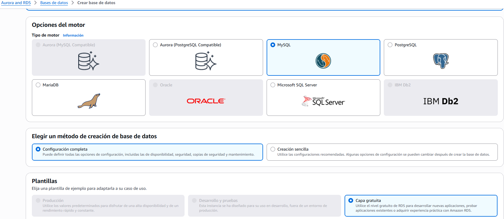
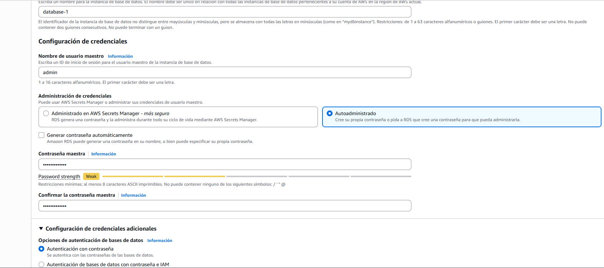
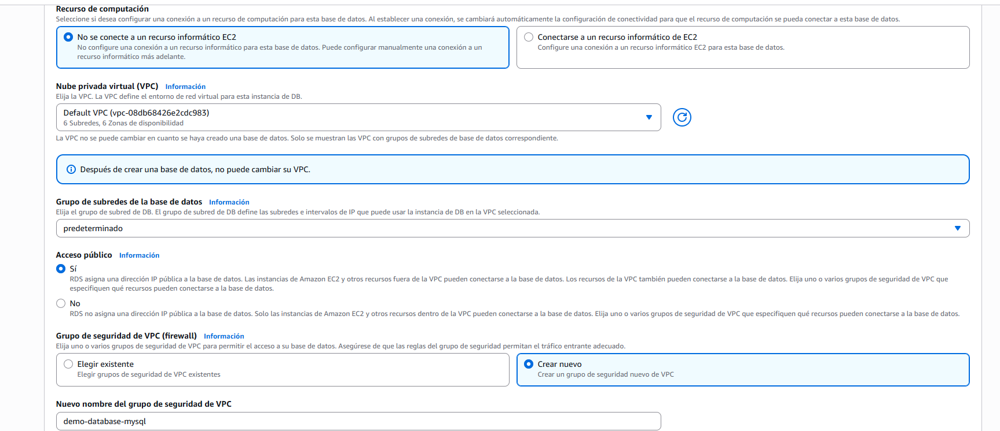
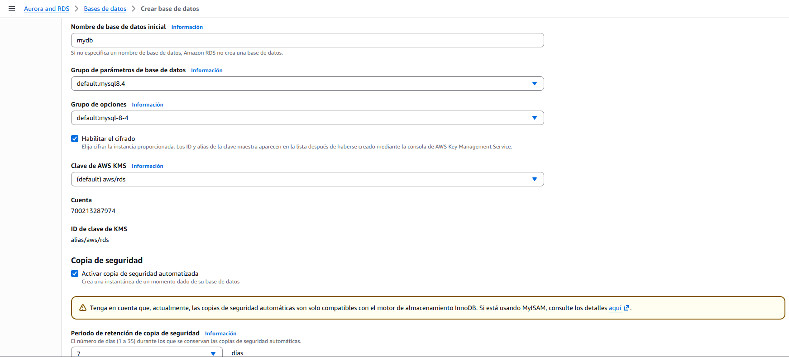
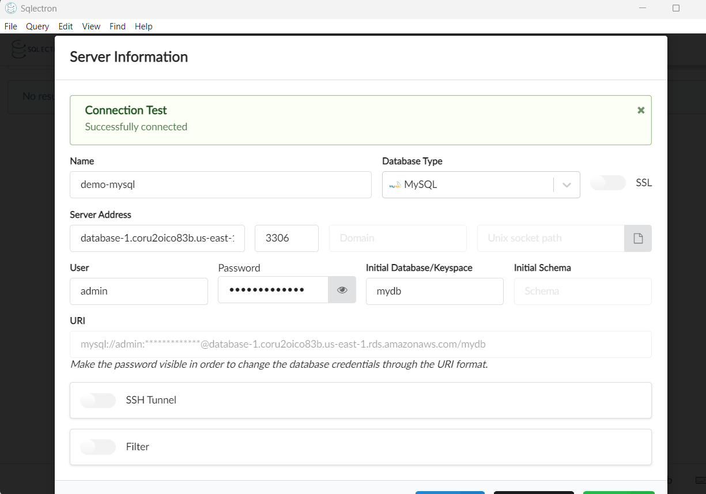

# Introducción a Amazon RDS

Amazon Relational Database Service (RDS) es un servicio administrado que facilita la configuración, operación y escalado de bases de datos relacionales en la nube.

- Proporciona instancias de base de datos preconfiguradas para motores como Amazon Aurora, PostgreSQL, MySQL, MariaDB, Oracle y SQL Server.
- Reduce la carga operativa al encargarse de tareas como backups automáticos, actualizaciones de software, monitoreo y recuperación ante fallos.
- Permite escalar vertical u horizontalmente según la demanda, con opciones de almacenamiento y rendimiento ajustables.

RDS es ideal para aplicaciones que requieren una base de datos relacional confiable y de alta disponibilidad sin la complejidad de administrar la infraestructura subyacente.

## Visión general de Amazon RDS
+ RDS significa Servicio de Base de Datos Relacional
+ Es un servicio de bases de datos gestionado para que las bases de datos utilicen SQL como lenguaje de consulta.
+ Permite crear bases de datos en el Cloud que son gestionadas por AWS
    + Postgres
    + MySQL
    + MariaDB
    + Oracle
    + Microsoft SQL Server
    + Aurora (base de datos propia de AWS)

+ Ventaja sobre el uso de RDS frente al despliegue de la BD en EC2
    - El RDS es un servicio gestionado:
        - Aprovisionamiento automatizado, parcheo del SO
        - Copias de seguridad continuas y restauración a una fecha determinada (Point in Time Restore)
        - Dashboards de monitorización
        - Réplicas de lectura para mejorar el rendimiento de lectura
        - Configuración multi AZ para DR (Disaster Recovery)
        - Ventanas de mantenimiento para actualizaciones
        - Capacidad de escalado (vertical y horizontal)
        - Almacenamiento respaldado por EBS (gp2 o io1)
    - PERO no puedes acceder por SSH a tus instancias

## RDS – Autoescalado de almacenamiento
+ Te ayuda a aumentar el almacenamiento de tu instancia de base de
datos RDS de forma dinámica
+ Cuando RDS detecta que te estás quedando sin almacenamiento
gratuito en la base de datos, escala automáticamente
+ Evita escalar manualmente el almacenamiento de tu base de datos
+ Tienes que establecer el Umbral Máximo de Almacenamiento
(límite máximo de almacenamiento de la BD)
+ Modifica automáticamente el almacenamiento si
    + El almacenamiento gratuito es inferior al 10% del almacenamiento
    asignado
    + El almacenamiento bajo dura al menos 5 minutos
    + Han pasado 6 horas desde la última modificación
+ Útil para aplicaciones con cargas de trabajo imprevisibles
+ Soporta todos los motores de bases de datos RDS (MariaDB, MySQL,
PostgreSQL, SQL Server, Oracle)

## PRACTICA CREAR BBDD

+ Vamos a `RDS y Aurora` y seguimos los pasos para crearla:
  
  
  
  

> Podemos usar [SQL ELECTRON](https://github.com/sqlectron/sqlectron/releases/tag/v1.39.0) para conectarnos a la bbdd.  
  

+ Si queremos eliminar una bbdd creada hay que darle a `Accion - modificar` y quitar la opción de: Habilitar la protección contra la eliminación: Protege la base de datos de eliminarse accidentalmente. Cuando esta opción está habilitada, no puede eliminar la base de datos.

## RDS Personalizada
+ Base de datos gestionada de Oracle y Microsoft SQL Server con
personalización del sistema operativo y de la base de datos
+ RDS: automatiza la configuración, el funcionamiento y el escalado de la base de datos en AWS
+ Personalizada: acceso a la base de datos subyacente y al SO para que puedas:
    + Configurar los ajustes
    + Instalar parches
    + Habilitar las funciones nativas
    + Acceder a la instancia EC2 subyacente mediante SSH o SSM Session Manager
+ Desactivar el Modo de Automatización para realizar tu personalización, mejor tomar una Snapshot de la BD antes
+ RDS vs. RDS Personalizada
    + RDS: toda la base de datos y el SO serán gestionados por AWS
    + RDS Personalizada: acceso administrativo completo al SO subyacente y a la base de datos

## AURORA
+ Aurora es una tecnología propietaria de AWS (no es de código abierto)
+ Tanto Postgres como MySQL se soportan como base de datos de Aurora (eso
significa que tus controladores funcionarán como si Aurora fuera una base de datos Postgres o MySQL)
+ Aurora está "optimizada para la nube de AWS" y afirma que su rendimiento es 5 veces superior al de MySQL en RDS, y más de 3 veces superior al de Postgres en RDS
+ El almacenamiento de Aurora crece automáticamente en incrementos de 10 GB, hasta 128 TB.
+ Aurora puede tener 15 réplicas mientras que MySQL tiene 5, y el proceso de replicación es más rápido (retraso de réplica inferior a 10 ms)
+ La conmutación por error en Aurora es instantánea. Es nativo de Alta Disponibilidad.
+ Aurora cuesta más que RDS (20% más), pero es más eficiente

+ 6 copias de tus datos en 3 AZ:
    + 4 copias de las 6 necesarias para las escrituras
    + 3 copias de las 6 necesarias para las lecturas
    + Autoreparación con replicación entre pares
    + El almacenamiento está dividido en 100 volúmenes

+ Una instancia de Aurora se encarga de las escrituras
(maestra)
+ Recuperación automática del maestro en menos de 30
segundos
+ El maestro + hasta 15 réplicas de lectura de Aurora
realizan lecturas
+ Soporte para la replicación entre regiones

+ Características de Aurora
    - Conmutación automática por error
    - Copia de seguridad y recuperación
    - Aislamiento y seguridad
    - Cumplimiento de la normativa del sector
    - Escalado con un botón
    - Parches automáticos con cero tiempo de inactividad
    - Supervisión avanzada
    - Mantenimiento rutinario
    - Backtrack: restaura los datos en cualquier momento sin usar copias de seguridad

## COPIAS DE SEGURIDAD
+ Copias de seguridad RDS
    + Copias de seguridad automatizadas:
        + Copia de seguridad completa diaria de la base de datos (durante la ventana de mantenimiento)
        + Los logs de transacciones son respaldados por el RDS cada 5 minutos
        + => posibilidad de restaurar a cualquier punto en el tiempo (desde la copia de seguridad más antigua hasta hace 5 minutos)
        + De 1 a 35 días de retención, establece 0 para desactivar las copias de seguridad automáticas
    + Snapshots manuales de la BD:
        + Activadas manualmente por el usuario
        + Retención de la copia de seguridad durante el tiempo que quieras
+ Truco: en una base de datos RDS parada, seguirás pagando por el almacenamiento. Si planeas detenerla durante mucho tiempo, deberías hacer un Snapshot y restaurar en su lugar

+ Copias de seguridad de Aurora:
    - Copias de seguridad automatizadas
        - De 1 a 35 días (no se pueden desactivar)
        - Recuperación puntual en ese intervalo de tiempo
    - Snapshots manuales de la BD
        - Activadas manualmente por el usuario
        - Retención de la copia de seguridad durante el tiempo que quieras

## ELASTICCACHE
- De la misma manera que RDS es para conseguir bases de datos relacionalesges tionadas...
- ElastiCache es para obtener Redis o Memcached gestionados
- Las cachés son bases de datos en memoria con un rendimiento realmente alto y baja latencia
- Ayuda a reducir la carga de las bases de datos para cargas de trabajo de lectura intensiva
- Ayuda a que tu aplicación no tenga estado
- AWS se encarga del mantenimiento/parche del sistema operativo, las optimizaciones, la instalación, la configuración, la supervisión, la recuperación de fallos y las copias de seguridad
- El uso de ElastiCache implica grandes cambios en el código de la aplicación

+ Todas las cachés de ElastiCache:
    + No soportan la autenticación IAM
    + Las políticas de IAM en ElastiCache sólo se utilizan
    para la seguridad a nivel de API de AWS
+ Redis AUTH:
    + Puedes establecer una "contraseña/token" cuando
    crees un Cluster de Redis
    + Se trata de un nivel adicional de seguridad para tu
    caché (además de los grupos de seguridad)
    + Soporta el cifrado SSL en vuelo
+ Memcached:
    + Soporta la autenticación basada en SASL (avanzada)

## Puertos de las bases de datos RDS:

+ PostgreSQL: 5432
+ MySQL: 3306
+ Oracle RDS: 1521
+ Servidor MYSQL: 1433
+ MariaDB: 3306 (igual que MySQL)
+ Aurora: 5432 (si es compatible con PostgreSQL) o 3306 (si es compatible con MySQL)

## RESUMEN

+ La pregunta mental principal: ¿Necesita SQL o NoSQL?
    - SQL (datos estructurados, relaciones) → RDS o Aurora
    - NoSQL (clave-valor, documentos, flexible) → DynamoDB (lo verás más adelante)
    - Caché (rapidez, datos temporales) → ElastiCache

+ RDS:
    - Motores: MySQL, PostgreSQL, Oracle, SQL Server, MariaDB
    - Gestión: AWS gestiona el SO y backups
    - Rendimiento: Estándar
    - Almacenamiento: Fijo, escala manual
    - Coste: Más barato
    - Alta disponibilidad: Multi-AZ con 1 standby

+ Aurora:
    - Motores: MySQL y PostgreSQL compatible
    - Gestión: AWS gestiona todo, más automatizado
    - Rendimiento: 5x más rápido que MySQL, 3x que PostgreSQL
    - Almacenamiento: Automático hasta 128TB
    - Coste: ~20% más caro que RDS
    - Alta disponibilidad: 6 copias en 3 AZs automáticamente

+ Palabras clave examen:
    - "Oracle" o "SQL Server" → RDS obligatoriamente, Aurora no los soporta
    - "alto rendimiento", "escala automática", "managed" → Aurora
    - "coste mínimo" + SQL → RDS

+ La trampa favorita del examen: Multi-AZ no mejora el rendimiento — solo da alta disponibilidad. Si el escenario dice "la base de datos tiene demasiadas lecturas" → Read Replica. Si dice "necesitamos que si falla la BD haya recuperación automática" → Multi-AZ.

+ ElastiCache — cuándo usarlo: Piénsalo como la memoria RAM de tu aplicación. Los datos más consultados se guardan en caché para no ir a la base de datos cada vez.  
Palabras clave: "reducir carga en la base de datos", "consultas repetitivas", "sesiones de usuario", "latencia de milisegundos" → ElastiCache.  
Dos motores:
- Redis → persistencia, backups, Multi-AZ, estructuras de datos complejas. Más potente.
- Memcached → simple, solo caché pura, sin persistencia. Más básico.
> Regla simple: si el examen no especifica, elige Redis. Si dice "simple y sin persistencia" → Memcached.  

```
ElastiCache y Read Replica para reducir lecturas, fíjate siempre en las palabras extra del enunciado:

"mínimo cambio" → la solución más simple sin tocar código
"máximo rendimiento" → la solución más potente aunque requiera cambios
"persistencia" → Redis no Memcached
"simple y sin persistencia" → Memcached
```  

+ RDS Proxy — cuándo usarlo: Cuando tienes muchas conexiones a la base de datos (típico en Lambda con miles de ejecuciones simultáneas). El Proxy agrupa las conexiones para no saturar RDS. Palabra clave: "Lambda + RDS" o "demasiadas conexiones a la BD" → RDS Proxy.

## CUESTIONARIO

Pregunta 1: Amazon RDS soporta las siguientes bases de datos, EXCEPTO:
> "MongoDB" porque Amazon RDS no soporta esta base de datos; en cambio, soporta MySQL, PostgreSQL, MariaDB, Oracle, Microsoft SQL Server y Amazon Aurora.

Pregunta 2: Estás planificando una nueva solución que requiere una base de datos MySQL que debe estar disponible incluso en caso de desastre en una de las Zonas de Disponibilidad. ¿Qué deberías utilizar?  
> "Habilitar Multi-AZ" porque esta opción permite que tu base de datos MySQL esté disponible y operativa incluso si una Zona de Disponibilidad falla, lo que es esencial para la recuperación ante desastres. Estas configuraciones garantizan que tus datos estén replicados automáticamente en otra AZ, mejorando la resiliencia de tu solución. 

Pregunta 3: Tenemos una base de datos RDS que lucha por mantener la demanda de peticiones de nuestro sitio web. Nuestro millón de usuarios lee sobre todo noticias, y no publicamos noticias con mucha frecuencia. ¿Qué solución NO se adapta a este problema?
> "RDS Multi-AZ" porque esta opción se centra en la alta disponibilidad y recuperación ante desastres, no en escalar las lecturas de la base de datos. Para tu situación, donde necesitas manejar una alta demanda de solicitudes de lectura, las Réplicas de Lectura RDS o ElastiCache serían más adecuadas para mejorar el rendimiento.

Pregunta 4: Has configurado réplicas de lectura en tu base de datos RDS, pero los usuarios se quejan de que, al actualizar sus publicaciones en las redes sociales, no ven sus publicaciones actualizadas de inmediato. ¿Cuál es la posible causa de esto?
> as réplicas de lectura en RDS funcionan con replicación asíncrona, lo que significa que los datos pueden no estar completamente sincronizados con la base de datos principal. Esto puede resultar en una consistencia eventual, provocando que los usuarios no vean de inmediato las actualizaciones que han realizado.

Pregunta 5: ¿Qué función de RDS (NO de Aurora), cuando se utiliza, no requiere que cambies la cadena de conexión SQL?
>  "Multi-AZ" porque esta función te permite mantener la misma cadena de conexión a la base de datos, sin importar qué instancia esté activa, lo que simplifica la administración y mejora la disponibilidad. Esto refleja el objetivo de asegurar la operación continua de la base de datos, un aspecto fundamental en la gestión de AWS. 

Pregunta 6: Tu aplicación se ejecuta en una flota de instancias EC2 gestionadas por un Auto Scaling Groups detrás de un Application Load Balancer. Los usuarios tienen que volver a iniciar sesión constantemente y no quieres habilitar las Sesiones Pegajosas en tu ALB porque temes que sobrecargue algunas instancias de EC2. ¿Qué debes hacer?
> "Almacenar los datos de sesión en ElastiCache" porque este enfoque permite que diversas instancias de EC2 compartan el estado de la sesión del usuario de manera eficiente, mejorando el rendimiento y evitando la sobrecarga en las instancias. Esto es fundamental para asegurar una experiencia fluida para los usuarios en aplicaciones escalables.

Pregunta 7: Una aplicación de análisis está realizando sus consultas contra tu base de datos RDS principal de producción. Estas consultas se ejecutan a cualquier hora del día y ralentizan la base de datos RDS, lo que afecta a la experiencia de tus usuarios. ¿Qué deberías hacer para mejorar la experiencia de los usuarios?
> "Configurar una Réplica de Lectura" correctamente porque permite que las consultas de tu aplicación de análisis se dirijan a esta réplica, aliviando la carga en la base de datos RDS principal y mejorando la experiencia del usuario al mantener un rendimiento óptimo en la base de datos de producción.

Pregunta 8: Te gustaría asegurarte de que tienes una réplica de tu base de datos disponible en otra región de AWS si se produce un desastre en tu región de AWS principal. ¿Qué base de datos recomiendas para implementar esto fácilmente?
> "Base de datos global Aurora" porque esta solución permite replicar tus datos en otra región de AWS, ofreciendo hasta cinco regiones secundarias, lo que es ideal para recuperación ante desastres a nivel regional. Esto asegura una alta disponibilidad y resistencia para tus aplicaciones.

Pregunta 9: ¿Cómo puedes mejorar la seguridad de tu clúster ElastiCache Redis obligando
>  "Utiliza Redis Auth" porque esta opción permite establecer una contraseña que los usuarios deben proporcionar al conectarse a tu clúster de ElastiCache Redis, mejorando así la seguridad del acceso a tus datos.

Pregunta 10: Tu empresa tiene una aplicación Node.js en producción que utiliza RDS MySQL 5.6 como base de datos. Una nueva aplicación programada en Java realizará una gran carga de trabajo de análisis para crear un dashboards cada hora. ¿Cuál es la solución más rentable que puedes implementar para minimizar la interrupción de la aplicación principal?
> "Crea una Réplica de Lectura en una AZ diferente y ejecuta la carga de trabajo de análisis en la base de datos de la réplica" porque esta opción permite dirigir las consultas de análisis a la réplica, reduciendo la carga en la base de datos principal y asegurando que la aplicación continúe funcionando sin interrupciones. 

Pregunta 11: Te gustaría crear una estrategia de recuperación de desastres para tu base de datos PostgreSQL de RDS, de modo que en caso de una caída regional, la base de datos pueda estar disponible rápidamente para cargas de trabajo de lectura y escritura en otra región de AWS. La base de datos de recuperación de desastres debe estar altamente disponible. ¿Qué recomiendas?
>  "Crea una Réplica de Lectura en una región diferente y habilita Multi-AZ en la Réplica de Lectura" porque esta estrategia garantiza alta disponibilidad y un rápido acceso a tu base de datos de recuperación de desastres en caso de una caída regional, permitiendo cargas de trabajo de lectura y escritura sin interrupciones. 

Pregunta 12: Has migrado la base de datos MySQL de las instalaciones a RDS. Tienes muchas aplicaciones y desarrolladores que interactúan con tu base de datos. Cada desarrollador tiene un usuario IAM en la cuenta AWS de la empresa. ¿Cuál es el enfoque adecuado para dar acceso a los desarrolladores a la instancia de la base de datos RDS de MySQL en lugar de crear un usuario de la base de datos para cada uno?
> Activa la autenticación de la base de datos de IAM" porque esta opción permite que los usuarios de IAM se autentiquen directamente en la base de datos RDS sin necesidad de crear cuentas adicionales en la base de datos, lo que simplifica la gestión de acceso y mejora la seguridad.

Pregunta 13: ¿Cuál de las siguientes afirmaciones es cierta respecto
> "La Réplica de Lectura utiliza la Replicación Asíncrona y la Multi-AZ utiliza la Replicación Síncrona" porque en RDS, las réplicas de lectura utilizan replicación asíncrona para permitir una baja latencia en las consultas, mientras que Multi-AZ utiliza replicación síncrona para garantizar que los datos estén siempre disponibles y actualizados en la instancia de respaldo. 

Pregunta 14: ¿Cómo se encripta una instancia de BD RDS no encriptada?
> para encriptar una instancia de base de datos RDS que no está encriptada, necesitas crear una Snapshot de la instancia, copiarla seleccionando la opción de activar la encriptación, y luego restaurar desde esa Snapshot encriptada. Este proceso es necesario ya que no se puede habilitar la encriptación directamente en una instancia existente.

Pregunta 15: Para tu base de datos RDS, puedes tener hasta ............ Réplicas de Lectura.
> 5 porque en Amazon RDS puedes tener hasta cinco réplicas de lectura para tu base de datos principal, lo cual permite mejorar el rendimiento de las lecturas y escalar tu aplicación de manera efectiva.

Pregunta 16: ¿Qué tecnología de base de datos RDS NO soporta la Autenticación de Bases de Datos IAM?
> "Oracle" porque esta tecnología de base de datos RDS no soporta la Autenticación de Bases de Datos IAM, mientras que PostgreSQL y MySQL sí la permiten. 

Pregunta 17: Tienes una instancia de base de datos RDS sin cifrar y quieres crear réplicas de lectura. ¿Puedes configurar las Réplicas de Lectura RDS para que estén cifradas?
> "No" es correcta porque no puedes crear réplicas de lectura encriptadas a partir de una instancia RDS que no está encriptada. Esto subraya la importancia de planificar la encriptación desde el inicio si se desea aprovechar esta característica en el futuro. 

Pregunta 18: Una aplicación que se ejecuta en producción utiliza un Cluster Aurora como base de datos. Tu equipo de desarrollo quiere ejecutar una versión de la aplicación a escala con la capacidad de realizar alguna carga de trabajo pesada en función de las necesidades. La mayor parte del tiempo, la aplicación no se utilizará. Tu CIO te ha encargado que ayudes al equipo a conseguirlo minimizando los costes. ¿Qué sugieres?
> "Utiliza Aurora Serverless" porque esta opción permite que tu base de datos escale automáticamente según las necesidades de carga de trabajo, lo que ayuda a minimizar costos al no tener instancias siempre activas. Esto es ideal para aplicaciones que tienen períodos de baja actividad, como la que mencionas.

Pregunta 19: ¿Cuántas réplicas de lectura de Aurora se pueden tener en un solo clúster de bases de datos de Aurora?
>  "15" porque un solo clúster de bases de datos de Aurora puede tener hasta 15 réplicas de lectura. Esto es importante para escalar tu aplicación y mejorar la disponibilidad sin afectar el rendimiento de la base de datos principal.

Pregunta 20: Amazon Aurora soporta las dos bases de datos ...........................
> MySQL y PostgreSQL" porque Amazon Aurora es compatible con estos dos sistemas de gestión de bases de datos, permitiendo a los usuarios aprovechar sus características de escalabilidad y rendimiento. 

Pregunta 21: Trabajas como arquitecto de soluciones para una empresa de juegos. Uno de los juegos exige que los jugadores se clasifiquen en tiempo real en función de su puntuación. Tu jefe te ha pedido que diseñes e implementes una solución eficaz y de alta disponibilidad para crear una tabla de clasificación de juegos. ¿Qué deberías utilizar?
> Utiliza ElastiCache para Redis - Conjuntos ordenados" porque esta opción permite almacenar y gestionar clasificaciones en tiempo real, ofreciendo alta disponibilidad y rendimiento para manejar la carga de jugadores en un juego. Los conjuntos ordenados en Redis son ideales para este tipo de aplicaciones, ya que permiten clasificaciones rápidas y eficaces.

Pregunta 22: Necesitas una personalización completa de una base de datos Oracle en AWS. Te gustaría beneficiarte del uso de los servicios de AWS. ¿Qué recomiendas?
>  "RDS personalizado para Oracle" porque ofrece una solución optimizada que te permite aprovechar la infraestructura de AWS mientras personalizas tu base de datos Oracle según tus necesidades específicas. Esto asegura que obtengas funcionalidad y escalabilidad sin sacrificar el control sobre la configuración de tu base de datos.

Pregunta 23: Necesitas almacenar copias de seguridad a largo plazo para tu base de datos Aurora con fines de recuperación de desastres y auditoría. ¿Qué recomiendas?
> "Realiza copias de seguridad bajo demanda" porque esta opción permite almacenar copias de seguridad de tu base de datos Aurora de manera flexible y prolongada, lo cual es crucial para la recuperación de desastres y auditoría. Esto asegura que puedas retener datos más allá del límite de 35 días que tienen las copias de seguridad automatizadas.

Pregunta 24: Tu equipo de desarrollo quiere realizar un conjunto de pruebas de lectura y escritura contra tu base de datos Aurora de producción porque necesita acceder a los datos de producción lo antes posible. ¿Qué aconsejas?
> Utiliza la función de clonación de Aurora" porque esta opción permite crear un entorno de prueba que replica los datos de producción de manera rápida y eficiente, sin afectar la base de datos principal. Esto es ideal para tus necesidades de acceso inmediato a datos para pruebas de lectura y escritura.

Pregunta 25: Tienes 100 instancias de EC2 conectadas a tu base de datos RDS y ves que, tras un mantenimiento de la base de datos, todas tus aplicaciones tardan mucho en volver a conectarse a RDS, debido a una mala lógica de aplicación. ¿Cómo puedes mejorar esto?
> "Utiliza un proxy RDS" porque este servicio permite administrar y mantener conexiones activas a la base de datos RDS, lo que reduce significativamente el tiempo que tardan tus aplicaciones en volver a conectarse después de un mantenimiento. Esta optimización es crucial para mejorar el rendimiento y la disponibilidad de tus aplicaciones. 


## PREGUNTAS TIPO EXAMEN 

**Pregunta 1**:  
Una aplicación web tiene una base de datos RDS MySQL que sufre lentitud porque el 80% de las operaciones son lecturas repetitivas de un catálogo de productos. ¿Qué solución mejora el rendimiento con mínimo cambio?
A) Migrar a Multi-AZ  
**B) Crear Read Replicas**  
C) Activar RDS Proxy  
D) Migrar a ElastiCache  
> B) Crear Read Replicas: Migrar a ElastiCache requiere modificar el código de la aplicación para que consulte primero la caché antes de ir a la BD — es un cambio arquitectónico importante. Crear una Read Replica en cambio no requiere tocar el código, solo redirigir las lecturas a la réplica. Cuando el examen dice "mínimo cambio" o "sin modificar la aplicación" → busca la solución más directa. ElastiCache sería correcto si el enunciado dijera "máximo rendimiento" o "reducir latencia al mínimo" sin mencionar el coste de implementación.  

**Pregunta 2**  
Una empresa necesita una base de datos SQL de alto rendimiento que escale automáticamente el almacenamiento y tenga alta disponibilidad con 6 copias de los datos. No usan Oracle ni SQL Server. ¿Qué eligen?
A) RDS MySQL Multi-AZ  
B) RDS PostgreSQL  
**C) Amazon Aurora**  
D) ElastiCache Redis  
> C) Amazon Aurora: 6 copias en 3 AZs + escala automática + alto rendimiento = Aurora siempre. Y has captado el matiz importante: no usan Oracle ni SQL Server, así que Aurora es viable.  

**Pregunta 3**  
Una aplicación serverless usa Lambda que puede generar 10.000 conexiones simultáneas a RDS. La base de datos empieza a fallar por exceso de conexiones. ¿Qué solución aplican?
A) Aumentar el tamaño de la instancia RDS  
B) Crear Read Replicas  
**C) Usar RDS Proxy**  
D) Migrar a Aurora  
> C) Usar RDS Proxy: Lambda + demasiadas conexiones = RDS Proxy siempre. El Proxy mantiene un pool de conexiones reutilizables para que Lambda no abra una conexión nueva por cada ejecución.  

**Pregunta 4**  
Una web de e-commerce almacena las sesiones de usuario en la base de datos RDS, causando latencia. Quieren que las sesiones se guarden con acceso en milisegundos y que persistan aunque el servidor de caché se reinicie. ¿Qué eligen?
A) ElastiCache Memcached  
B) RDS Read Replica  
**C) ElastiCache Redis**  
D) Aurora  
> C) ElastiCache Redis: bien pillado el matiz: "que persistan aunque se reinicie" = necesita persistencia = Redis. Memcached no tiene persistencia — si se reinicia, pierdes todo. Esa palabra "persistencia" es la clave que diferencia Redis de Memcached en el examen.