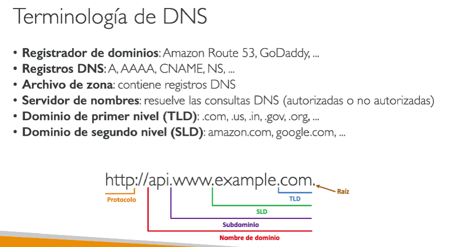

# DNS (Domain Name System)

+ DNS es un sistema de nombres de dominio que traduce nombres de dominio legibles por humanos en direcciones IP numéricas. Es fundamental para la operación de internet y permite a los usuarios acceder a recursos utilizando nombres en lugar de memorizar direcciones IP.

+ Conceptos Clave: 
    - **Nombre de Dominio**: Identificador legible como `example.com`
    - **Dirección IP**: Identificador numérico como `192.0.2.1`
    - **Resolución DNS**: Proceso de traducción de nombre a IP
    - **Servidor DNS**: Servidor que almacena y proporciona información de resolución de nombres

## Route 53

### Introducción

Route 53 es el servicio DNS de Amazon Web Services que permite registrar nombres de dominio, enrutar tráfico de internet hacia los recursos y verificar la salud de los recursos. Ofrece alta disponibilidad, escalabilidad y está completamente integrado con otros servicios de AWS.

### Características Principales

- Un DNS altamente disponible, escalable, totalmente gestionado y autoritativo.
- **Registro de Dominios**: Registrar y gestionar dominios directamente en AWS
- **Resolución DNS**: Traducir nombres de dominio a direcciones IP
- **Health Checks**: Monitorear la salud de los recursos y cambiar el tráfico automáticamente
- **Routing Policies**: Múltiples estrategias de enrutamiento para distribuir tráfico
- **Integración con AWS**: Compatible con ELB, CloudFront, S3, y otros servicios  

### REGISTROS
+ Cómo quieres dirigir el tráfico de un dominio
+ Cada registro contiene
    + Nombre del dominio/subdominio - por ejemplo, ejemplo.com
    + Tipo de registro - por ejemplo, A o AAAA
    + Valor - por ejemplo, 12.34.56.78
    + Política de enrutamiento - cómo responde Route 53 a las consultas
    + TTL - cantidad de tiempo que el registro se almacena en caché en los Resolvers DNS
+ Route 53 soporta los siguientes tipos de registros DNS:
    + (obligatorio) A / AAAA / CNAME / NS
    + (avanzado) CAA / DS / MX / NAPTR / PTR / SOA / TXT / SPF / SRV

### TIPOS DE REGISTRO
+ A - asigna un nombre de host a IPv4
+ AAAA - asigna un nombre de host a IPv6
+ CNAME - asigna un nombre de host a otro nombre de host
    + El objetivo es un nombre de dominio que debe tener un registro A o AAAA
    + No puedes crear un registro CNAME para el nodo superior de un espacio de nombres DNS (Zona Apex)
    + Ejemplo: no puedes crear para example.com, pero sí para
    www.example.com
+ NS - Servidores de nombres para la Zona Alojada
    + Controla cómo se enruta el tráfico de un dominio

### ZONAS DE ALOJAMIENTO
+ Un contenedor para los registros que definen cómo dirigir el tráfico a un
dominio y sus subdominios
+ Zonas de alojamiento público: contiene registros que especifican cómo
enrutar el tráfico en Internet (nombres de dominio público)
application1.mypublicdomain.com
+ Zonas de alojamiento privadas: contienen registros que especifican cómo
enrutar el tráfico dentro de una o más VPC (nombres de dominio privados)
application1.company.internal
+ Pagas 0,50$ al mes por zona alojada

### TTL
+ TTL alto - por ejemplo, 24 horas:
    + Menos tráfico en Route 53
    + Registros posiblemente obsoletos
+ TTL bajo - por ejemplo, 60 seg.
    + Más tráfico en la Route 53 ($$)
    + Los registros están desfasados durante menos tiempo
    + Facilidad para cambiar los registros
+ Excepto los registros de Alias, el TTL es obligatorio para cada registro DNS

### COMANDOS
+ Instalar paquetes con `sudo yum install bind-utils`

+ Traductor DNS con `nslookup dominio.com` 

+ TTL con `dig xxx.dominio.com`

### CNAME vs Alias
+ Los recursos de AWS (Load Balancer, CloudFront...) exponen un nombre de host de AWS:
    + lb1-1234.us-east-2.elb.amazonaws.com y quieres myapp.midominio.com
+ CNAME:
    + Apunta un nombre de host a cualquier otro nombre de host. (app.midominio.com => blabla.algo.com)
    + SÓLO PARA DOMINIOS NO ROOT (algo.midominio.com)
+ Alias:
    + Apunta un nombre de host a un recurso de AWS (app.mydomain.com => blabla.amazonaws.com)
    + Funciona para DOMINIO RAÍZ y DOMINIO NO RAÍZ (mydomain.com)
    + Gratis
    + Comprobación de salud nativa

### Route 53 - Políticas de enrutamiento
+ Definir cómo responde Route 53 a las consultas DNS
+ No te confundas con la palabra "Enrutamiento"
    - No es lo mismo que el enrutamiento del Load Balancer, que enruta el tráfico
    - El DNS no enruta ningún tráfico, sólo responde a las consultas del DNS
+ Route 53 soporta las siguientes políticas de enrutamiento:
    - Simple: Normalmente, dirige el tráfico a un solo recurso
    - Ponderada: Asigna un peso de 0 a un registro para dejar de enviar tráfico a un recurso
    - Conmutación por error: failover
    - Basada en la latencia: Redirigir al recurso que tenga la menor latencia cerca de nosotros
    - Geolocalización: Este enrutamiento se basa en la ubicación del usuario. Especifica la ubicación por continente, país o estado.
    - Respuesta multivalente: Utilízalo cuando dirijas el tráfico a múltiples recursos
    - Geoproximidad (utilizando la función de flujo de tráfico de Route 53): Dirige el tráfico a tus recursos en función de la ubicación geográfica de los usuarios y los recursos

### Registrar el dominio vs. Servicio DNS

+ Compras o registras tu nombre de dominio con un Registrador de Dominios,
normalmente pagando una cuota anual (por ejemplo, GoDaddy, Amazon
Registrar Inc., ...)
+ El Registrador de dominios suele proporcionarte un servicio de DNS para
gestionar tus registros de DNS
+ Pero puedes utilizar otro servicio DNS para gestionar tus registros DNS
+ Ejemplo: compra el dominio a GoDaddy y utiliza Route 53 para gestionar tus registros DNS

+ Si compras tu dominio en un registrador de terceros, puedes seguir
utilizando Route 53 como proveedor de servicios DNS. Solo hay que cambiar los Nameservers de ese proveedor y poner los nameserver de route 53 para poder utilizar los servidores de nombres de AWS.

### RESUMEN

+ Tipos de registros — solo los que importan en el examen:
    - A: Dominio → IPv4: empresa.com → 1.2.3.4
    - AAAA: Dominio → IPv6: empresa.com → IPv6
    - CNAME: Dominio → otro dominio: www.empresa.com → empresa.com
    - Alias: Dominio → recurso AWS: empresa.com → ALB, CloudFront, S3

+ La trampa más repetida del examen — CNAME vs Alias:
    - CNAME no puede usarse en el dominio raíz (empresa.com). Solo en subdominios (www.empresa.com)
    - Alias sí puede usarse en el dominio raíz y además es gratis dentro de AWS
    - Regla: si apunta a un recurso AWS → Alias siempre. Si apunta a dominio externo → CNAME

+ Políticas de enrutamiento — con escenarios reales:
    - Simple → un dominio, una respuesta. Sin lógica. Ejemplo: startup pequeña con un solo servidor.
    - Weighted (Ponderada) → repartes el tráfico por porcentajes. Ejemplo real: tienes una versión nueva de tu app y quieres probarla con el 10% del tráfico antes de migrar el 100%. También para distribuir carga entre regiones.
    - Latency (Latencia) → manda al usuario al servidor más cercano en tiempo de respuesta. Ejemplo real: tienes servidores en Irlanda y Singapur, un usuario de España va a Irlanda automáticamente porque tiene menos latencia.
    - Failover → tienes un servidor primario y uno secundario. Si el primario falla el health check, todo el tráfico va al secundario automáticamente. Ejemplo real: disaster recovery, web con backup en otra región.
    - Geolocation (Geolocalización) → según el país o continente del usuario. Ejemplo real: usuarios de España ven la web en español, usuarios de Francia en francés. O cumplimiento legal — usuarios de Europa solo pueden acceder a servidores europeos por GDPR.
    - Geoproximity → como geolocalización pero puedes ajustar el "peso" geográfico para atraer más o menos tráfico hacia una región. Ejemplo real: quieres mover gradualmente tráfico de una región a otra.
    - Multivalue → devuelve hasta 8 IPs aleatorias con health checks. No es un Load Balancer pero actúa parecido para tráfico simple. Ejemplo real: varias instancias sin ELB que necesitan distribución básica.

+ La tabla mental para el examen:
    - "probar nueva versión con X% del tráfico" → Weighted
    - "el usuario más rápido posible" → Latency
    - "si falla el primario, usar el secundario" → Failover
    - "usuarios de cada país a su servidor" → Geolocation
    - "cumplimiento legal por país" → Geolocation
    - "mover tráfico gradualmente entre regiones" → Geoproximity
    - "varias IPs sin Load Balancer" → Multivalue

### CUESTIONARIO

**Pregunta 1:**  
Has comprado mycoolcompany.com en el Registrador Route 53 de Amazon y quieres que el dominio apunte a tu Elastic Load Balancer my-elb-1234567890.us-west-2.elb.amazonaws.com. ¿Qué tipo de registro de Route 53 debes utilizar aquí?
> "Alias" porque, en Amazon Route 53, un registro Alias permite apuntar directamente a servicios de AWS como Elastic Load Balancers sin el problema que presenta un registro CNAME en un nodo superior del espacio de nombres DNS, donde no se permite su uso.

**Pregunta 2:**  
Has desplegado un nuevo entorno de Elastic Beanstalk y te gustaría dirigir el 5% de tu tráfico de producción a este nuevo entorno. Esto te permite monitorizar las métricas de CloudWatch y asegurarte de que no existen errores en tu nuevo entorno. ¿Qué tipo de Registro de Route 53 te permite hacerlo?
> "Ponderado" porque esta política de enrutamiento te permite distribuir un porcentaje específico del tráfico hacia tu nuevo entorno de Elastic Beanstalk, lo que te ayuda a monitorizar su rendimiento sin afectar la experiencia del usuario. Esto es esencial para asegurarte de que no hay errores antes de realizar un cambio completo.  

**Pregunta 3:**  
Has actualizado el valor myapp.mydomain.com de un Registro Route 53 para que apunte a un nuevo Elastic Load Balancer, pero parece que los usuarios siguen siendo redirigidos al antiguo ELB. ¿Cuál es la posible causa de este comportamiento?
> "Debido al TTL" porque el TTL (Time To Live) determina cuánto tiempo los registros DNS se almacenan en caché por los clientes. Si el TTL es alto, los usuarios seguirán siendo redirigidos al antiguo Elastic Load Balancer hasta que expire el tiempo de caché, lo que explica el comportamiento que observas.

**Pregunta 4:**  
Tienes una aplicación que está alojada en dos regiones de AWS diferentes us-west-1 y eu-west-2. Quieres que tus usuarios obtengan la mejor experiencia de usuario posible minimizando el tiempo de respuesta de los servidores de la aplicación a sus usuarios. ¿Qué política de enrutamiento Route 53 debes elegir?
> "Latencia" porque esta política de enrutamiento optimiza la experiencia del usuario al redirigir las solicitudes a la región de AWS que ofrezca la menor latencia, lo que se traduce en respuestas más rápidas desde los servidores de tu aplicación. Esto es fundamental para mejorar el tiempo de respuesta y, por ende, la satisfacción del usuario.

**Pregunta 5:**  
Tienes un requisito legal por el que las personas de cualquier país, excepto Francia, NO deben poder acceder a tu sitio web. ¿Qué política de Route 53 te ayuda a conseguirlo?
> "Geolocalización" porque esta política de enrutamiento de Route 53 permite redirigir el tráfico en función de la ubicación del usuario, asegurando que solo las personas fuera de Francia puedan acceder a tu sitio web, cumpliendo así con tu requisito legal.

**Pregunta 6:**  
Has comprado un dominio en GoDaddy y quieres utilizar Route 53 como proveedor de servicios DNS. ¿Qué debes hacer para que esto funcione?
> "Crea una Zona Pública Alojada y actualiza los registros NS del Registrador de terceros" porque las Zonas Públicas Alojadas permiten que tu sitio web sea accesible a través de Internet, y es crucial actualizar los registros NS en GoDaddy para que redirijan las solicitudes a Route 53.

**Pregunta 7:**  
¿Cuál de las siguientes NO es una comprobación válida de la salud de Route 53?
> "Comprobación de salud que monitoriza la cola SQS" porque esta comprobación no es válida en Route 53; las comprobaciones de salud se utilizan para supervisar endpoints HTTP/HTTPS, no colas SQS. Esto refuerza tu comprensión de los tipos de comprobaciones de salud que puede utilizar Route 53.

## PREGUNTAS TIPO EXAMEN

+ Pregunta 1: Una empresa lanza una nueva versión de su aplicación. Quieren que el 5% del tráfico vaya a la nueva versión y el 95% a la versión actual para validarla antes del despliegue completo. ¿Qué política de Route 53 usan?  
A) Latency  
B) Failover  
**C) Weighted**  
D) Geolocation  
> C) Weighted/Ponderada: Este escenario se llama blue/green deployment o canary testing en el mundo real — probar una versión nueva con poco tráfico antes de migrar todo. Weighted es exactamente la herramienta para eso.  

+ Pregunta 2: Una empresa tiene servidores en us-east-1 y ap-southeast-1. Quieren que cada usuario sea dirigido automáticamente al servidor que le responda más rápido. ¿Qué política usan?  
A) Geolocation  
B) Weighted  
C) Multivalue  
**D) Latency**  
> D) Latency: El matiz importante: Latency no mide distancia geográfica sino tiempo de respuesta real. Un usuario en Brasil podría ir a us-east-1 en vez de sa-east-1 si us-east-1 responde más rápido en ese momento.

+ Pregunta 3: Una empresa necesita que si su servidor principal falla, el tráfico se dirija automáticamente a un servidor de backup en otra región. ¿Qué política usan?  
A) Multivalue  
**B) Failover**  
C) Weighted  
D) Simple  
> B) Failover: Y el detalle técnico: Failover requiere Health Checks obligatoriamente — Route 53 necesita saber que el primario ha fallado para activar el secundario. Sin Health Check no hay Failover automático.

+ Pregunta 4: Una plataforma de streaming necesita que los usuarios europeos solo accedan a servidores en Europa por requisitos legales de GDPR. ¿Qué política usan?  
A) Latency  
B) Geoproximity  
**C) Geolocation**  
D) Weighted  
> C) Geolocation: La diferencia clave con Latency: Geolocation es determinista — un usuario de España siempre va al servidor europeo independientemente de la latencia. Latency es dinámico — va donde responda más rápido. Para cumplimiento legal necesitas certeza, no optimización.

+ Pregunta 5: Un equipo quiere apuntar su dominio raíz empresa.com directamente a un Application Load Balancer de AWS. ¿Qué tipo de registro DNS usan?  
A) CNAME  
B) A record  
**C) Alias**  
D) AAAA  
> C) Alias: Y has clavado el motivo implícito — CNAME no puede usarse en dominio raíz, y Alias sí. Además Alias no cobra por las consultas DNS cuando apunta a recursos AWS, CNAME sí. Doble ventaja.