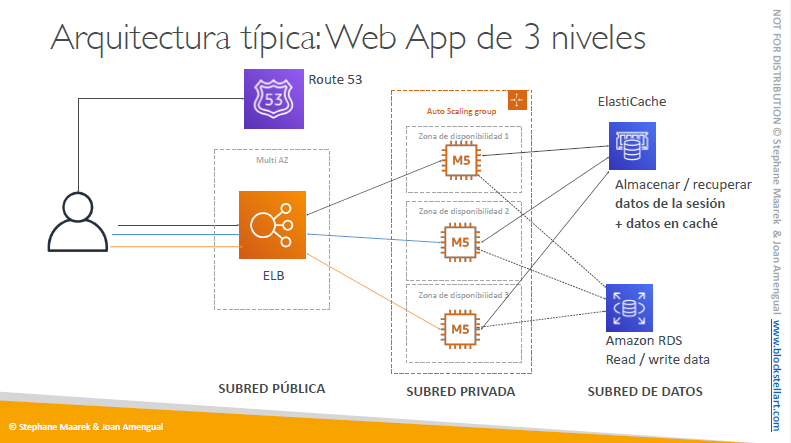
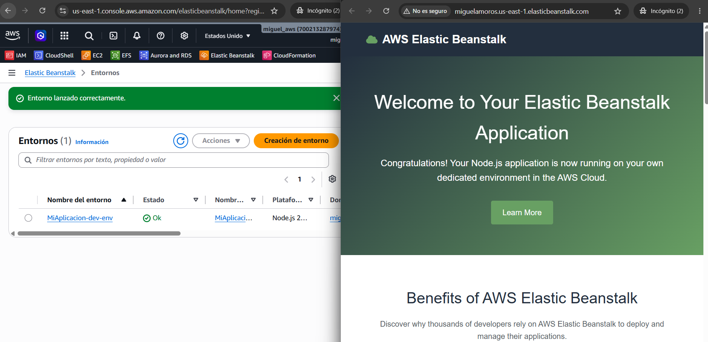

# Soluciones clásicas de arquitectura en AWS

## Ejemplos para usar en la construcción de arquitecturas
+ IP pública vs privada e instancias EC2
+ Elastic IP vs Route 53 vs Load Balancers
+ Route 53 TTL, registros A y registros Alias
+ Mantener las instancias EC2 manualmente vs Auto Scaling Group
+ Multi AZ para sobrevivir a los desastres
+ Comprobaciones de salud del ELB
+ Reglas de grupos de seguridad
+ Reserva de capacidad para ahorrar costes cuando sea posible
+ Estamos considerando 5 pilares para una aplicación bien
+ Sesiones persistentes del ELB
+ Clientes web para almacenar cookies y hacer que nuestra aplicación web sea sin estado
+ ElastiCache
+ Para almacenar sesiones (alternativa: DynamoDB)
+ Para almacenar en caché los datos de RDS
+ Multi AZ
+ RDS
+ Para almacenar los datos de los usuarios
+ Réplicas de lectura para escalar las lecturas
+ Multi AZ para la recuperación de desastres
+ Seguridad estricta con grupos de seguridad que se referencian entre sí

  

## ELASTIC BEANSTALK

+ Elastic Beanstalk es una visión centrada en el desarrollador de la
implementación de una aplicación en AWS
+ Utiliza todos los componentes que hemos visto antes: EC2, ASG, ELB, RDS, ...
+ Servicio gestionado
+ Gestiona automáticamente el aprovisionamiento de capacidad, el
equilibrio de carga, el escalado, la supervisión del estado de la aplicación, la configuración de las instancias, ...
+ Sólo el código de la aplicación es responsabilidad del desarrollador
+ Seguimos teniendo el control total de la configuración
+ Beanstalk es gratis pero pagas por las instancias subyacentes
> Este servicio te permite meter tu aplicación en un entorno en el cual ya AWS te gestiona todo el proceso de instancias, redes, loadbalancer, autoscaling,etc a la hora de crear la aplicación  

  

### 1. Arquitectura de 3 capas
- Capa de presentación: Amazon CloudFront, Elastic Load Balancer (ALB) o AWS Amplify.
- Capa de aplicación: Amazon EC2, AWS Elastic Beanstalk, ECS o EKS.
- Capa de datos: Amazon RDS, Aurora, DynamoDB o Amazon ElastiCache.
- Uso común para aplicaciones web tradicionales con escalado horizontal y alta disponibilidad.

### 2. Arquitectura sin servidor (Serverless)
- AWS Lambda para lógica de negocio.
- Amazon API Gateway para exposiciones de API.
- DynamoDB o Amazon Aurora Serverless para persistencia.
- Amazon S3 para almacenamiento de objetos.
- Ideal para cargas variables y desarrollo rápido.

### 3. Microservicios y contenedores
- Amazon ECS con Fargate para despliegue de contenedores sin administrar infraestructura.
- Amazon EKS para Kubernetes gestionado.
- Service Discovery con AWS Cloud Map.
- ALB o NLB para enrutamiento entre servicios.

### 4. Alta disponibilidad y tolerancia a fallos
- Multi-AZ para bases de datos y servicios críticos.
- Multi-región para recuperación ante desastres.
- Elastic Load Balancer y Auto Scaling para distribuir carga.
- Replicación de datos entre zonas y regiones.

### 5. Arquitectura de datos y analítica
- Ingesta: Amazon Kinesis, AWS Data Pipeline o AWS Glue.
- Almacenamiento: Amazon S3 como data lake.
- Procesamiento: AWS Glue, Amazon EMR, Amazon Redshift.
- Visualización: Amazon QuickSight.

### 6. Seguridad y operaciones
- VPC con subredes públicas y privadas.
- IAM para control de acceso y políticas de permisos.
- AWS WAF, Shield y AWS Config para protección y cumplimiento.
- Monitorización: Amazon CloudWatch, AWS X-Ray y AWS CloudTrail.

### 7. Ejemplo clásico de arquitectura web
- Cliente -> CloudFront -> ALB -> ECS/EKS/EC2 -> RDS/Aurora.
- S3 para activos estáticos, Route 53 para DNS.
- CloudWatch para logs y métricas.

## CUESTIONARIO

**Pregunta 1:**  
Tu sitio web TriangleSunglasses.com está alojado en una flota de instancias de EC2 gestionadas por un Auto Scaling Groups y encabezadas por un Application Load Balancer. Tu ASG ha sido configurado para escalar bajo demanda en función del tráfico que va a tu sitio web. Para reducir los costes, has configurado el ASG para que escale en función del tráfico que pase por el ALB. Para que la solución sea de alta disponibilidad, has actualizado tu ASG y has establecido la capacidad mínima en 2. ¿Cómo puedes reducir aún más los costes respetando los requisitos?  
>  "Reservar dos instancias EC2" porque esto garantiza que siempre tendrás dos instancias ejecutándose, lo cual es esencial para mantener la alta disponibilidad. Al hacerlo, también puedes optimizar los costos ya que se evita el inicio dinámico de instancias que puede ser más costoso.

**Pregunta 2:**  
¿Cuál de las siguientes opciones NO nos ayudará a la hora de diseñar un nivel de aplicación STATELESS?
>  "Almacenar los datos de la sesión en volúmenes EBS" porque estos volúmenes están asociados a una única instancia EC2 en una zona de disponibilidad específica, lo que impide el acceso simultáneo desde múltiples instancias, lo cual es incompatible con un diseño de aplicación stateless. 

**Pregunta 3:**  
Quieres instalar actualizaciones de software en 100s de instancias EC2 de Linux que gestionas. Quieres almacenar estas actualizaciones en un almacenamiento compartido que debería cargarse dinámicamente en las instancias EC2 y no debería requerir operaciones pesadas. ¿Qué sugieres?
> "Almacenar las actualizaciones de software en EFS y montar EFS como unidad de red en el arranque" porque Amazon EFS permite que múltiples instancias EC2 accedan al mismo sistema de archivos de forma simultánea y sencilla, facilitando la distribución y gestión de actualizaciones sin necesidad de duplicar datos. 

**Pregunta 4:**  
Como arquitecto de soluciones, estás planeando migrar un complejo conjunto de software ERP a AWS Cloud. Estás planeando alojar el software en un conjunto de instancias EC2 de Linux gestionadas por un Auto Scaling Groups. Tradicionalmente, el software tarda más de una hora en configurarse en una máquina Linux. ¿Cómo recomiendas acelerar el proceso de instalación cuando hay un evento de escalado?  
>  "Utilizar una AMI dorada" porque esta imagen preconfigurada incluye todo el software necesario, permitiendo que las futuras instancias EC2 se inicien rápidamente sin el tiempo de configuración habitual. Esto es clave para optimizar el proceso durante eventos de escalado, alineándose perfectamente con el objetivo de mejorar la eficiencia en la implementación de soluciones en la nube. 

**Pregunta 5:**  
Estás desarrollando una aplicación y te gustaría desplegarla en Elastic Beanstalk con un coste mínimo. Deberías ejecutarla en ..................
> "Modo de instancia única" porque este enfoque es ideal durante la fase de desarrollo y te ayuda a minimizar costos al crear solo una instancia EC2 y una IP elástica, evitando así los gastos adicionales de alta disponibilidad y balanceo de carga.

**Pregunta 6:**  
Estás desplegando tu aplicación en un entorno de Elastic Beanstalk, pero notas que el proceso de despliegue es dolorosamente lento. Tras revisar los logs, has descubierto que las dependencias se resuelven en cada instancia de EC2 cada vez que se despliega. ¿Cómo puedes acelerar el proceso de despliegue con un impacto mínimo?
>  "Crea una AMI dorada que contenga las dependencias y utiliza esa imagen para lanzar las instancias EC2" porque al usar una AMI dorada, puedes preinstalar todas las dependencias necesarias, lo que acelera el proceso de despliegue al permitir que las instancias EC2 arranquen rápidamente sin necesidad de configurar nada adicional. Esto está alineado con el objetivo de optimizar tiempos de despliegue y mejorar la eficiencia en tu entorno de Elastic Beanstalk. 
