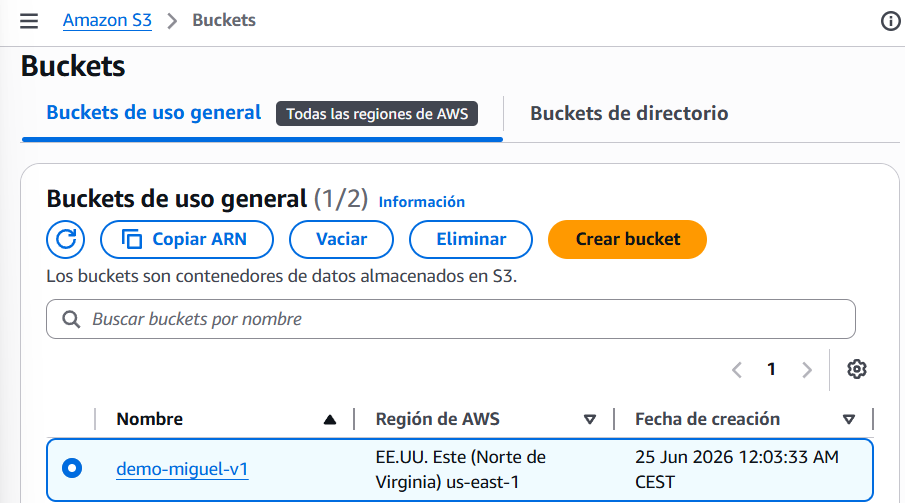

# Introducción a Amazon S3

+ Amazon Simple Storage Service (Amazon S3) es un servicio de almacenamiento de objetos escalable y duradero en la nube. S3 permite almacenar y recuperar cualquier cantidad de datos desde cualquier parte del mundo, con alta disponibilidad y seguridad.

+ Conceptos clave:
    - Bucket: contenedor lógico donde se almacenan los objetos.
    - Objeto: unidad de datos almacenados en S3, compuesta por datos, clave y metadatos.
    - Región: ubicación geográfica donde se almacena el bucket.
    - Clases de almacenamiento: S3 Standard, S3 Intelligent-Tiering, S3 Glacier, entre otras, optimizadas según frecuencia de acceso y costo.

+ Casos de uso comunes:
    - Copias de seguridad y recuperación ante desastres.
    - Almacenamiento de archivos estáticos para sitios web.
    - Archivado a largo plazo.
    - Gestión y análisis de grandes volúmenes de datos.

+ Características importantes:
    - Durabilidad del 99.999999999 % (11 nueves).
    - Control de acceso mediante políticas de bucket y listas de control de acceso (ACL).
    - Versionado para conservar versiones anteriores de objetos.
    - Cifrado en reposo y en tránsito.
    - Eventos de S3 para activar flujos de trabajo y funciones sin servidor.

## BUCKET
+ Amazon S3 permite almacenar objetos (archivos) en "buckets" (directorios)
+ Los buckets deben tener un nombre único global (en todas las regiones y todas las cuentas)
+ Los buckets se definen a nivel de región
+ S3 parece un servicio global, pero los buckets se crean en una región
+ Convención de nombres
    + Sin mayúsculas, sin guión bajo
    + De 3 a 63 caracteres
    + No es una IP
    + Debe empezar por letra minúscula o número
    + NO debe empezar por el prefijo xn--
    + NO debe terminar con el sufijo -s3alias

## OBJETOS
+ Los objetos (archivos) tienen una clave
+ La clave es la ruta COMPLETA:
    + s3://mi-bucket/mi-archivo.txt
    + s3://mi-bucket/mi_carpeta1/otra_carpeta/mi-archivo.txt
+ La clave se compone de prefijo + nombre del objeto:
    + s3://mi-bucket/mi_carpeta1/otra_carpeta/mi-archivo.txt
+ No existe el concepto de "directorios" dentro de los buckets (aunque la interfaz de usuario te hará pensar lo contrario)

  

## SEGURIDAD S3
+ Basada en el usuario:
    + Políticas IAM - qué llamadas a la API deben permitirse a un usuario concreto desde IAM
+ Basada en recursos:
    + Políticas de bucket - reglas para todo el bucket desde la consola de S3 - permite cuentas cruzadas
    + Lista de control de acceso a objetos (ACL) - nivel de detalle profundo (puede desactivarse)
    + Lista de control de acceso a bucket (ACL) - menos común (puede desactivarse)
+ Nota: un usuario IAM puede acceder a un objeto S3 si:
    + Los permisos IAM del usuario LO PERMITEN O la política de recursos LO PERMITE
    + Y no hay una DENEGACIÓN explícita
+ Cifrado: cifra objetos en Amazon S3 utilizando claves de cifrado

+ Políticas basadas en JSON
    + Resource: buckets y objetos
    + Effect: permitir (Allow) o denegar (Deny)
    + Action: conjunto de API a permitir o denegar
    + Principal: la cuenta o usuario al que aplicar la política
+ Utilizar una política de bucket S3 para:
    + Conceder acceso público al bucket
    + Forzar que los objetos se cifren al subirlos
    + Conceder acceso

## PRÁCTICA PERMISOS BUCKET
+ Al crear el bucket anterior y añadir archivos, no nos deja acceder al no tener permisos para ver la imagen con la url del objeto.

+ Para ello vamos a la pestaña permisos y creamos una politica. Para crearla mejor usar el `[AWS GENERATOR POLICY](https://awspolicygen.s3.amazonaws.com/policygen.html)`  

  
  

+ Al crear un a política de que pueda acceder a ver los objetos, nos permite ver la foto.

## VERSIONADO

+ Puedes versionar tus archivos en Amazon S3
+ Se activa a nivel de bucket
+ La misma clave de sobrescritura cambiará la "versión": 1, 2, 3....
+ Es una buena práctica versionar tus buckets
    + Protege contra borrados involuntarios (posibilidad de restaurar
    una versión)
    + Rolling fácil a la versión anterior
+ Nota:
    + Cualquier archivo que no esté versionado antes de activar el
    versionado tendrá la versión "nula".
    + Suspender el versionado no elimina las versiones anteriores

## Replicación (CRR & SRR)
+ Debes activar el versionado en los buckets de origen y destino
+ Replicación entre regiones (CRR)
+ Replicación en la misma región (SRR)
+ Los buckets pueden estar en diferentes cuentas de AWS
+ La copia es asíncrona
+ Debes dar los permisos IAM adecuados a S3
+ Casos de uso:
    + CRR - normativa, acceso de menor latencia, replicación entre
    cuentas
    + SRR - agregación de logs, replicación en vivo entre cuentas de
    producción y de test
+ Después de activar la Replicación, sólo se replican los objetos nuevos
+ Opcionalmente, puedes replicar los objetos existentes utilizando la Replicación por lotes de S3
    + Replica los objetos existentes y los objetos que fallaron en la replicación
+ Para las operaciones de borrado
    + Puede replicar los marcadores de borrado del origen al destino (configuración opcional)
    + Los borrados con un ID de versión no se replican (para evitar borrados maliciosos)

## Clases de almacenamiento S3
+ Amazon S3 Standard - General Purpose
+ Amazon S3 Standard-Infrequent Access (IA)
+ Amazon S3 One Zone-Infrequent Access (IA)
+ Amazon S3 Glacier Instant Retrieval
+ Amazon S3 Glacier Flexible Retrieval
+ Amazon S3 Glacier Deep Archive
+ Amazon S3 Intelligent Tiering
> Se puede pasar de una clase a otra manualmente o utilizando las configuraciones del ciclo de vida de S3

## RESUMEN
+ Las palabras clave del examen para S3, Si el escenario dice...
    "acceso frecuente" -> Standard
    "acceso infrecuente, recuperación rápida" -> Standard-IA
    "acceso infrecuente, no importa perder datos si falla una AZ" -> One Zone-IA
    "no sé con qué frecuencia se accederá" -> Intelligent-Tiering
    "archivado con acceso ocasional instantáneo" -> Glacier Instant
    "archivado, puedo esperar minutos u horas" -> Glacier Flexible
    "archivado largo plazo, 7-10 años, acceso rarísimo" -> Glacier Deep Archive

## CUESTIONARIO

**Pregunta 1:**  
Tienes un archivo de 25 GB que estás intentando subir a S3 pero te da errores. ¿Cuál es una posible solución para esto?
>  "Utiliza la subida de varias partes cuando subas archivos de más de 5GB" porque esta técnica permite dividir archivos grandes en partes más pequeñas, facilitando la carga y reduciendo la probabilidad de errores. Esto es crucial para manejar archivos que superan los 100 MB y garantiza una transferencia más eficiente en Amazon S3. 

**Pregunta 2:**  
Obtienes errores al intentar crear un nuevo bucket de S3 llamado "dev". Estás utilizando una nueva cuenta de AWS sin haber creado antes ningún bucket de S3. ¿Cuál es la posible causa de esto?
> "Los nombres de los buckets S3 deben ser globalmente únicos y 'dev' ya está ocupado" porque en AWS S3, los nombres de los buckets deben ser únicos a nivel mundial, lo que significa que no puedes usar un nombre que ya esté en uso por otra cuenta, incluso si es tu primera vez creando un bucket.

**Pregunta 3:**  
Has activado el control de versiones en tu bucket de S3 que ya contiene muchos archivos. ¿Qué versión tendrán los archivos existentes?
> "null" porque cuando se activa el control de versiones en un bucket de S3, los archivos existentes no se les asigna una versión numérica; en su lugar, tienen un estado de "null" hasta que se les asigna una nueva versión al ser modificados. Esto refleja tu comprensión de cómo S3 maneja las versiones de los objetos. 

**Pregunta 4:**  
Has actualizado una política de bucket S3 para permitir a los usuarios de IAM leer/escribir archivos en el bucket S3, pero uno de los usuarios se queja de que no puede realizar una llamada a la API PutObject. ¿Cuál es la posible causa de esto?
>  "El usuario IAM debe tener un DENY explícito en la política IAM adjunta" porque una denegación explícita siempre tiene prioridad sobre cualquier permiso otorgado, incluso si la política del bucket S3 permite acciones. Esto resalta la importancia de comprender cómo las políticas de IAM pueden interactuar con las configuraciones de permisos en S3.

**Pregunta 5:**  
Quieres que el contenido de un bucket de S3 esté totalmente disponible en diferentes regiones de AWS. Eso ayudará a tu equipo a realizar análisis de datos con la menor latencia y coste posibles. ¿Qué función de S3 debes utilizar?
> "Replicación en S3" porque esta función permite copiar automáticamente los datos de un bucket S3 a otro en la misma o diferente región de AWS, asegurando que tu contenido esté disponible y tenga menor latencia para tus análisis de datos.

**Pregunta 6:**  
Tienes 3 buckets de S3. Un bucket de origen A, y dos buckets de destino B y C en diferentes regiones de AWS. Quieres replicar objetos del bucket A a los dos buckets B y C. ¿Cómo lo conseguirías?
>  "Configura la replicación del bucket A al bucket B, y luego del bucket A al bucket C" porque este enfoque asegura que los objetos del bucket A se repliquen correctamente a ambos buckets de destino, respetando las limitaciones de la replicación de S3, que no permite el encadenamiento entre buckets. Esto demuestra tu comprensión de cómo gestionar la disponibilidad de datos en diferentes regiones de AWS. 

**Pregunta 7:**  
¿Cuál de los siguientes NO es un modo de recuperación de Glacier Deep Archive?
>  "Acelerado (1 - 5 minutos)" porque este modo de recuperación no está disponible en Glacier Deep Archive; las opciones de recuperación más rápidas como "Estándar" y "A granel" son las que realmente se utilizan. Esto demuestra tu comprensión clara de las características y limitaciones de los modos de recuperación en AWS Glacier. 

**Pregunta 8:**  
¿Cuál de los siguientes NO es un modo de recuperación flexible de Glacier?
> Instantánea (10 segundos)" porque este modo de recuperación no está disponible en Glacier; los tiempos de recuperación para este servicio son más largos. Esto demuestra tu entendimiento de cómo funcionan los diferentes modos de recuperación en AWS Glacier.

## PREGUNTAS TIPO EXAMEN

Pregunta 1: Una empresa almacena informes financieros que se consultan frecuentemente durante el primer mes y luego casi nunca. Quieren optimizar costes automáticamente sin saber exactamente cuándo cambiará el patrón de acceso. ¿Qué clase usan?  
A) S3 Standard  
B) S3 Glacier Deep Archive  
**C) S3 Intelligent-Tiering**  
D) S3 Standard-IA  
> C) S3 Intelligent-Tiering: La palabra clave era "no sé cuándo cambiará el patrón de acceso" — eso es exactamente Intelligent-Tiering. AWS monitoriza el acceso y mueve los objetos automáticamente entre clases sin que tú hagas nada.

Pregunta 2: Un hospital necesita archivar registros médicos durante 10 años por ley. Solo se accederá a ellos en caso de auditoría y pueden esperar hasta 48 horas para recuperarlos. Quieren el coste mínimo. ¿Qué clase usan?  
A) S3 Standard-IA  
B) S3 Glacier Flexible  
**C) S3 Glacier Deep Archive**  
D) S3 One Zone-IA  
> C) S3 Glacier Deep Archive: 10 años", "auditoría", "48 horas de espera", "coste mínimo" — todas las palabras apuntan a Deep Archive. Es el más barato de todos precisamente porque el acceso es rarísimo y puedes esperar.

Pregunta 3: Una empresa replica datos de backup en S3 para recuperación ante desastres. Los datos son reproducibles si se pierden y se accederá raramente. Quieren el coste más bajo posible sin preocuparse por la disponibilidad multi-AZ. ¿Qué clase usan?  
A) S3 Standard  
**B) S3 One Zone-IA**  
C) S3 Glacier Deep Archive  
D) S3 Standard-IA  
> B) S3 One Zone-IA: "Datos reproducibles" + "sin preocuparse por multi-AZ" + "coste bajo" = One Zone-IA. El matiz importante es "reproducibles" — si los datos se pueden regenerar, no necesitas la resiliencia multi-AZ que da Standard-IA. Por eso One Zone-IA es válido aquí.

Pregunta 4: Una startup tiene un bucket S3 con imágenes de producto. Quieren que si una imagen se elimina accidentalmente puedan recuperarla. ¿Qué función activan?  
A) Replicación S3  
B) Lifecycle Policy  
**C) Versionado S3**  
D) S3 Intelligent-Tiering  
> C) Versionado S3: El Versionado en cambio guarda todas las versiones de cada objeto en el mismo bucket. Si alguien borra un archivo, S3 no lo elimina realmente sino que añade un "delete marker" — puedes recuperar la versión anterior en cualquier momento.