# DOCKER

## INTRODUCCIÓN
+ Docker es una plataforma de desarrollo de software para desplegar aplicaciones.
+ Las aplicaciones se empaquetan en contenedores que pueden ejecutarse en cualquier sistema operativo.
+ Las aplicaciones se ejecutan igual, independientemente de dónde se ejecuten:
    + Cualquier máquina
    + Sin problemas de compatibilidad
    + Comportamiento predecible
    + Menos trabajo
    + Más fácil de mantener e implantar
    + Funciona con cualquier lenguaje, sistema operativo y tecnología
+ Casos de uso: arquitectura de microservicios, aplicaciones lift-and-shift de on-premises a
la nube de AWS, ...

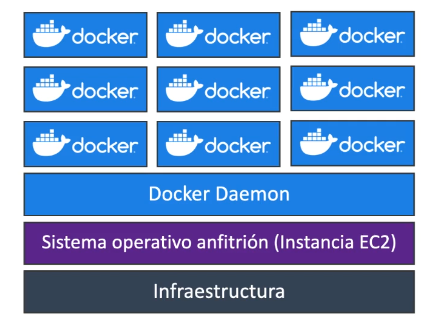  

+ Las imágenes Docker se almacenan en repositorios Docker
+ Docker Hub (https://hub.docker.com)
    + Repositorio público
    + Encuentre imágenes base para muchas tecnologías o sistemas operativos (por ejemplo Ubuntu, MySQL, ...)
+ Amazon ECR (Registro elástico de contenedores de Amazon)
    + Repositorio privado
    + Repositorio público (Galería pública de Amazon ECR https://gallery.ecr.aws)

## Gestión de contenedores Docker en AWS
+ Amazon Elastic Container Service (Amazon ECS): Plataforma de contenedores propia de Amazon.
+ Servicio Amazon Elastic Kubernetes (Amazon EKS): Kubernetes administrado por Amazon (código abierto)
+ AWS Fargate: Plataforma de contenedores sin servidor propia de Amazon,Funciona con ECS y con EKS
+ Amazon ECR: Almacena imágenes de contenedores

## AMAZON ECS
- Tipo de lanzamiento EC2: 
    + ECS = Elastic Container Service
    + Lanzar contenedores Docker en AWS = Lanzar tareas ECS en clústeres ECS
    + Tipo de lanzamiento EC2: debe aprovisionar y mantener la infraestructura (las instancias EC2)
    + Cada Instancia EC2 debe ejecutar el Agente ECS para registrarse en el Cluster ECS
    + AWS se encarga de iniciar / detener los contenedores

- Tipo de lanzamiento Fargate:
    + Lanzar contenedores Docker en AWS
    + No aprovisionas la infraestructura (no hay instancias EC2 que administrar)
    + ¡Todo es Serverless!
    + Sólo tienes que crear definiciones de tareas
    + AWS ejecuta las tareas ECS por ti en función de la CPU / RAM que necesites.
    + Para escalar, basta con aumentar el número de tareas. Simple - no más instancias EC2

## PRACTICA CREACION CLUSTER DE ECS

+ Creamos un cluster con minimo una instancia ECS y con autoescalado
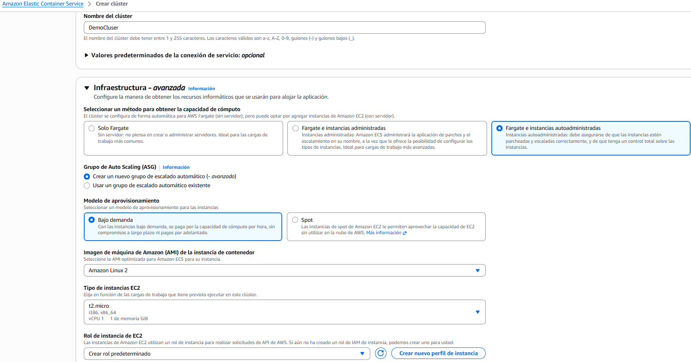  
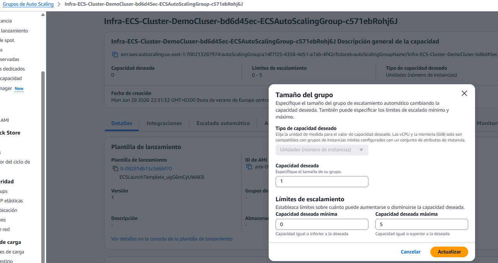  
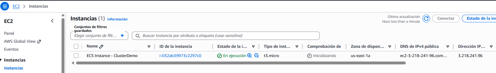  

+ Creamos una definición de tarea la cual indicamos que le metemos una imagen docker de `nginx/hello":
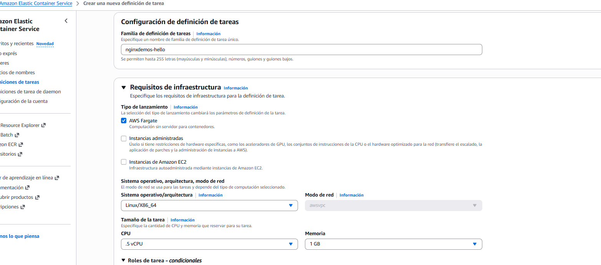  
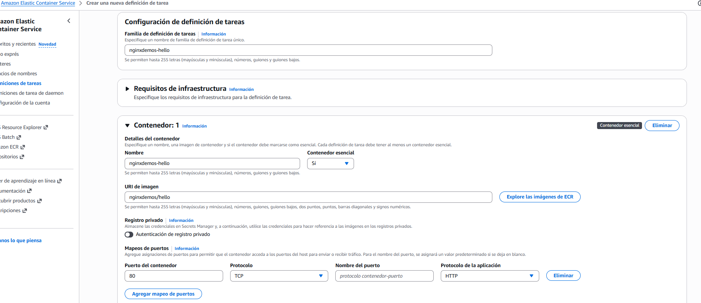  

+ Creamos dos grupos de seguridad, uno para el Aplication Load Balancer y otro para el nginx:
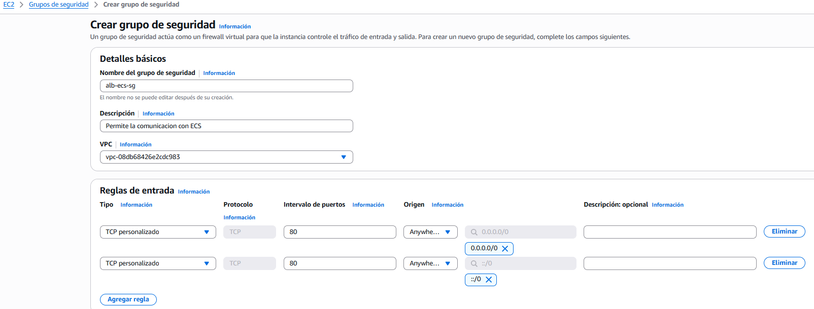  
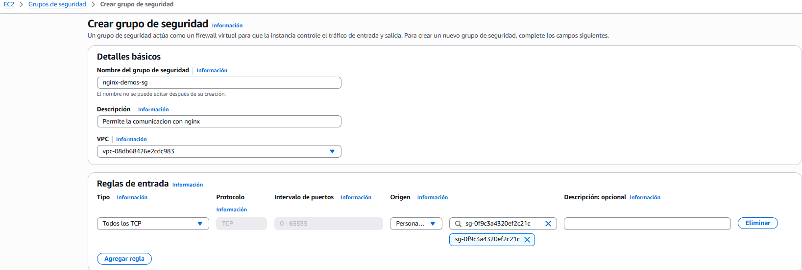  

+ Creamos un servicio de cluser con el grupo de seguridad de ALB y creando un balanceador de carga, el cual sirve para distribuir la carga de los servicios que queremos correr dentro del cluster:
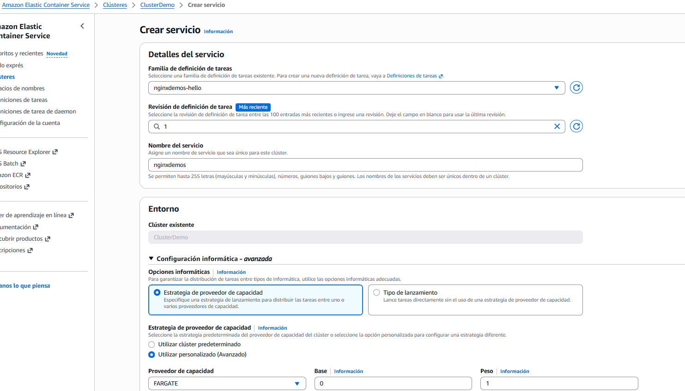  
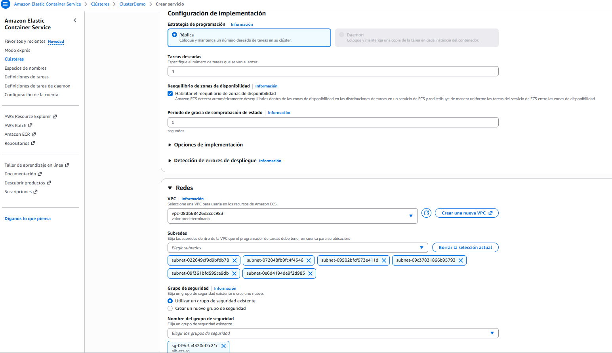  
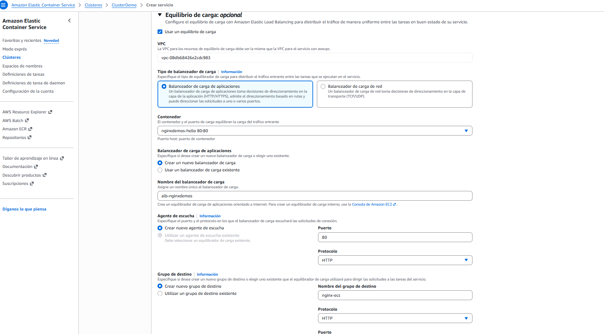  
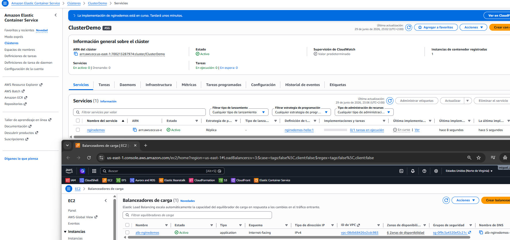  

+ Si vamos a a dirección DNS del balanceador de carga veremos el contenedor de NGINX funcionando sin necesidad de gestión de servidores al haber lanzado con el sistema FARGATE:

+ Si en el servicio ponemos que sean 3 o 4 tareas, pues añade 3 o 4 contenedores y por tanto, diferentes ip internas.

## Escalado automático del servicio ECS
+ Aumentar/disminuir automáticamente el número deseado de tareas ECS
+ Amazon ECS Auto Scaling utiliza AWS Application Auto Scaling:
    + Utilización media de la CPU del servicio ECS
    + Utilización media de memoria del servicio ECS - Escalado en RAM
    + Recuento de solicitudes de ALB por objetivo - métrica procedente del ALB
+ Seguimiento de objetivo - escala basada en el valor objetivo para una métrica específica de CloudWatch
+ Escalado por pasos - escalado basado en una alarma CloudWatch específica
+ Escalado programado - escalado basado en una fecha/hora especificada (cambios predecibles)
+ Autoescalado del servicio ECS (nivel de tarea) ≠ Autoescalado de EC2 (nivel de instancia de EC2)
+ Fargate Auto Scaling es mucho más fácil de configurar (porque es Serverless)

## Amazon EKS
+ Amazon EKS = Servicio Amazon Elastic Kubernetes
+ Es una forma de lanzar clústeres Kubernetes administrados en AWS
+ Kubernetes es un sistema de código abierto para el despliegue, escalado y gestión
automáticos de aplicaciones en contenedores (normalmente Docker)
+ Es una alternativa a ECS, objetivo similar pero API diferente
+ EKS soporta EC2 si quieres desplegar nodos trabajadores o Fargate para desplegar contenedores sin servidor
+ Caso de uso: si tu empresa ya utiliza Kubernetes on-premises o en otra nube, y quiere
migrar a AWS utilizando Kubernetes
+ Kubernetes es agnóstico a la nube (puede utilizarse en cualquier nube - Azure, GCP...)

+ Tipos de nodos
    + Grupos de nodos gestionados:
        + Crea y gestiona Nodos (instancias EC2) para ti
        + Los nodos forman parte de un ASG gestionado por EKS
        + Admite instancias bajo demanda o puntuales
    + Nodos autogestionados:
        + Nodos creados por ti y registrados en el clúster EKS y gestionados por un ASG
        + Puede utilizar AMI preconstruidas - Amazon EKS Optimized AMI
        + Admite instancias bajo demanda o puntuales
    + AWS Fargate:
        + No requiere mantenimiento; no se administran nodos

## AWS App Runner (Corredor de aplicaciones AWS)
+ Servicio totalmente gestionado que facilita el despliegue de aplicaciones web y API a escala
+ No se requiere experiencia en infraestructura
+ Empieza con tu código fuente o una imagen de docker
+ Crea y despliega automáticamente la aplicación web
+ Escalado automático, alta disponibilidad, equilibrador de carga, cifrado
+ Soporte de acceso VPC
+ Conexión a servicios de base de datos, caché y cola de mensajes
+ Casos de uso: aplicaciones web, API, microservicios, despliegues rápidos en producción

## RESUMEN

+ La jerarquía de ECS explicada con analogía. Piénsalo como un restaurante:
    - Cluster → el edificio del restaurante. Es el entorno donde todo ocurre. Puede tener muchas cocinas y mesas.
    - Task Definition → la receta. Define qué contenedor usar, cuánta CPU y memoria necesita, qué puertos abre. Es como decir "este plato lleva estos ingredientes".
    - Task → una receta ejecutándose. Es el plato ya cocinado — un contenedor corriendo en un momento concreto.
    - Service → el camarero que garantiza que siempre haya X platos disponibles. Si una Task muere, el Service lanza otra automáticamente para mantener el número deseado.
> En la práctica: defines una Task Definition (imagen Docker + recursos), creas un Service que dice "quiero 3 copias de esta Task siempre corriendo" y el Cluster es donde todo eso vive.  

+ Palabras clave examen:
    - "contenedores en AWS sin Kubernetes" → ECS
    - "Kubernetes" o "migrar cluster K8s" → EKS
    - "desplegar aplicación rápido sin gestionar infraestructura" → App Runner
    - "guardar imágenes Docker en AWS" → ECR

+ EC2 Launch Type vs Fargate — esto el examen lo pregunta mucho: Regla simple: si el examen dice "sin gestionar la infraestructura subyacente" o "serverless containers" → Fargate siempre.

## CUESTIONARIO

+ **Pregunta 1:** Tienes varias aplicaciones basadas en Docker alojadas en las instalaciones que quieres migrar a AWS. No quieres aprovisionar ni administrar ninguna infraestructura; sólo quieres ejecutar tus contenedores en AWS. ¿Qué servicio de AWS debes elegir?  
> "AWS Fargate en ECS" porque este servicio permite ejecutar tus contenedores de forma sencilla, sin necesidad de gestionar la infraestructura subyacente, lo que se ajusta perfectamente a tu objetivo de no tener que aprovisionar ni administrar servidores.

+ **Pregunta 2:** Amazon Elastic Container Service (ECS) tiene dos tipos de lanzamiento: .................. y ..................  
> "Tipo de lanzamiento de Amazon EC2 y tipo de lanzamiento de Fargate" porque Amazon ECS ofrece precisamente esos dos métodos para desplegar contenedores, permitiéndote elegir entre gestionar tu propia infraestructura con EC2 o dejar que Fargate se encargue de ello, simplificando así la administración de los recursos.

+ **Pregunta 3:** Tienes una aplicación alojada en un Cluster ECS (Tipo de Lanzamiento EC2) donde quieres que tus tareas ECS suban archivos a un bucket S3. ¿Qué rol de IAM para tus tareas ECS debes modificar?  
> "Rol de la tarea ECS" porque este rol permite que tus tareas ECS interactúen con otros servicios de AWS, como S3, lo cual es esencial para subir archivos al bucket que mencionas. 

+ **Pregunta 4:** Estás planeando migrar un sitio web de WordPress que se ejecuta en contenedores Docker desde las instalaciones a AWS. Has decidido ejecutar la aplicación en un clúster ECS, pero quieres que tus contenedores Docker accedan al mismo contenido del sitio web de WordPress, como archivos del sitio web, imágenes, vídeos, etc. ¿Qué recomiendas para conseguirlo?
>  "Monta un volumen EFS" porque este tipo de almacenamiento permite que múltiples instancias EC2 y tareas ECS accedan al mismo contenido de forma simultánea, lo cual es ideal para tu sitio web de WordPress que necesita compartir archivos, imágenes y videos.

+ **Pregunta 5:** Estás desplegando una aplicación en un Cluster ECS formado por instancias EC2. Actualmente, el clúster aloja una aplicación que emite llamadas a la API de DynamoDB con éxito. Al añadir una segunda aplicación, que emite llamadas de API a S3, estás obteniendo problemas de autorización. ¿Qué deberías hacer para resolver el problema y garantizar una seguridad adecuada?  
> "Crea un rol de tarea IAM para la nueva aplicación" porque esto permite otorgar permisos específicos a la segunda aplicación para acceder a S3, asegurando que cada aplicación tenga los permisos necesarios sin comprometer la seguridad de la primera. Esto está alineado con el objetivo de gestionar adecuadamente las políticas de acceso en AWS. 

+ **Pregunta 6:** Estás migrando tus aplicaciones locales basadas en Docker a Amazon ECS. Estabas utilizando Docker Hub Container Image Library como repositorio de imágenes de contenedores. ¿Cuál es un servicio alternativo de AWS que está totalmente integrado con Amazon ECS?  
> "Registro elástico de contenedores (ECR)" porque es un servicio de AWS que permite almacenar y gestionar imágenes de contenedores de manera integrada con ECS, facilitando el despliegue de tus aplicaciones. Esto es fundamental para mantener tu flujo de trabajo eficiente al migrar aplicaciones de Docker a Amazon.

+ **Pregunta 7:** Amazon EKS soporta los siguientes tipos de nodo, EXCEPTO:  
> "AWS Lambda" porque, a diferencia de los otros tipos de nodos, Lambda se utiliza para ejecutar código sin necesidad de administrar servidores ni contenedores, lo que lo hace incompatible con el entorno de nodos de Amazon EKS.

+ **Pregunta 8:** Un desarrollador tiene un sitio web y unas APIs en funcionamiento en su máquina local utilizando contenedores y quiere desplegar ambos en AWS. El desarrollador es nuevo en AWS y no sabe mucho sobre los diferentes servicios de AWS. ¿Cuál de los siguientes servicios de AWS permite al desarrollador construir e implementar el sitio web y las APIs de la manera más fácil según las mejores prácticas de AWS?  
> "AWS App Runner" como la mejor opción porque es un servicio diseñado para desarrolladores que simplifica el despliegue de aplicaciones web y APIs sin necesidad de gestionar la infraestructura subyacente. Esto te permite enfocarte en tu código y seguir las mejores prácticas de AWS para un despliegue eficiente y fácil.

## PREGUNTAS TIPO EXAMEN
**Pregunta 1**: Una empresa quiere ejecutar contenedores Docker en AWS sin gestionar servidores ni clusters de Kubernetes. Quieren que AWS gestione toda la infraestructura subyacente. ¿Qué combinación usan?  
A) ECS con EC2 Launch Type  
B) EKS con EC2  
**C) ECS con Fargate**  
D) App Runner  
> C) ECS con Fargate: "Sin gestionar servidores" + "sin Kubernetes" = ECS con Fargate. Es el combo más usado en empresas que quieren contenedores sin el overhead operativo de gestionar instancias EC2.

**Pregunta 2**: Una empresa ya tiene una aplicación funcionando en Kubernetes on-premise y quiere migrarla a AWS manteniendo Kubernetes como orquestador. ¿Qué servicio usan?  
A) ECS con Fargate  
**B) EKS**  
C) App Runner  
D) ECS con EC2  
> B) EKS: "Ya usan Kubernetes" + "migrar a AWS" = EKS siempre. EKS es Kubernetes estándar gestionado por AWS — si ya tienes workloads en K8s, la migración es mucho más limpia que reescribir todo para ECS.  

**Pregunta 3**: Un desarrollador individual quiere desplegar una API REST en contenedor en AWS lo más rápido posible sin configurar clusters, VPCs ni load balancers. ¿Qué servicio usa?  
A) EKS  
B) ECS con EC2  
C) ECR  
**D) App Runner**  
> D) App Runner: es exactamente para ese caso — un desarrollador o startup que quiere pasar de código a producción en minutos sin tocar VPCs, load balancers ni clusters. Es el servicio más abstracto y simple de todos.  

**Pregunta 4**: Un equipo necesita almacenar y versionar sus imágenes Docker privadas en AWS para usarlas en ECS. ¿Qué servicio usan?  
A) S3  
B) EKS  
**C) ECR**  
D) EFS  
> c) ECR: es el Docker Hub privado de AWS. La ventaja sobre Docker Hub es que está dentro de la red de AWS — las pulls desde ECS o EKS son más rápidas y no salen a internet público.

**Pregunta 5**: Una empresa tiene un servicio ECS con 3 Tasks corriendo. De repente una Task falla y se detiene. ¿Qué componente de ECS garantiza que automáticamente se lance una nueva Task para mantener las 3?  
A) Task Definition  
B) Cluster  
C) ECR  
**D) Service**  
> D) Service: Has usado exactamente la analogía del camarero — el Service es el que mantiene el número deseado de Tasks corriendo. Si una muere, el Service detecta que hay 2 en vez de 3 y lanza una nueva automáticamente. La Task Definition solo define cómo es la Task, no cuántas hay.