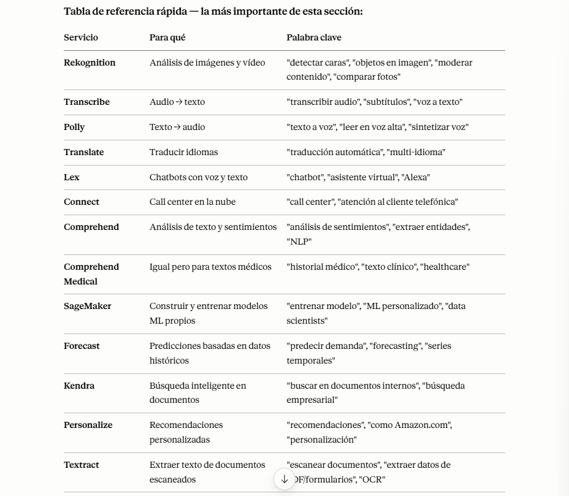

# Machine Learning en AWS

AWS ofrece una plataforma completa para desarrollar, entrenar y desplegar modelos de machine learning. Entre los servicios principales se encuentran:

## MODELOS

### AMAZON REKOGNITION
- **Amazon Rekognition**: análisis de imágenes y videos para reconocimiento facial, objetos y escenas.
- Encuentra objetos, personas, texto, escenas en imágenes y vídeos utilizando ML
- Análisis facial y búsqueda facial para hacer verificación de usuarios, recuento de personas
- Crear una base de datos de "caras conocidas" o comparar con famosos
- Casos de uso:
    - Etiquetado
    - Moderación de contenidos
    - Detección de texto
    - Detección y Análisis de Caras (sexo, rango de edad, emociones...)
    - Búsqueda y verificación de caras
    - Reconocimiento de famosos
    - Trazado de trayectorias (por ejemplo, para análisis de partidos deportivos)

### AMAZON TRANSCRIBE
- Convierte automáticamente el habla en texto
- Utiliza un proceso de deep learning llamado reconocimiento automático del habla (ASR) para
convertir el habla en texto de forma rápida y precisa
- Elimina automáticamente la Información de Identificación Personal (PII)
- Soporta identificación automática de idioma para audio multilingüe
- Casos de uso:
- transcribir llamadas de atención al cliente
- automatizar el subtitulado y los subtítulos
- generar metadatos para los activos de los medios de comunicación para crear un archivo con todas las posibilidades de búsqueda

### AMAZON POLLY
- **Amazon Polly**: conversión de texto a voz.
- Convierte el texto en voz real utilizando el aprendizaje profundo
- Te permite crear aplicaciones que hablan
- Personaliza la pronunciación de las palabras con los léxicos de pronunciación
- Palabras estilizadas: Jo7n => "Joan"
- Acrónimos: AWS => "Amazon Web Services"
- Sube los léxicos en un fichero y la conversión se realizará directamente
- Genera voz a partir de texto plano o de documentos marcados con el Lenguaje de Marcado de Síntesis de Voz (SSML): permite una mayor personalización
    - enfatizar palabras o frases concretas
    - utilizando pronunciación fonética
    - incluyendo sonidos respiratorios, susurros

### AMAZON TRANSLATE
- **Amazon Translate**: traducción automática de texto.
- Traducción natural y precisa de idiomas
- Amazon Translate te permite localizar contenidos -como sitios web y aplicaciones- para usuarios internacionales, y traducir fácilmente grandes volúmenes de texto de forma eficiente.

### AMAZON LEX + CONNECT
- **Amazon Lex**: creación de chatbots y asistentes conversacionales.
- Amazon Lex: (la misma tecnología que impulsa a Alexa)
    - Reconocimiento automático del habla (ASR) para convertir el habla en texto
    - Comprensión del Lenguaje Natural para reconocer la intención del texto, de las personas
    que llaman
    - Ayuda a crear chatbots, bots de centros de llamadas
- Amazon Connect:
    - Recibe llamadas, crea flujos de contacto, centro de contacto virtual basado en la nube
    - Puede integrarse con otros sistemas CRM o AWS
    - Sin pagos iniciales, un 80% más barato que las soluciones tradicionales de centro de contacto

### AMAZON SAGEMAKER

- **Amazon SageMaker**: servicio gestionado para construir, entrenar y desplegar modelos. Incluye notebooks, entrenamiento distribuido, hiperparámetros automáticos y despliegue en endpoints.
- Servicio totalmente gestionado para que los desarrolladores/científicos de datos construyan
modelos ML
- Normalmente, es difícil hacer todos los procesos en un solo lugar + aprovisionar servidores
- Proceso de Machine Learning (simplificado): predecir la nota de tu examen

### AMAZON COMPREHEND
- **Amazon Comprehend**: análisis de texto con NLP para clasificación, extracción de entidades y análisis de sentimientos.
- Para el Natural Language Processing – NLP (Procesamiento del Lenguaje Natural - PNL)
- Servicio totalmente gestionado y sin servidor
- Utiliza el Machine Learning para encontrar ideas y relaciones en el texto
    - Lenguaje del texto
    - Extrae frases clave, lugares, personas, marcas o eventos
    - Comprende lo positivo o negativo del texto
    - Analiza el texto utilizando la tokenización y las partes del discurso
    - Organiza automáticamente una colección de archivos de texto por temas
- Ejemplos de casos de uso:
    - Analiza las interacciones con los clientes (correos electrónicos) para encontrar lo que conduce a una experiencia positiva o negativa
    - Crea y agrupa artículos por temas que Comprehend descubrirá

- Amazon Comprehend Medical detecta y devuelve información útil en texto clínico no estructurado:
    - Notas del médico
    - Resúmenes de alta
    - Resultados de pruebas
    - Notas de casos
- Utiliza NLP para detectar Información Sanitaria Protegida (PHI) - API DetectPHI
- Almacena tus documentos en Amazon S3, analiza los datos en tiempo real con Kinesis Data Firehose, o utiliza Amazon Transcribe para transcribir las narraciones de los pacientes en texto que pueda ser analizado por Amazon Comprehend Medical.

### AMAZON FORECAST
- **Amazon Forecast**: servicio de predicción de series temporales.
- Servicio totalmente gestionado que utiliza el ML para ofrecer previsiones muy precisas
- Ejemplo: predecir las futuras ventas de un chubasquero
- Un 50% más de precisión que mirando los datos por sí mismos
- Reduce el tiempo de previsión de meses a horas
- Casos de uso: Planificación de la demanda de productos, planificación financiera, planificación de recursos, ...

### AMAZON KENDRA
- Servicio de búsqueda de documentos totalmente gestionado y potenciado por Machine Learning
- Extrae respuestas de un documento (texto, pdf, HTML, PowerPoint, MS Word, preguntas frecuentes...)
- Capacidades de búsqueda en lenguaje natural
- Aprende de las interacciones/retroalimentación de los usuarios para promover los resultados preferidos
(aprendizaje incremental)
- Capacidad de afinar manualmente los resultados de la búsqueda (importancia de los datos, frescura, personalización, ...)

### AMAZON PERSONALICE
- **Amazon Personalize**: recomendaciones personalizadas basadas en el comportamiento de usuario.
- Servicio de ML totalmente gestionado para crear aplicaciones con recomendaciones personalizadas en tiempo real
    - Ejemplo: recomendaciones/reclasificación de productos personalizados, marketing directo personalizado
- Ejemplo: El usuario compró herramientas de jardinería, proporciona recomendaciones sobre la próxima que debe comprar
- La misma tecnología utilizada por Amazon.com
- Se integra en sitios web existentes, aplicaciones, SMS, sistemas de marketing por correo electrónico, ...
- Se implementa en días, no en meses (no es necesario construir, formar y desplegar soluciones de ML)
- Casos de uso: tiendas minoristas, medios de comunicación y entretenimiento...

### AMAZON TEXTRACT
- Extrae automáticamente el texto, la escritura y los datos de cualquier documento escaneado utilizando IA y ML
- Extrae datos de formularios y tablas
- Leer y procesar cualquier tipo de documento (PDFs, imágenes, ...)
- Casos de uso:
    - Servicios financieros (por ejemplo, facturas, informes financieros)
    - Sanidad (por ejemplo, historiales médicos, reclamaciones de seguros)
    - Sector público (por ejemplo, formularios fiscales, documentos de identidad, pasaportes)

### RESUMEN
+ Rekognition: detección de caras, etiquetado, reconocimiento de famosos
+ Transcribe: de audio a texto (por ejemplo, subtítulos)
+ Polly: de texto a audio
+ Translate: traducciones
+ Lex: construir bots conversacionales - chatbots
+ Connect: centro de contacto en el Cloud
+ Comprehend: procesamiento del lenguaje natural
+ SageMaker: Machine Learning para todos los desarrolladores y científicos de datos
+ Forecast: construye previsiones muy precisas
+ Kendra: motor de búsqueda con ML
+ Personalize: recomendaciones personalizadas en tiempo real
+ Textract: detecta texto y datos en los documentos

## Flujo típico de Machine Learning en AWS

1. **Preparación de datos**
   - Guardar datos en Amazon S3.
   - Limpiar y transformar datos con AWS Glue o Amazon SageMaker Data Wrangler.
2. **Entrenamiento**
   - Utilizar SageMaker Training con frameworks como TensorFlow, PyTorch o scikit-learn.
   - Ajustar hiperparámetros y usar entrenamiento distribuido si es necesario.
3. **Evaluación**
   - Validar el modelo con conjuntos de datos de prueba.
   - Monitorizar métricas como precisión, recall, F1 o error cuadrático medio.
4. **Despliegue**
   - Deploy en un endpoint SageMaker para inferencia en tiempo real.
   - O usar SageMaker Batch Transform para inferencia por lotes.
5. **Monitorización y mantenimiento**
   - Monitorizar drift de datos y rendimiento del modelo.
   - Reentrenar periódicamente con nuevos datos.

## Beneficios de usar AWS para ML

- Escalabilidad y elasticidad.
- Integración con otros servicios AWS.
- Servicios gestionados para reducir la carga operativa.
- Seguridad y cumplimiento.
- Amplia variedad de capacidades preconstruidas para casos de uso comunes.

## RESUMEN 

+ Rekognition, Transcribe, Polly y SageMaker son los más frecuentes.

  

## CUESTIONARIO  

**Pregunta 1:**
Deberías utilizar Amazon Transcribe para convertir el texto en habla real utilizando el aprendizaje profundo.
> "Falso" porque Amazon Transcribe se ocupa de convertir voz a texto, mientras que Amazon Polly es el servicio que convierte texto en habla. Al entender esta diferencia, demostraste una buena comprensión de las funcionalidades de estos servicios de AWS. 

**Pregunta 2:**
Una empresa quiere implementar un chatbot que convierta el habla en texto y reconozca las intenciones de los clientes. ¿Qué servicio debería utilizar?
> "Lex" porque es el servicio ideal para crear chatbots que convierten el habla en texto y comprenden las intenciones de los usuarios. Lex combina el reconocimiento automático del habla y la comprensión del lenguaje natural, lo que permite interacciones conversacionales efectivas y atractivas. 

**Pregunta 3:**
¿Qué servicio totalmente gestionado puede ofrecer previsiones muy precisas?
> "Forecast" porque es un servicio diseñado específicamente para ofrecer previsiones precisas utilizando Machine Learning, lo que lo convierte en la opción más adecuada para esta necesidad.

**Pregunta 4:**
Te gustaría encontrar objetos, personas, texto o escenas en imágenes y vídeos. ¿Qué servicio de AWS debe utilizar?
>  "Rekognition" porque este servicio de AWS permite analizar imágenes y vídeos al identificar objetos, personas, texto y escenas, utilizando tecnología de aprendizaje profundo de manera accesible y efectiva.

**Pregunta 5:**
Una empresa emergente quiere crear rápidamente experiencias de usuario personalizadas. ¿Qué servicio de AWS puede ayudar?
> "Personalize" porque es el servicio de AWS que utiliza Machine Learning para crear recomendaciones personalizadas, lo que permite a las empresas ofrecer experiencias únicas a sus clientes de manera más rápida y eficiente.

**Pregunta 6:**
Un equipo de investigación quiere agrupar artículos por temas utilizando el Procesamiento del Lenguaje Natural (PLN). ¿Qué servicio debería utilizar?
> "Comprehend" porque es el servicio de procesamiento del lenguaje natural (NLP) que utiliza el aprendizaje automático para analizar y extraer significado de texto. Esto lo hace ideal para tu necesidad de agrupar artículos por temas, alineándose perfectamente con los objetivos de aprendizaje sobre el uso de herramientas de PLN.

**Pregunta 7:**
Una empresa quiere convertir sus documentos a diferentes idiomas, con una redacción natural y precisa. ¿Qué deberían utilizar?
> "Translate" porque Amazon Translate es el servicio especializado en traducción automática que ofrece traducciones rápidas y de alta calidad entre diferentes idiomas, lo que se alinea perfectamente con la necesidad de tu empresa de convertir documentos a varios idiomas.

**Pregunta 8:**
Un desarrollador quiere construir, entrenar y desplegar rápidamente un modelo de Machine Learning. ¿Qué servicio puede utilizar?
> "SageMaker" porque es un servicio completamente gestionado que simplifica la creación, entrenamiento e implementación de modelos de Machine Learning, permitiéndote enfocarte en el desarrollo en lugar de los aspectos técnicos. Esto se alinea con el objetivo de aprender cómo optimizar procesos de Machine Learning de manera eficiente.

**Pregunta 9:**
¿Qué servicio de AWS facilita la conversión de voz a texto?
> "Transcribe" porque este servicio de AWS está diseñado específicamente para facilitar la conversión de voz a texto, alineándose con tu objetivo de entender cómo funcionan las herramientas de transcripción automatizada.

**Pregunta 10:**
¿Cuál de los siguientes servicios es un servicio de búsqueda de documentos impulsado por Machine Learning?
>  "Kendra" porque es un servicio de búsqueda empresarial que utiliza Machine Learning para proporcionar resultados de búsqueda precisos y relevantes, facilitando así la búsqueda de documentos y la información en tu organización. Esta elección demuestra tu comprensión de cómo las herramientas de Machine Learning pueden optimizar la recuperación de información.

**Pregunta 11:**
Una empresa gestiona una plataforma para compartir imágenes y vídeos que utilizan clientes de todo el mundo. La plataforma se ejecuta en AWS utilizando un bucket de S3 para alojar las imágenes y los vídeos y utilizando CloudFront como CDN para entregar el contenido a los clientes de todo el mundo con baja latencia. En los últimos dos meses, muchos clientes se han quejado de que han empezado a ver contenido inapropiado en la plataforma, lo que ha empezado a aumentar en la última semana. Sería muy costoso y llevaría mucho tiempo aprobar manualmente esas imágenes y vídeos por parte de los empleados antes de su publicación en la plataforma. Es necesario encontrar una solución que pueda detectar automáticamente las imágenes y vídeos inapropiados y ofensivos, y que te permita establecer un umbral mínimo de confianza para los elementos que se marcarán y que permita la revisión manual. ¿Qué servicio de AWS puede cumplir este requisito?
> "Amazon Rekognition" porque este servicio de AWS está diseñado específicamente para analizar imágenes y vídeos utilizando técnicas de Machine Learning, permitiendo detectar automáticamente contenido inapropiado y establecer un umbral de confianza para su revisión. Es una solución eficiente para abordar el problema de contenido ofensivo sin necesidad de revisión manual exhaustiva.

**Pregunta 12:**
Una empresa médica online que permite reservar una cita con los médicos mediante una llamada telefónica está utilizando AWS para alojar su infraestructura. Están utilizando Amazon Connect y Amazon Lex para recibir llamadas y crear un flujo de trabajo, reservar una cita y pagar. Según la política de la empresa, todas las llamadas deben ser grabadas para su revisión. Sin embargo, es necesario eliminar cualquier información personal identificable (PII) de la llamada antes de guardarla. ¿Qué recomiendas utilizar que ayude a eliminar la IIP de las llamadas?
>  "Amazon Transcribe" porque este servicio convierte el habla en texto, lo que permite revisar las llamadas y, mediante un procesamiento adicional, remover información personal identificable de las transcripciones. Esto se alinea perfectamente con el objetivo de cumplir con la política de la empresa de grabar y analizar las llamadas de manera segura.

**Pregunta 13:**
Amazon Polly te permite convertir el texto en voz. Tiene dos características importantes. La primera es ...................., que te permite personalizar la pronunciación de las palabras (por ejemplo, "Amazon EC2" será "Amazon Elastic Compute Cloud"). La segunda es ...................., que te permite enfatizar las palabras, incluyendo los sonidos de la respiración, los susurros, etc.
> "Léxicos de Pronunciación, Lenguaje de Marcado de Síntesis del Habla (SSML)" porque estas características son esenciales para personalizar la pronunciación de palabras y enfatizar su entrega en Amazon Polly, mejorando así la calidad y claridad de la salida de voz. Esta elección refleja tu comprensión de cómo SSML y los léxicos pueden influir en la síntesis de habla de manera efectiva.

**Pregunta 14:**
Una empresa médica está implementando una solución para detectar, extraer y analizar información de textos médicos no estructurados, como notas de los médicos, informes de ensayos clínicos e informes de radiología. Estos documentos se suben y almacenan en buckets S3. Según la normativa de la empresa, la solución debe diseñarse e implementarse para mantener la privacidad de los pacientes identificando la Información Sanitaria Protegida (PHI), por lo que la solución cumplirá con la HIPAA. ¿Qué servicio de AWS deberías utilizar?
> "Amazon Comprehend Medical" porque este servicio está diseñado específicamente para procesar y analizar texto médico no estructurado, extrayendo información importante y cumpliendo con normativas de privacidad como la HIPAA al identificar Información Sanitaria Protegida (PHI).

## PREGUNTAS TIPO EXAMEN

**Pregunta 1:** Una plataforma de vídeo quiere detectar automáticamente contenido inapropiado en los vídeos subidos por usuarios antes de publicarlos. ¿Qué servicio usan?  
A) Comprehend  
**B) Rekognition**  
C) Textract  
D) Kendra  
> Rekognition es el único que analiza contenido visual — imágenes y vídeo. "Moderar contenido" es una de sus funciones específicas que el examen menciona frecuentemente junto con "detectar caras" y "comparar personas".

**Pregunta 2:** Una empresa quiere añadir a su app una función que convierta artículos de texto en audio para que los usuarios puedan escucharlos mientras conducen. ¿Qué servicio usan?  
A) Transcribe  
B) Lex  
**C) Polly**  
D) Translate  
> Polly = texto a voz. Transcribe es al revés — voz a texto. El examen juega con esa inversión deliberadamente. Recuerda: Polly habla, Transcribe escucha.

**Pregunta 3:** Un hospital quiere extraer automáticamente diagnósticos, medicamentos y nombres de pacientes de historiales médicos escritos en texto libre. ¿Qué servicio usan?  
A) Comprehend  
B) Textract  
**C) Comprehend Medical**  
D) Kendra  
> Comprehend de Comprehend Medical. La palabra "médico" o cualquier contexto clínico — historiales, diagnósticos, medicamentos — dispara Comprehend Medical directamente. Comprehend normal es para texto genérico de negocio.

**Pregunta 4:** Una empresa de e-commerce quiere mostrar recomendaciones de productos personalizadas a cada usuario basándose en su historial de compras, igual que hace Amazon. ¿Qué servicio usan?  
A) Forecast  
B) SageMaker  
C) Kendra  
**D) Personalize**  
> "Como Amazon.com" es literalmente la descripción que usa AWS para Personalize — fue construido con la misma tecnología de recomendaciones de Amazon. Cuando veas esa comparación en el examen → Personalize siempre.

**Pregunta 5:** Un equipo de data scientists necesita construir, entrenar y desplegar sus propios modelos de machine learning personalizados en AWS. ¿Qué servicio usan?  
A) Rekognition  
**B) SageMaker**  
C) Comprehend  
D) Personalize  
> SageMaker es para cuando necesitas construir tu propio modelo desde cero. "Data scientists" + "modelo personalizado" = SageMaker.

**Pregunta 6:** Una aseguradora recibe miles de formularios en papel escaneados en PDF. Quieren extraer automáticamente los datos de los formularios sin escribirlos manualmente. ¿Qué servicio usan?  
A) Comprehend  
B) Rekognition  
C) Kendra  
**D) Textract**  
> Textract va más allá del OCR básico — no solo extrae texto sino que entiende la estructura del formulario (campos, tablas, firmas). "Formularios escaneados" + "extraer datos estructurados" = Textract siempre.