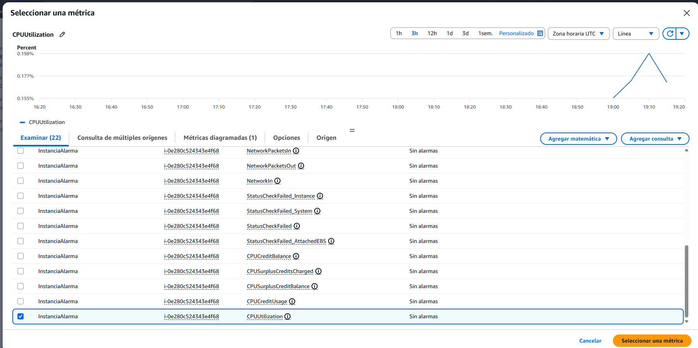
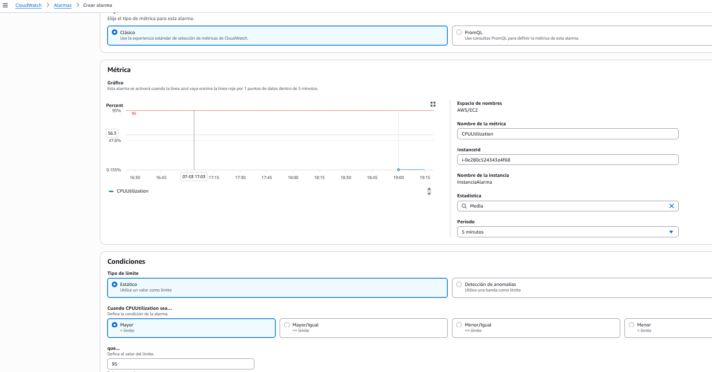
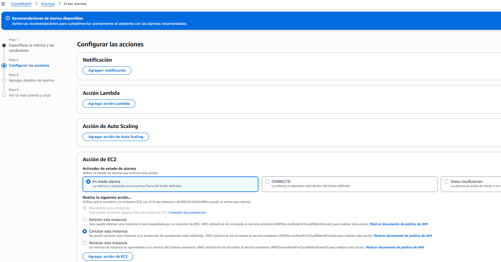
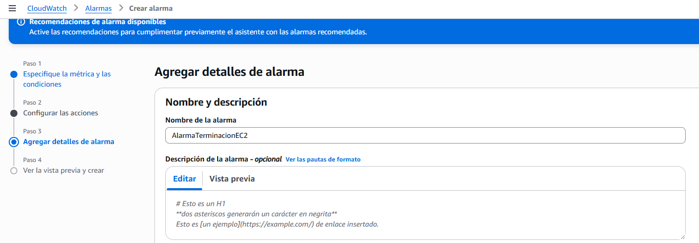
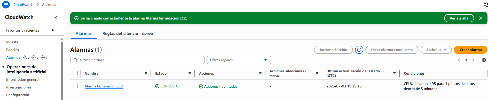
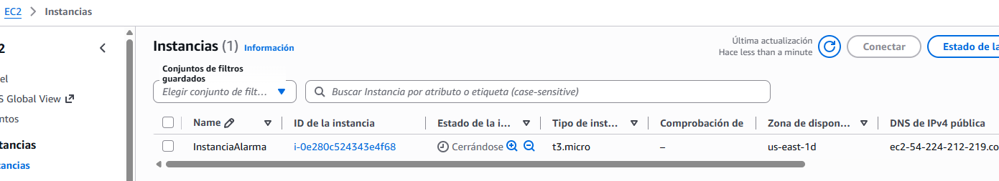
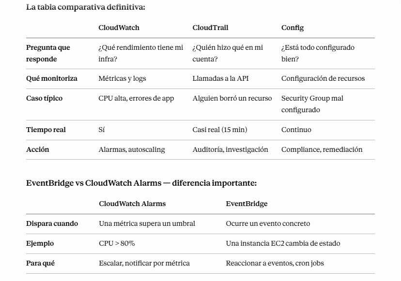

# Monitorización, auditoría y rendimiento de AWS
- CloudWatch Logs almacena y permite buscar logs de instancias, Lambda, API Gateway, etc.
- CloudWatch Alarms permiten definir umbrales sobre métricas y activar acciones (SNS, Auto Scaling, Lambda).

## Métricas de Amazon CloudWatch
+ CloudWatch proporciona métricas para cada servicio en AWS
+ La métrica es una variable a monitorizar (CPUUtilization, NetworkIn...)
+ Las métricas pertenecen a espacios de nombres
+ Las métricas tienen marcas de tiempo
+ Se pueden crear Dashboards de métricas de CloudWatch
+ Se pueden crear métricas personalizadas de CloudWatch (para la RAM, por ejemplo)
 
+ Recopilados directamente en tu servidor Linux / instancia EC2
+ CPU (activa, huésped, inactiva, sistema, usuario)
+ Métricas de disco (libre, usado, total), IO de disco (escrituras, lecturas, bytes, iops)
+ RAM (gratis, inactiva, usada, total, en caché)
+ Netstat (número de conexiones TCP y UDP, paquetes netos, bytes)
+ Procesos (totales, muertos, bloqueados, inactivos, en ejecución, en reposo)
+ Espacio de intercambio (gratis, usado, % usado)

 
## CLOUDWATCH ALARMS

+ Las alarmas se utilizan para activar notificaciones para cualquier métrica
+ Varias opciones (muestreo, %, máx, mín, etc...)
+ Estados de alarma:
    + OK
    + DATOS_INSUFICIENTES
    + ALARMA
+ Periodo:
    + Tiempo en segundos para evaluar la métrica
    + Métricas personalizadas de alta resolución: 10 seg, 30 seg o múltiplos de 60 seg

+ Objetivos de alarma de CloudWatch:
    - Detener, Terminar, Reiniciar o Recuperar una Instancia EC2
    - Activar la acción de Autoescalado
    - Enviar notificación a SNS (desde donde puedes hacer prácticamente cualquier cosa)

+ Las Alarmas CloudWatch son sobre una única métrica
+ Las alarmas compuestas supervisan los estados de otras alarmas múltiples
+ Condiciones AND y OR
+ Útiles para reducir el "ruido de alarma" creando alarmas compuestas complejas
 Se pueden crear alarmas basadas en los filtros de métricas de CloudWatch Logs
+ Para probar las alarmas y notificaciones, establece el estado de alarma mediante la CLI aws cloudwatch set-alarm-state --alarm-name "myalarm" --state-value ALARM --state-reason "fines de prueba"

## PRACTICA CLOUDWATCH ALARM

+ Creamos una instancia y creamos una alarma con una métrica de que el Uso de Cpu supere 95% se termine esa instancia:  

  
  
  
  
  
  
> aws cloudwatch set-alarm-state --alarm-name AlarmaTerminacionEC2 --state-value ALARM --state-reason "Testing" ->PARA HACER QUE SALTE LA ALARMA

## Amazon EventBridge (Antes CloudWatch Events)

+ Programar: Cron jobs (scripts programados)
+ Patrón de eventos: Reglas de eventos para reaccionar ante un servicio que hace algo
+ Activa funciones Lambda, envía mensajes SQS/SNS...

+ Otras cuentas de AWS pueden acceder a los buses de eventos mediante políticas
basadas en recursos
+ Puedes archivar eventos (todos/filtro) enviados a un bus de eventos (indefinidamente
o por un periodo determinado)
+ Posibilidad de reproducir eventos archivados

+ EventBridge puede analizar los eventos de tu bus e inferir el esquema
+ El Registro de esquemas te permite generar código para tu aplicación, que
sabrá de antemano cómo se estructuran los datos en el bus de eventos
+ El esquema puede versionarse

+ Política basada en recursos:
    + Gestionar permisos para un bus de eventos específico
    + Ejemplo: permitir/denegar eventos de otra cuenta AWS o región AWS
    + Caso práctico: agregar todos los eventos de tu Organización AWS en una única cuenta AWS o región AWS

## CLOUDWATCH INSIGHTS

+ CloudWatch Container Insights
    + ECS, EKS, Kubernetes en EC2, Fargate, necesita agente para Kubernetes
    + Métricas y logs
+ CloudWatch Lambda Insights
    + Métricas detalladas para solucionar problemas de aplicaciones sin servidor
+ CloudWatch Contributors Insights
    + Encuentra los contribuidores "Top-N" a través de los logs de CloudWatch
+ CloudWatch Application Insights
    + Dashboards automáticos para solucionar problemas de tu aplicación y los servicios de AWS relacionados

## AWS CloudTrail
- CloudTrail registra llamadas a la API de AWS para auditoría y análisis forense.
- Se pueden almacenar los logs de CloudTrail en S3 y analizar con Athena o CloudWatch Logs.
- Proporciona gobernanza, normativa y auditoría para tu cuenta de AWS
- CloudTrail está activado por defecto
- Obtén un historial de eventos / llamadas a la API realizadas dentro de tu Cuenta de AWS por:
    - Consola
    - SDK
    - CLI
    - Servicios de AWS
- Puedes poner logs de CloudTrail en CloudWatch Logs o S3
- Un rastro (trail) puede aplicarse a todas las regiones (por defecto) o a una sola
región
- Si se elimina un recurso en AWS, ¡investiga primero en CloudTrail!

+ Eventos CloudTrail
    + Eventos de gestión:
        + Operaciones que se realizan en los recursos de tu cuenta de AWS
        + Ejemplos:
            + Configurar la seguridad (IAM AttachRolePolicy)
            + Configurar reglas para enrutar datos (Amazon EC2 CreateSubnet)
            + Configurar logs (AWS CloudTrail CreateTrail)
        + Por defecto, los trails están configurados para logs de eventos de gestión.
        + Pueden separar los eventos de lectura (que no modifican los recursos) de los Eventos de Escritura (que pueden modificar los recursos)

+ Eventos de datos:
    - Por defecto, los eventos de datos no se registran (porque son operaciones de gran volumen)
    - Actividad a nivel de objeto de Amazon S3 (ej: GetObject, DeleteObject, PutObject): puede separar los Eventos de Lectura de los de Escritura
    - Actividad de ejecución de funciones de AWS Lambda (la API Invoke)
 
+ CloudTrail Insights
    - Activa CloudTrail Insights para detectar actividad inusual en tu cuenta:
        - aprovisionamiento inexacto de recursos
        - superación de los límites de servicio
        - ráfagas de acciones de AWS IAM
        - lagunas en la actividad de mantenimiento periódico

+ Los eventos se almacenan durante 90 días en CloudTrail

## AWS Config
+ AWS Config evalúa la configuración de recursos contra reglas y mantiene un historial de cambios para auditoría.
+ Ayuda a auditar y registrar la normativa de tus recursos de AWS
+ Ayuda a registrar configuraciones y cambios a lo largo del tiempo
+ Preguntas que se pueden resolver con AWS Config:
    + ¿Hay acceso SSH sin restricciones a mis grupos de seguridad?
    + ¿Mis buckets tienen acceso público?
    + ¿Cómo ha cambiado la configuración de mi ALB a lo largo del tiempo?
+ Puedes recibir alertas (notificaciones SNS) de cualquier cambio
+ AWS Config es un servicio por región
+ Puede agregarse entre regiones y cuentas
+ Posibilidad de almacenar los datos de configuración en S3 (analizados por Athena)
 
## CloudWatch vs CloudTrail vs Config
+ CloudWatch
    + Monitorización del rendimiento (métricas, CPU, red, etc...) y dashboards
    + Eventos y alertas
    + Agregación y análisis de logs
+ CloudTrail
    + Registra las llamadas a la API realizadas dentro de tu Cuenta por cualquier persona
    + Puedes definir trails para recursos específicos
    + Servicio Global
+ Config
    + Registra los cambios de configuración
    + Evalúa los recursos según las normas de cumplimiento
    + Obtén una cronología de los cambios y de la normativa
 
## Buenas prácticas
- Definir métricas y alarmas críticas (CPU, memoria, latencia, errores y saturación de disco).
- Centralizar logs en S3/CloudWatch y protegerlos (bloquear borrado con políticas y versiones).
- Automatizar respuestas (runbooks, Lambdas) ante alarmas frecuentes.
- Revisar auditorías (CloudTrail, Config) regularmente y aplicar principios de mínimo privilegio.

## RESUMEN

+ La distinción más importante del examen: Antes de todo, grábate esto:
    - CloudWatch → rendimiento y métricas. ¿Qué está pasando ahora mismo?
    - CloudTrail → auditoría de acciones. ¿Quién hizo qué y cuándo?
    - Config → cumplimiento de configuración. ¿Está todo configurado como debería?

### CLOUDWATCH
+ CloudWatch — explicado con casos reales:
    - Es el sistema de monitorización central de AWS. Todo lo que ocurre en tu infraestructura genera métricas que CloudWatch recoge.
    - Caso real: tu equipo quiere saber si la CPU de las instancias EC2 supera el 80%, recibir una alerta y escalar automáticamente. Todo eso es CloudWatch.
    - Los componentes principales:
        - Métricas → datos numéricos que AWS recoge automáticamente. CPU, memoria de RDS, requests de ALB, errores de Lambda. Por defecto cada 5 minutos, con monitorización detallada cada 1 minuto.

+ CloudWatch Logs → guarda los logs de tus aplicaciones y servicios. Lambda, EC2, RDS, 

+ CloudTrail — todo puede mandar logs aquí. Puedes buscar, filtrar y crear alertas basadas en patrones de texto.

+ CloudWatch Agent → para métricas que EC2 no manda por defecto — memoria RAM, espacio en disco. Instalas el agente en la instancia y empieza a mandar esas métricas.

+ CloudWatch Alarms → cuando una métrica supera un umbral, dispara una acción. Ejemplo: CPU > 80% durante 5 minutos → escalar el ASG, o enviar notificación SNS, o reiniciar la instancia.

+ EventBridge → antes llamado CloudWatch Events. Responde a eventos en tiempo real. Ejemplo: cuando una instancia EC2 se para → notificar por email. O ejecutar Lambda cada lunes a las 9am. Es el bus de eventos central de AWS.

+ CloudWatch Insights → análisis avanzado de logs con queries. Container Insights para ECS/EKS, Lambda Insights para funciones Lambda.

### CLOUDTRAIL

+ CloudTrail — auditoría de todo lo que pasa en tu cuenta:

+ Registra cada llamada a la API de AWS — quién hizo qué, desde dónde y cuándo. Si alguien borra un bucket S3, termina una instancia EC2 o cambia una política IAM — CloudTrail lo registra.

+ Caso real: un recurso crítico desaparece. El equipo de seguridad abre CloudTrail y ve que un usuario IAM lo eliminó a las 3am desde una IP desconocida.

+ Puntos importantes para el examen:
    - Los eventos se guardan 90 días por defecto
    - Para guardarlos más tiempo → exportar a S3
    - CloudTrail Insights detecta actividad inusual automáticamente — muchas llamadas a DeleteBucket en poco tiempo, por ejemplo
    - Cubre todas las regiones pero puedes crear un trail multi-región

+ Palabra clave: "auditar", "quién hizo qué", "historial de cambios en la cuenta", "investigar incidente de seguridad" → CloudTrail.

### AWS CONFIG

+ AWS Config — ¿está tu infraestructura configurada correctamente?

+ Config evalúa continuamente la configuración de tus recursos contra las reglas que defines. Si algo no cumple la regla, lo marca como no conforme.

+ Caso real: la empresa tiene una regla de seguridad que dice "ningún Security Group puede tener el puerto 22 abierto al mundo (0.0.0.0/0)". Config revisa todos los Security Groups continuamente y avisa si alguno viola esa regla.

+ Puntos importantes:
    - No previene los cambios — solo los detecta y notifica
    - Guarda el historial de configuración de cada recurso
    - Puede remediar automáticamente con SSM Automation
    - Es de pago — cobra por regla evaluada

+ Palabra clave: "cumplimiento", "compliance", "configuración correcta", "historial de configuración", "detectar cambios no autorizados" → Config.

  

## CUESTIONARIO

**Pregunta 1:** Tienes una instancia de base de datos RDS que está configurada para enviar sus logs de base de datos a CloudWatch. Quieres crear una alarma de CloudWatch si se encuentra un Error en los logs. ¿Cómo lo harías?  
> crear un filtro métrico en CloudWatch Logs te permite detectar de manera específica los errores en los registros de la base de datos. A partir de este filtro, puedes configurar una alarma en CloudWatch que te notifique inmediatamente cuando se registre un error, lo cual es una forma eficaz y directa de monitorear la salud de tu instancia de base de datos RDS.

**Pregunta 2:** Tienes una aplicación alojada en una flota de instancias EC2 gestionadas por un Grupo de Autoescalado que has configurado su capacidad mínima a 2. Además, has creado una Alarma de CloudWatch que está configurada para escalar en tu ASG cuando la Utilización de la CPU está por debajo del 60%. Actualmente, tu aplicación se ejecuta en 2 instancias EC2 y tiene poco tráfico y la Alarma de CloudWatch está en estado de ALARMA. ¿Qué ocurrirá?  
> la Alarma de CloudWatch esté en estado de ALARMA debido a la baja utilización de la CPU, el Grupo de Autoescalado (ASG) no reducirá el número de instancias EC2 por debajo de la capacidad mínima que has establecido, que es 2. Esto asegura que siempre haya suficientes recursos disponibles para tu aplicación.

**Pregunta 3:** ¿Cómo controlarías el uso de la memoria de tu instancia EC2 en CloudWatch?  
> el Agente Unificado de CloudWatch es necesario para recopilar métricas de uso de memoria en instancias EC2, ya que, por defecto, esta métrica no se envía a CloudWatch. Usar este agente te permite monitorear el uso de la memoria como una métrica personalizada y, así, mantener un control más completo del rendimiento de tu instancia.

**Pregunta 4:** Has realizado un cambio de configuración y quieres evaluar su impacto en el rendimiento de tu aplicación. ¿Qué servicio de AWS deberías utilizar?  
> 'Amazon CloudWatch' porque es la herramienta ideal para evaluar el impacto de cambios de configuración en el rendimiento de tu aplicación, ya que te permite monitorear métricas clave y responder de manera proactiva a variaciones en el rendimiento.

**Pregunta 5:** Alguien ha dado de baja una instancia EC2 en tu cuenta de AWS la semana pasada, que alojaba una base de datos crítica que contiene datos sensibles. ¿Qué servicio de AWS te ayuda a encontrar quién lo hizo y cuándo?  
> "AWS CloudTrail" porque este servicio registra y supervisa todas las actividades dentro de tu cuenta de AWS, incluyendo quién ha realizado acciones específicas como terminar una instancia EC2, lo que te permite investigar y auditar cambios en tu infraestructura de manera efectiva.

**Pregunta 6:** Tienes habilitado CloudTrail para tu cuenta de AWS en todas las regiones de AWS. ¿Qué deberías utilizar para detectar actividad inusual en tu Cuenta de AWS?  
> "CloudTrail Insights" porque este servicio te permite detectar patrones de comportamiento inusuales en la actividad de tu cuenta de AWS, monitorizando eventos que puedan indicar acciones anómalas y facilitando la identificación de posibles problemas de seguridad. 

**Pregunta 7:** Uno de tus compañeros de equipo dio de baja una instancia EC2 hace 4 meses que tiene datos críticos. No sabes quién lo hizo, así que vas a revisar todas las llamadas a la API en este periodo utilizando CloudTrail. Ya tienes CloudTrail instalado y configurado para enviar logs al bucket de S3. ¿Qué deberías hacer para averiguar quién ha hecho esto?  
> "Analiza los logs de CloudTrail en un bucket S3 con Amazon Athena" porque esta opción te permite acceder a registros que superan los 90 días, lo cual es fundamental en tu caso para identificar quién dio de baja la instancia EC2. Utilizar Athena facilita la consulta y el análisis de esos logs almacenados en S3, garantizando que puedas obtener la información necesaria para tu investigación.

**Pregunta 8:** Estás ejecutando un sitio web en una flota de instancias EC2 con SO que tiene una vulnerabilidad conocida en el puerto 84. Quieres monitorizar continuamente tus instancias EC2 para ver si tienen el puerto 84 expuesto. ¿Cómo deberías hacerlo?  
> "Establecer reglas de configuración" porque esta opción te permite definir las políticas para asegurar que el puerto 84 no esté expuesto, asegurando el cumplimiento de la seguridad en tus instancias EC2. 

**Pregunta 9:** Quieres evaluar la normativa de las configuraciones de tus recursos a lo largo del tiempo. ¿Qué servicio de AWS vas a elegir?  
> "AWS Config" porque este servicio es clave para monitorizar y evaluar las configuraciones de tus recursos en AWS, asegurando así que cumplen con las políticas de compliance que has establecido, lo que te ayuda a mantener la seguridad y la integridad de tu entorno.

**Pregunta 10:** Alguien ha cambiado la configuración de un recurso y lo ha hecho no conforme. ¿Qué servicio de AWS puedes utilizar para averiguar quién hizo el cambio?  
> "AWS CloudTrail" porque este servicio registra y documenta las acciones realizadas en tus recursos de AWS, permitiéndote identificar quién hizo los cambios en la configuración y cuándo, lo que es esencial para el seguimiento de la conformidad y la auditoría de seguridad.

**Pregunta 11:** Has habilitado AWS Config para supervisar los grupos de seguridad si hay acceso SSH sin restricciones a alguna de tus instancias EC2. ¿Qué función de AWS Config puedes utilizar para reconfigurar automáticamente tus Grupos de Seguridad a su estado correcto?  
> "Remediaciones de AWS Config" porque esta función permite la reconfiguración automática de los recursos a su estado deseado, asegurando que los grupos de seguridad cumplan con las políticas establecidas, como evitar el acceso SSH sin restricciones.

**Pregunta 12:** Estás ejecutando un sitio web crítico en un conjunto de instancias EC2 con un Grupo de Seguridad reforzado que tiene acceso SSH restringido. Has habilitado AWS Config en tu región de AWS y quieres recibir una notificación por correo electrónico cuando alguien modifique el Grupo de Seguridad de tus instancias EC2. ¿Qué función de AWS Config te ayuda a hacer esto?  
> "AWS Config Notifications" porque esta función te permite recibir alertas cuando hay cambios en la configuración de los recursos, como el Grupo de Seguridad de tus instancias EC2, lo que te ayuda a mantener la seguridad y la gestión adecuada de tu infraestructura en la nube.

**Pregunta 13:** ............................... es una función de CloudWatch que te permite enviar métricas de CloudWatch casi en tiempo real al bucket de S3 (a través de Kinesis Data Firehose) y a destinos de terceros (por ejemplo, Splunk, Datadog, ...).  
> "Flujo de métricas de CloudWatch (CloudWatch Metric Stream)" porque esta función permite enviar métricas de CloudWatch en tiempo real a un bucket de S3 y a destinos de terceros, facilitando la centralización y análisis de datos.

**Pregunta 14:** Un ingeniero de DevOps trabaja para una empresa y gestiona su infraestructura y recursos en AWS. Se ha producido un repentino pico de tráfico en la aplicación principal de la empresa que no es normal en este periodo del año. La aplicación está alojada en un par de instancias de EC2 en subredes privadas y está dirigida por un Load Balancer de aplicaciones en una subred pública. Para detectar si se trata de tráfico normal o de un ataque, el ingeniero de DevOps habilitó los VPC Flow Logs para las subredes y almacenó esos logs en CloudWatch Log Group. El DevOps quiere analizar esos logs y averiguar las principales direcciones IP que realizan peticiones contra el sitio web para comprobar si hay un ataque. ¿Cuál de las siguientes opciones puede ayudar al ingeniero de DevOps a analizar esos logs?  
> "Información de los colaboradores de CloudWatch (CloudWatch Contributor Insights)" porque esta herramienta permite analizar los registros de flujo de VPC para identificar las direcciones IP que generan más tráfico, lo cual es esencial para detectar patrones de tráfico anómalos o posibles ataques. 

**Pregunta 15:** Una empresa está desarrollando una aplicación sin servidor en AWS utilizando Lambda, DynamoDB y Cognito. Un desarrollador junior se incorporó hace unas semanas y borró accidentalmente una de las tablas de DynamoDB en la cuenta dev AWS que contenía datos importantes. El CTO te pide que evites que esto vuelva a ocurrir y que haya un sistema de notificación para controlar si se intenta realizar este tipo de acciones de borrado de las tablas de DynamoDB. ¿Qué harías?  
> asignar a los desarrolladores a un grupo IAM que impida la eliminación de tablas de DynamoDB previene que se realicen acciones no autorizadas, y configurar EventBridge para capturar las llamadas a la API DeleteTable a través de CloudTrail garantiza que cualquier intento de eliminación sea monitoreado y enviado como notificación mediante SNS, lo que permite una respuesta rápida ante incidentes.

**Pregunta 16:** Una empresa tiene una aplicación Serverless en ejecución en AWS que utiliza EventBridge como canal de intercomunicación entre los diferentes servicios de la aplicación. Existe la necesidad de utilizar los eventos del entorno prod en el entorno dev para hacer algunas pruebas. Las pruebas se harán cada 6 meses, por lo que los eventos deben almacenarse y utilizarse posteriormente. ¿Cuál es la forma más eficaz y rentable de almacenar los eventos de EventBridge y utilizarlos posteriormente?  
> "Usa Amazon EventBridge archivar y repetir" porque esta opción te permite almacenar eventos en EventBridge y repetirlos cuando los necesites, lo que es eficiente y rentable para tus pruebas semestrales en el entorno de desarrollo. Así puedes aprovechar los eventos de producción de manera efectiva sin necesidad de implementar soluciones adicionales.

## PREGUNTAS TIPO EXAMEN

**Pregunta 1**: El equipo de seguridad necesita investigar quién eliminó un bucket S3 crítico la semana pasada y desde qué IP lo hizo. ¿Qué servicio consultan?  
A) CloudWatch Logs  
B) AWS Config  
**C) CloudTrail**  
D) EventBridge  
> C) CloudTrail: "Quién eliminó" + "desde qué IP" = CloudTrail siempre. Es exactamente para investigar incidentes de seguridad retrospectivamente. CloudWatch no registra acciones de usuarios, solo métricas de rendimiento.

**Pregunta 2**: Una empresa quiere recibir una alerta automática cuando el uso de CPU de sus instancias EC2 supere el 90% durante más de 5 minutos. ¿Qué configuran?  
A) CloudTrail con notificación SNS  
**B) CloudWatch Alarm con acción SNS**  
C) AWS Config con regla de CPU  
D) EventBridge con trigger de EC2  
> B) CloudWatch Alarm con acción SNS: Métrica + umbral + notificación = CloudWatch Alarm. El flujo clásico es CloudWatch Alarm → SNS Topic → email/SMS al equipo. Config no monitoriza métricas de rendimiento como CPU — solo configuración de recursos.

**Pregunta 3**: Una empresa necesita asegurarse de que ningún bucket S3 en su cuenta tenga acceso público habilitado. Si alguno lo tiene, quieren ser notificados inmediatamente. ¿Qué servicio usan?  
A) CloudTrail  
B) CloudWatch  
**C) AWS Config**  
D) GuardDuty  
> C) AWS Config: "Bucket S3 con acceso público" es una de las reglas más comunes de AWS Config — de hecho AWS tiene una regla predefinida llamada s3-bucket-public-read-prohibited. Config evalúa continuamente y notifica si algo viola la regla. CloudTrail te diría quién lo activó, pero Config es el que detecta que está mal configurado.

**Pregunta 4**: Una empresa quiere ejecutar automáticamente una función Lambda cada día a las 8am para generar un informe diario. ¿Qué servicio configura esto?  
A) CloudWatch Alarms  
B) CloudTrail  
C) AWS Config  
**D) EventBridge**  
> D) EventBridge: Cron jobs en AWS = EventBridge siempre. Es el scheduler central de AWS. Puedes usar expresiones cron estándar para ejecutar Lambda, Step Functions o cualquier target en el horario que quieras.

**Pregunta 5**: Las instancias EC2 de una empresa muestran en CloudWatch que la métrica de memoria RAM no aparece. El equipo quiere monitorizar el uso de RAM. ¿Qué necesitan instalar?  
A) CloudTrail en cada instancia  
**B) CloudWatch Agent en cada instancia**  
C) AWS Config rules para RAM  
D) EventBridge en la VPC  
> B) CloudWatch Agent en cada instancia: RAM y espacio en disco son las dos métricas que EC2 no manda a CloudWatch por defecto — AWS no tiene acceso al sistema operativo interno sin el agente. Con CloudWatch Agent instalado en la instancia, esas métricas empiezan a aparecer automáticamente

**Pregunta 6**: Un equipo quiere detectar automáticamente si alguien en la cuenta AWS hace un número inusualmente alto de llamadas a DeleteSecurityGroup en poco tiempo, lo que podría indicar un ataque. ¿Qué servicio usan?  
A) CloudWatch Alarms  
B) AWS Config  
**C) CloudTrail Insights**  
D) EventBridge  
> C) CloudTrail Insights: CloudTrail Insights es específicamente para detectar actividad inusual en llamadas a la API — picos de DeleteSecurityGroup, CreateUser masivo, o cualquier comportamiento anómalo que podría indicar un compromiso de seguridad. CloudWatch Alarms no puede analizar patrones de comportamiento de API