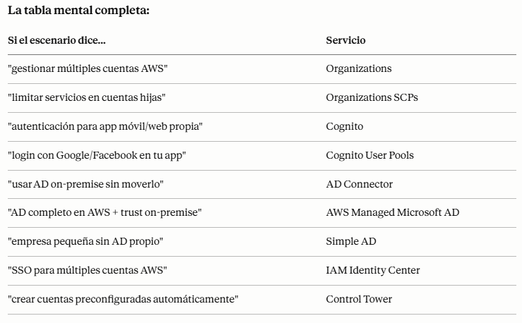

# AWS Organizations

+ Ventajas
    + Multi Cuenta vs Una Cuenta Multi VPC
    + Utiliza normas de etiquetado con fines de facturación
    + Activar CloudTrail en todas las cuentas, enviar logs a cuenta S3 central
    + Enviar logs de CloudWatch a la cuenta central de logs
    + Establece roles entre cuentas para fines administrativos
+ Seguridad: Políticas de Control de Servicios (SCP)
    + Políticas IAM aplicadas a OU o Cuentas para restringir usuarios y roles
    + No se aplican a la cuenta de gestión (plenos poderes de administrador)
    + Deben tener un permiso explícito (no permiten nada por defecto - como IAM)

## Condiciones IAM
+ aws:SourceIP: restringe la IP del cliente desde el que se realizan las llamadas a la API
+ aws:RequestedRegion: restringir la región a la que se hacen las llamadas a la API
+ ec2:ResourceTag: restringir en función de las etiquetas
+ aws:MultiFactorAuthPresent: para forzar el uso de MFA

## IAM para S3

+ El permiso s3:ListBucket se aplica a arn:aws:s3:::test => permiso a nivel de bucket
+ s3:GetObject, s3:PutObject, s3:DeleteObject se aplica a arn:awn:s3:::test/* => permiso de nivel de objeto

## Políticas de recursos & aws:PrincipalOrgID
+ aws:PrincipalOrgID puede utilizarse en cualquier política de recursos para restringir el acceso a cuentas que sean miembros de una Organización de AWS.

## Roles IAM vs Políticas basadas en recursos
+ Cuando asumes un rol (usuario, aplicación o servicio), renuncias a tus permisos originales y tomas los permisos asignados al rol
+ Cuando se utiliza una política basada en recursos, el principal no tiene que renunciar a sus permisos
+ Ejemplo: El usuario de la cuenta A necesita escanear una tabla DynamoDB de la cuenta A y volcarla en un bucket S3 de la cuenta B.
+ Soportado por: Amazon S3 buckets, SNS Topic, SQS queues, etc...

## Amazon EventBridge - Seguridad
+ Cuando se ejecuta una regla, necesita permisos en el objetivo:
    + Política basada en recursos: Lambda, SNS, SQS, CloudWatch Logs, API Gateway...
    + Rol IAM: Kinesis stream, Systems Manager Run Command, ECS task...

## Límites de permisos de IAM
+ Puede utilizarse en combinaciones de AWS Organizations SCP
    - Delegar responsabilidades a no administradores dentro de sus límites de permisos, por ejemplo crear nuevos usuarios IAM
    - Permitir que los desarrolladores se autoasignen políticas y gestionen sus propios permisos, asegurándose al mismo tiempo de que no puedan "escalar" sus privilegios (= hacerse admin)
    - Útil para restringir a un usuario concreto (en lugar de a toda una cuenta mediante Organizaciones y SCP)

## Amazon Cognito
+ Dar a los usuarios una identidad para interactuar con nuestra aplicación web o móvil
+ Grupos de usuarios Cognito (Cognito User Pools):
    + Funcionalidad de inicio de sesión para usuarios de aplicaciones
    + Integración con API Gateway y Application Load Balancer
+ Cognito Identity Pools (Identidad Federada):
    + Proporciona credenciales de AWS a los usuarios para que puedan acceder directamente a los recursos de AWS
    + Integrar con Cognito User Pools como proveedor de identidades
+ Cognito vs IAM: "cientos de usuarios", "usuarios móviles", "autenticar con SAML"


+ Cognito User Pools (CUP) - Características del usuario
    - Crea una base de datos de usuarios sin servidor para tus aplicaciones web y móviles
    - Inicio de sesión sencillo: Combinación de nombre de usuario (o correo electrónico) / contraseña
    - Restablecimiento de contraseña
    - Verificación de correo electrónico y número de teléfono
    - Autenticación multifactor (MFA)
    - Identidades federadas: usuarios de Facebook, Google, SAML...
    - CUP se integra con API Gateway y Application Load Balancer


+ Cognito Identity Pools (Identidades Federadas)
    - Obtener identidades para "usuarios" para que obtengan credenciales temporales de AWS
    - El origen de los usuarios puede ser Cognito User Pools, inicios de sesión de terceros, etc.
    - Los usuarios pueden acceder a los servicios de AWS directamente o a través de API Gateway
    - Las políticas IAM aplicadas a las credenciales se definen en Cognito
    - Se pueden personalizar en función del user_id para un control más preciso.
    - Roles IAM por defecto para usuarios autenticados e invitados

## Centro de Identidad de AWS IAM (sucesor de AWS Single Sign-On)
+ Un inicio de sesión (inicio de sesión único) para todas tus
    + cuentas de AWS en AWS Organizations
    + Aplicaciones empresariales en el Cloud (por ejemplo, Salesforce, Box, Microsoft 365, ...)
    + Aplicaciones habilitadas para SAML2.0
    + Instancias de Windows EC2
+ Proveedores de identidad
    + Almacén de identidades incorporado en el Centro de Identidades de IAM
    + De terceros: Active Directory (AD), OneLogin, Okta...

+ Permisos y asignaciones en detalle:
    - Permisos multicuenta
        - Gestiona el acceso a través de las cuentas de AWS en tu Organización AWS
        - Conjuntos de permisos - una colección de una o más políticas IAM asignadas a usuarios y grupos para definir el acceso a AWS
    - Asignaciones de aplicaciones
        - Acceso SSO a muchas aplicaciones empresariales SAML 2.0 (Salesforce, Box, Microsoft 365, ...)
        - Proporciona las URL, certificados y metadatos necesarios
    - Control de acceso basado en atributos (ABAC)
        - Permisos detallados basados en los atributos de los usuarios almacenados en el Almacén de Identidades del Centro de Identidades IAM
        - Ejemplo: centro de costes, cargo, configuración regional, ...
        - Caso práctico: Define los permisos una vez, y luego modifica el acceso a AWS cambiando los atributos

## Microsoft Active Directory (AD)?
+ Se encuentra en cualquier Servidor Windows con Servicios de Dominio AD
+ Base de datos de objetos: Cuentas de usuario, ordenadores, impresoras, archivos compartidos, grupos de seguridad
+ Gestión centralizada de la seguridad, crear cuenta, asignar permisos
+ Los objetos se organizan en árboles
+ Un grupo de árboles es un bosque

+ Servicios de directorio de AWS
    - Microsoft AD administrado por AWS
        - Crea tu propio AD en AWS, administra usuarios localmente, soporta MFA
        - Establece conexiones de "confianza" con tu AD local
    - Conector AD
        - Directory Gateway (proxy) para redirigir al AD local, soporta MFA
        - Los usuarios se gestionan en el AD local
    - AD simple
        - Directorio gestionado compatible con AD en AWS
        - No se puede unir con AD local

## AWS Control Tower
+ Forma sencilla de configurar y gobernar un entorno AWS multicuenta seguro y conforme a las mejores prácticas
+ AWS Control Tower utiliza AWS Organizations para crear cuentas
+ Ventajas:
    + Automatiza la configuración de tu entorno con unos pocos clics
    + Automatiza la gestión continua de las políticas mediante guardrails
    + Detecta las infracciones de las políticas y corrígelas
    + Controla la normativa mediante un dashboards interactivo

+ Proporciona gobernanza continua para tu Entorno de AWS Control Tower (Cuentas de AWS)
    + Guardrail preventivo - utilizando SCP (por ejemplo, restringir regiones en todas tus cuentas)
    + Guardrail Detectivo - utilizando AWS Config (por ejemplo, identificar recursos no etiquetados)

## RESUMEN

+ AWS Organizations — gestionar múltiples cuentas AWS:
    - Caso real: una empresa grande tiene una cuenta AWS para producción, otra para desarrollo, otra para el equipo de seguridad y otra para cada departamento. Organizations las agrupa en una jerarquía y permite gestionar políticas y facturación centralizadamente.
    - La estructura es:
        - Root → la cuenta maestra, arriba de todo
        - OUs (Organizational Units) → carpetas que agrupan cuentas. Ejemplo: OU Producción, OU Desarrollo, OU Seguridad
        -Cuentas → cada cuenta AWS individual dentro de una OU
        - SCPs (Service Control Policies) → políticas que se aplican a toda una OU y limitan lo que pueden hacer las cuentas dentro. Ejemplo: "ninguna cuenta en la OU Desarrollo puede lanzar instancias en us-east-1"
    - Punto crítico del examen: SCPs no afectan a la cuenta root de la organización. Y SCPs son límites máximos — si el SCP no permite algo, ninguna política IAM dentro de esa cuenta puede permitirlo.

+ Amazon Cognito — autenticación para apps propias:
    - Caso real: tu startup tiene una app móvil y necesitas que los usuarios se registren, inicien sesión y gestionen su perfil. Cognito gestiona todo eso sin que tengas que construirlo desde cero. Además permite login con Google, Facebook o Apple.
    - Dos componentes:
        - User Pools → directorio de usuarios para tu app. Registro, login, recuperación de contraseña
        - Identity Pools → da credenciales AWS temporales a los usuarios para acceder a recursos AWS directamente (S3, DynamoDB)
    - Palabra clave: "autenticación para app móvil o web", "login con Google/Facebook", "usuarios externos" → Cognito.

+ El proceso de conectar AD on-premise con AWS:
    - Opción 1 — AD Connector: la más simple. No mueves nada. Instalas un conector en AWS que cuando alguien quiere autenticarse, redirige la petición a tu AD on-premise. Tu AD sigue siendo la fuente de verdad. Requiere Direct Connect o VPN para la conexión.
    - Opción 2 — AWS Managed Microsoft AD: creas un AD completo en AWS y estableces una relación de confianza (trust) con tu AD on-premise. Los usuarios pueden autenticarse en ambos. Más complejo pero más robusto.
    - Regla del examen:
    "usar AD existente sin modificarlo" → AD Connector
    "AD completo en AWS con trust a on-premise" → AWS Managed Microsoft AD
    "empresa pequeña, sin AD on-premise" → Simple AD 

+ IAM Identity Center — SSO para múltiples cuentas:
    - Antes llamado AWS SSO. Permite que los usuarios inicien sesión una sola vez y accedan a múltiples cuentas AWS y aplicaciones empresariales (Salesforce, Office 365) sin volver a autenticarse.
    - Caso real: un empleado entra al portal de IAM Identity Center con su usuario corporativo y ve todas las cuentas AWS a las que tiene acceso. Un clic y está dentro sin introducir más contraseñas.
    - Palabra clave: "SSO", "inicio de sesión único", "acceso a múltiples cuentas", "portal centralizado" → IAM Identity Center.

+ Control Tower — automatizar la configuración de múltiples cuentas:
    - Cuando una empresa necesita crear nuevas cuentas AWS ya preconfiguradas con todas las políticas de seguridad correctas. Control Tower automatiza ese proceso.
    - Palabra clave: "crear cuentas con configuración segura automáticamente", "landing zone", "gobernar múltiples cuentas" → Control Tower.

+ Tabla:
  


## CUESTIONARIO

+ **Pregunta 1:** Tienes una aplicación móvil y te gustaría dar a tus usuarios acceso a su propio espacio personal en el bucket de S3. ¿Cómo lo consigues?  
> Amazon Cognito Identity Federation permite que las cuentas de usuarios móviles tengan acceso a un espacio personal en S3 mediante la asignación de permisos IAM individuales, facilitando así que cada usuario acceda de manera segura a sus propios datos sin la necesidad de gestionar cuentas IAM por separado para cada uno.

+ **Pregunta 2:** Tienes fuertes requisitos normativos para permitir sólo servicios de AWS totalmente auditados internamente en producción. Sin embargo, quieres permitir que tus equipos experimenten en un entorno de desarrollo mientras se auditan los servicios. ¿Cuál es la mejor manera de configurar esto?  
> Organización AWS con dos OUs (Unidades Organizativas), Prod y Dev, permite gestionar los permisos de manera efectiva. Al aplicar un SCP (Service Control Policy) en la OU Prod, puedes restringir el acceso a solo los servicios auditados, mientras permites la experimentación en la OU Dev, cumpliendo así con los requisitos normativos.

+ **Pregunta 3:** Gestionas la cuenta de AWS de tu empresa y quieres dar a uno de los desarrolladores acceso para leer archivos de un bucket de S3. Has actualizado la política del bucket, pero sigue sin poder acceder a los archivos del bucket. ¿Cuál es el problema?  
```
{
   "Version": "2012-10-17",
   "Statement": [{
      "Sid": "AllowsRead",
      "Effect": "Allow",
      "Principal": {
         "AWS": "arn:aws:iam::123456789012:user/Dave"
       },
      "Action": "s3:GetObject",
     "Resource": "arn:aws:s3:::static-files-bucket-xxx"
  }]
}
```
> el permiso "s3:GetObject" se aplica a objetos específicos dentro del bucket, por lo que necesitas usar el recurso "arn:aws:s3:::static-files-bucket-xxx/*" para permitir el acceso a los archivos dentro del bucket. Esto asegura que el desarrollador pueda leer efectivamente los archivos que necesita.

+ **Pregunta 4:** Tienes 5 cuentas de AWS que gestionas mediante AWS Organizations. Quieres restringir el acceso a determinados servicios de AWS en cada cuenta. ¿Cómo deberías hacerlo?  
> 'Utilizar el SCP de AWS Organizations' porque los SCP te permiten establecer políticas de control de servicio a nivel de organización, restringiendo el acceso a servicios específicos en cada cuenta de AWS de manera centralizada, lo cual es esencial para una gestión efectiva de permisos en un entorno multi-cuenta. Esto se alinea con el objetivo de garantizar un control adecuado y cumplir con las normativas en la gestión de recursos en la nube.

+ **Pregunta 5:** ¿Cuál de las siguientes claves de condición de IAM puedes utilizar sólo para permitir las llamadas a la API desde una región de AWS especificada?  
> 'aws:RequestedRegion' correctamente porque esta clave de condición de IAM se utiliza específicamente para permitir o denegar acceso a las llamadas a la API basadas en la región de AWS desde la cual se realiza la solicitud. Esto te ayuda a controlar el uso de servicios dependiendo de su ubicación geográfica, alineándose con las mejores prácticas de seguridad y cumplimiento.

+ **Pregunta 6:** Cuando configures los permisos para que EventBridge configure una función Lambda como objetivo debes utilizar ....................... pero cuando quieras configurar un Kinesis Data Streams como objetivo debes utilizar .......................  
> "Política basada en recursos, política basada en la identidad" porque para configurar permisos en AWS EventBridge se necesita una política basada en recursos, que define lo que puede hacer el recurso, mientras que para Kinesis Data Streams se utiliza una política basada en la identidad, que define a quién se le otorgan los permisos. 

+ **Pregunta 7:** Estás desarrollando una nueva aplicación web y móvil que se alojará en AWS y, actualmente, estás trabajando en el desarrollo de la página de inicio de sesión y registro. El backend de la aplicación es sin servidor y estás utilizando Lambda, DynamoDB y API Gateway. ¿Cuál de los siguientes enfoques es el mejor y más fácil para configurar la autenticación para tu backend?  
>  "Utilizar los pools de usuarios de Cognito" porque esta opción proporciona una solución integral y fácil de usar para gestionar la autenticación y autorización de usuarios en aplicaciones sin servidor. Cognito te permite manejar de manera segura el registro, inicio de sesión y control de acceso, lo que simplifica significativamente el proceso en comparación con el almacenamiento manual de credenciales.


## PREGUNTAS TIPO EXAMEN

**Pregunta 1:** Una empresa tiene 20 cuentas AWS y quiere que ninguna cuenta del departamento de desarrollo pueda lanzar instancias de tipo costosas como p3 o inf1. ¿Qué configuran?  
A) IAM Policy en cada cuenta  
**B) SCP en la OU de Desarrollo**  
C) CloudTrail en todas las cuentas  
D) AWS Config rule en cada cuenta  
> b) SCP en la OU es la única forma de limitar servicios a nivel de cuenta hija de forma centralizada. La diferencia clave con IAM Policy es que las SCPs son límites máximos — aunque un administrador de esa cuenta intente dar permisos para lanzar esas instancias, el SCP lo bloquea por encima. IAM Policy solo controla dentro de una cuenta, no entre cuentas.

**Pregunta 2:** Una startup quiere añadir registro e inicio de sesión a su app móvil permitiendo también que los usuarios entren con su cuenta de Google. ¿Qué servicio usan?  
A) IAM Identity Center  
B) AWS Directory Service  
**C) Amazon Cognito**  
D) AWS Organizations  
> c) Amazon cognito: App móvil" + "login con Google" = Cognito User Pools siempre. IAM Identity Center es para empleados accediendo a cuentas AWS corporativas, no para usuarios externos de una app.

**Pregunta 3:** Una empresa tiene Active Directory on-premise con 5.000 usuarios. Quieren que esos mismos usuarios puedan autenticarse en AWS sin migrar el AD a la nube ni modificarlo. ¿Qué usan?  
A) AWS Managed Microsoft AD  
B) Simple AD  
C) Cognito User Pools  
**D) AD Connector**  
> D) AD connector: "Sin migrar" + "sin modificar" = AD Connector. Es el proxy transparente — los usuarios ni notan que hay algo en AWS, su autenticación sigue yendo al AD on-premise. La conexión física se hace via Direct Connect o VPN Site-to-Site.

**Pregunta 4:** Una empresa quiere que sus empleados inicien sesión una sola vez y tengan acceso a sus 15 cuentas AWS y a Salesforce sin volver a introducir contraseña. ¿Qué servicio usan?  
A) Cognito  
**B) IAM Identity Center**  
C) AWS Organizations  
D) Directory Service  
> B) IAM identity center: "Una sola vez" + "múltiples cuentas" + "aplicaciones externas como Salesforce" = IAM Identity Center. Cognito es para apps propias con usuarios externos, no para empleados accediendo a infraestructura corporativa.

**Pregunta 5:** Una empresa grande está expandiendo su uso de AWS y necesita crear nuevas cuentas para cada equipo ya preconfiguradas con políticas de seguridad, logging y compliance activados automáticamente. ¿Qué servicio usan?  
A) AWS Organizations  
B) IAM avanzado  
**C) Control Tower**  
D) AWS Config  
> C) Control Tower automatiza lo que Organizations hace manualmente. Si el examen dice "automáticamente" + "nuevas cuentas preconfiguradas" + "landing zone" → Control Tower. Organizations es el servicio subyacente pero Control Tower es la capa de automatización encima.

