# VPC

## DIRECCIONES IP

+ CIDR - Enrutamiento entre dominios sin clase - un método para asignar direcciones IP.
+ Un CIDR consta de dos componentes: 
    - IP base
        - Representa una IP contenida en el rango (XX.XX.XX.XX)
        - Ejemplo: 10.0.0.0, 192.168.0.0, ...
    - Máscara de subred
        - Define cuántos bits pueden cambiar en la IP
        - Ejemplo: /0, /24, /32
        - Puede adoptar dos formas:
            - /8 ⬄ 255.0.0.0
            - /16 ⬄ 255.255.0.0
            - /24 ⬄ 255.255.255.0
            - /32 ⬄ 255.255.255.255

+ [WEB CONVERSIÓN DE MÁSCARAS/IPS](https://www.ipaddressguide.com/cidr)  
+ La Autoridad de Asignación de Números de Internet (IANA) estableció ciertos bloques de direcciones IPv4 para uso de direcciones privadas (LAN) y públicas (Internet)
+ La IP privada sólo puede permitir determinados valores:
    - 10.0.0.0 – 10.255.255.255 (10.0.0.0/8)  en grandes redes
    - 172.16.0.0 – 172.31.255.255 (172.16.0.0/12)  VPC por defecto de AWS en ese rango
    - 192.168.0.0 – 192.168.255.255 (192.168.0.0/16)  por ejemplo, redes domésticas
    > El resto de direcciones IP de Internet son Públicas

## VPC
+ VPC = Virtual Private Cloud (nube privada virtual)
+ Todas las cuentas nuevas de AWS tienen una VPC por defecto
+ Las nuevas instancias EC2 se lanzan en la VPC por defecto si no se especifica ninguna subred
+ La VPC predeterminada tiene conectividad a Internet y todas las instancias EC2 dentro de ella tienen direcciones IPv4 públicas
+ También obtenemos un nombre DNS IPv4 público y otro privado

+ Puedes tener varias VPC en una región de AWS (máx. 5 por región - límite suave)
+ CIDR máx. CIDR por VPC es 5, por cada CIDR:
    + El tamaño mínimo es /28 (16 direcciones IP)
    + El tamaño máximo es /16 (65536 direcciones IP)
+ Como la VPC es privada, sólo se permiten los rangos IPv4 Privados:
    + 10.0.0.0 - 10.255.255.255 (10.0.0.0/8)
    + 172.16.0.0 - 172.31.255.255 (172.16.0.0/12)
    + 192.168.0.0 - 192.168.255.255 (192.168.0.0/16)

+ Creamos una VPC en Virginia de prueba:
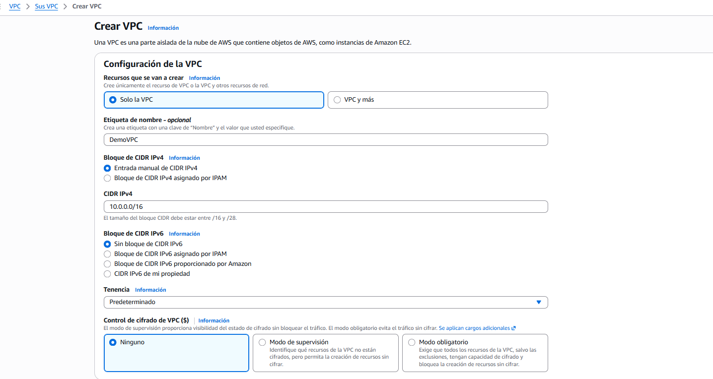  

## SUBRED
+ AWS reserva 5 direcciones IP (4 primeras y 1 última) en cada subred
+ Estas 5 direcciones IP no están disponibles para su uso y no se pueden asignar a una instancia EC2
+ Ejemplo: si el bloque CIDR es 10.0.0.0/24, las direcciones IP reservadas son:
    + 10.0.0.0 - Dirección de red
    + 10.0.0.1 - reservada por AWS para el router de la VPC
    + 10.0.0.2 - reservada por AWS para la asignación al DNS proporcionado por Amazon
    + 10.0.0.3 - reservada por AWS para uso futuro
    + 10.0.0.255 - Dirección de difusión de red. AWS no soporta broadcast en una VPC, por lo que la dirección está reservada

+ Creamos 4 subredes: 2 publicas en dos zonas de disponibilidad A y B y dos privadas. Lo hacemos para tener alta disponibilidad.  
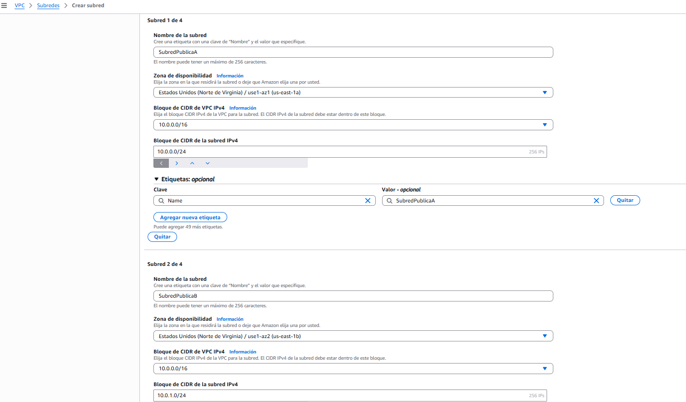  
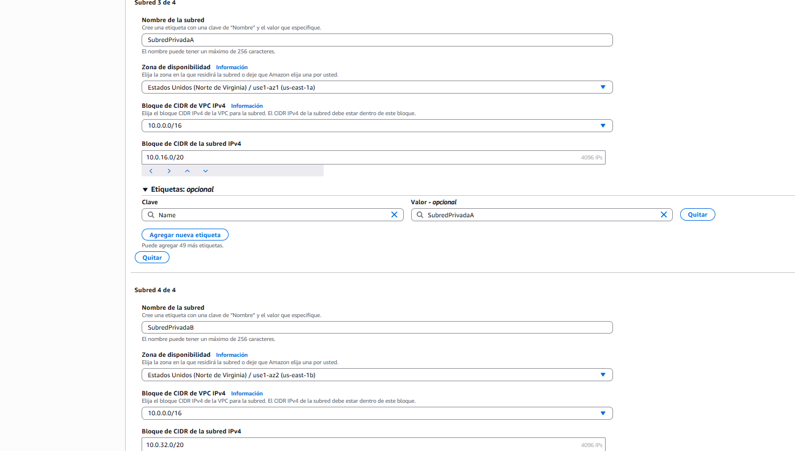  

## GATEWAY / PUERTA DE ENLACE
+ Permite que los recursos (por ejemplo, instancias EC2) de una VPC se conecten a Internet
+ Se escala horizontalmente y tiene alta disponibilidad y redundancia
+ Debe crearse por separado de una VPC
+ Una VPC sólo puede conectarse a una IGW y viceversa
+ Las Puertas de enlace (Gateway) de Internet por sí solas no permiten el acceso a Internet...
+ ¡Las tablas de rutas también deben editarse!

+ PRÁCTICA: por defecto, la red/subred de Amazon si te da una IP pública automática. Pero las que creas manualmente no y se tiene que habilitar en la configuración para que te habilite una IP al crear una instancia en esa subred:
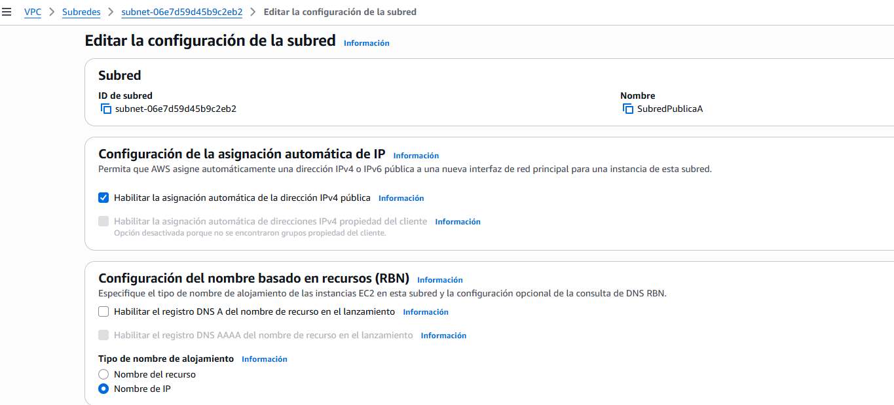  

+ Esta subred y VPC tienen una IP publica ahora pero no tienen configurado un Gateway y una tabla de enrutamiento que les lleve a Internet. Para ello habrá que crear un Gateway y asociarlo a la VPC y luego un enrutamiento para la salida a internet con rutas para la privada y para la publica y asociar las subredes de cada tipo:
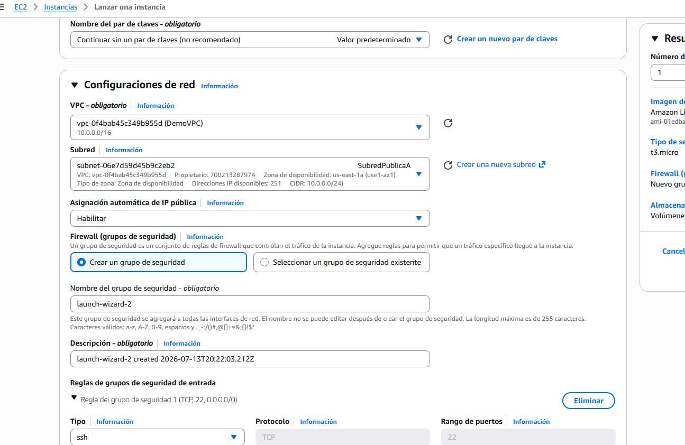  
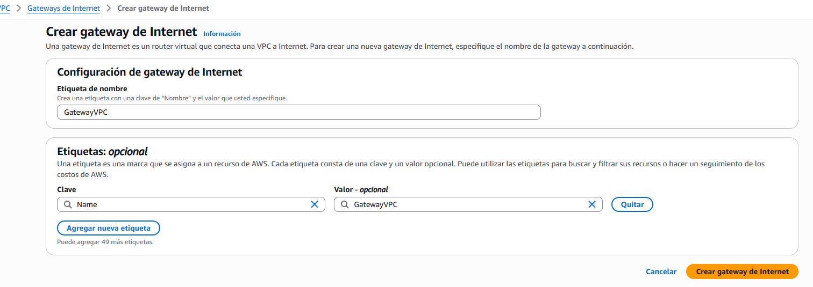  
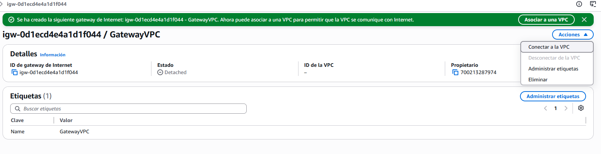  
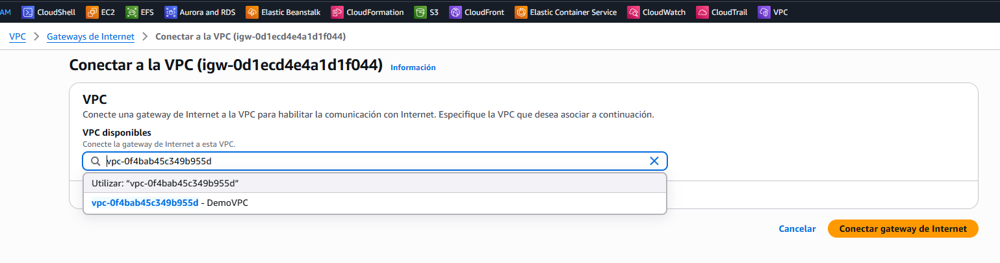  
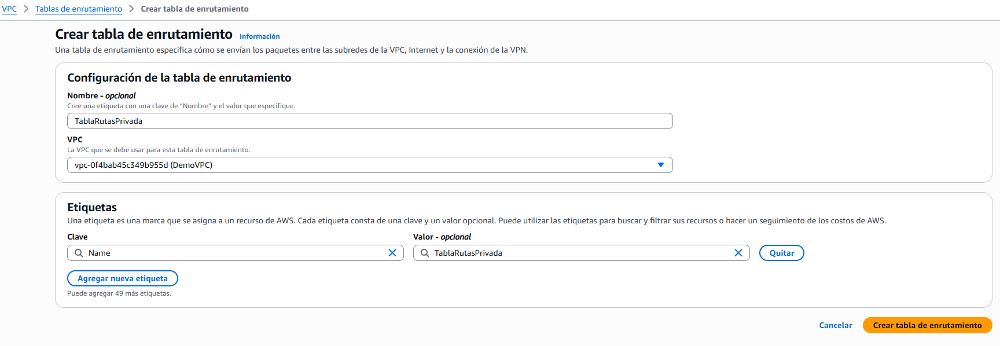  
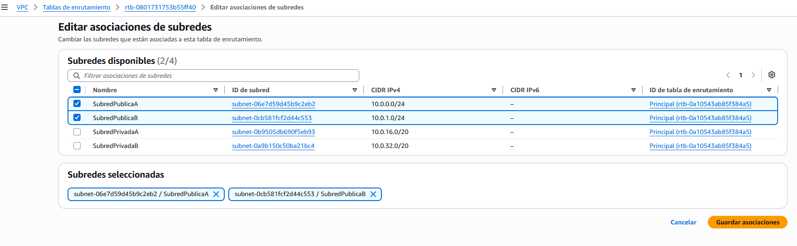  
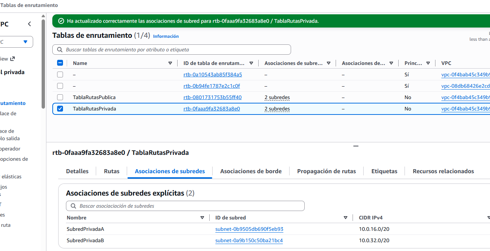  

+ Creamos la ruta de Cualquier Ip a nuestro gateway creado. Por lo que, ahora, como nuestra instancia estaba en una subredPublica, ahora la subred publica está configurada con un gateway y un grupo de tablas de enrutamiento público que se indica que vaya a ese gateway:
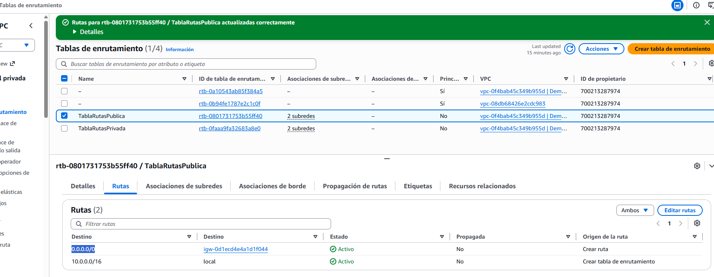  

## Bastion Host (Host Bastión)
+ Podemos utilizar un bastion host para acceder mediante SSH a nuestras instancias EC2 privadas
+ El Bastion Host está en la subred pública, que a su vez está conectada a todas las demás subredes privadas
+ El grupo de seguridad del Bastion Host debe permitir la entrada desde Internet en el puerto 22 desde un CIDR restringido, por ejemplo el CIDR público de tu empresa
+ El grupo de seguridad de las instancias EC2 debe permitir el grupo de seguridad del Bastion Host, o la IP privada del Bastion Host

+ PRÁCTICA: la instancia que teniamos, la llamamos BastionHost. Ahora creamos otra instancia en una subredPrivada (estas no tienen internet porque solo configuramos el gateway/enrutamiento en la pública), creamos par de claves ssh y en el security group ponemos que el origen será PERSONALIZADO desde el Security Group de la instancia 1 (bastion host). 
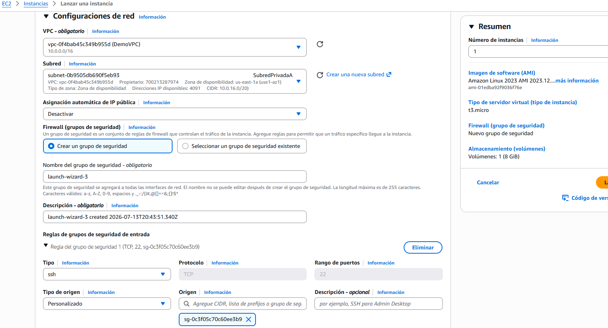  
  
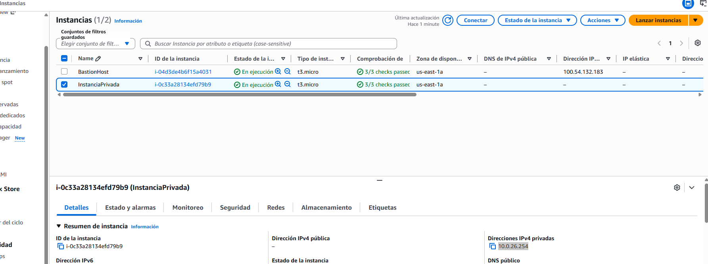  
> Con esto conseguimos que dentro de una VPC nos conectamos de una SubredPublica con acceso a internet a una subredPrivada sin internet mediante SSH  
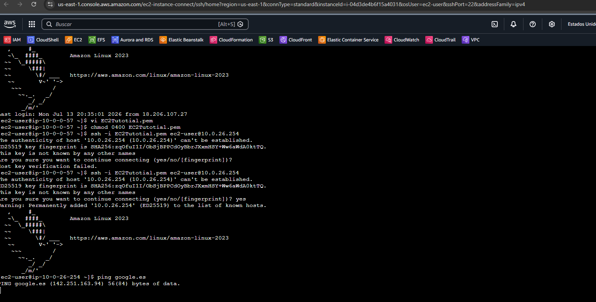  

## Instancia NAT (obsoleta, pero aún en el examen)
+ NAT = Traducción de direcciones de red
+ Permite a las instancias EC2 en subredes privadas conectarse a Internet
+ Debe lanzarse en una subred pública
+ Debe desactivar la configuración de EC2: Comprobación origen / destino
+ Debe tener IP elástica asociada
+ Las tablas de ruta deben estar configuradas para dirigir el tráfico de subredes privadas a la Instancia NAT

## Gateways NAT
+ NAT gestionado por AWS, mayor ancho de banda, alta disponibilidad, sin administración
+ Paga por hora de uso y ancho de banda
+ NATGW se crea en una Zona de Disponibilidad específica, utiliza una IP Elástica
+ No puede ser utilizada por una instancia EC2 en la misma subred (sólo desde otras subredes)
+ Requiere una IGW (subred privada => NATGW => IGW)
+ 5 Gbps de ancho de banda con escalado automático hasta 45 Gbps
+ No se necesitan / gestionan Grupos de Seguridad

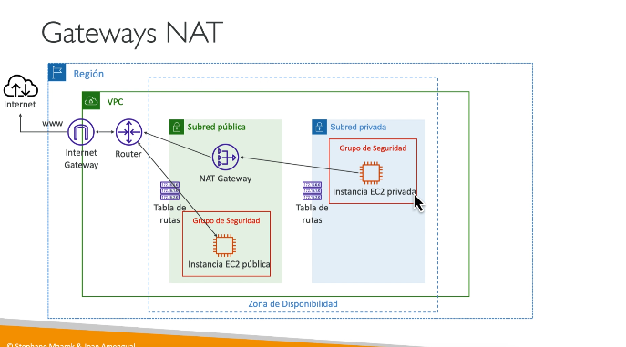  

+ Alta Disponibilidad: 
    - Los Gateways NAT son resilientes dentro de una única Zona de Disponibilidad
    - Debes crear varios Gateways NAT en varias AZ para la tolerancia a fallos
    - No es necesaria la conmutación por error entre zonas de disponibilidad, porque si una zona de disponibilidad se cae, no necesita NAT

+ PRÁCTICA: creamos un Nat gateway que vaya a una red publica vpc de las nuestras. Luego vamos a las tablas de enrutamiento Privada y le decimos que cualquir Ip vaya al Nat gateway creado para que la instancia privada pueda tener acceso a internet
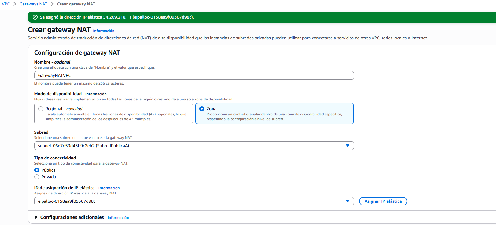  
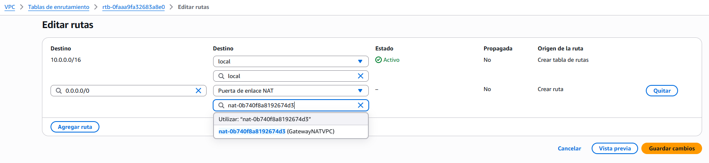  
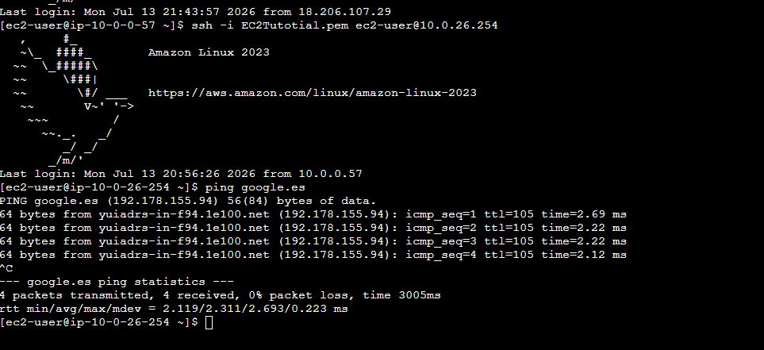  
> Nos conectamos a la instancia pública y por SSH nos conectamos a la privada y comprobamos que conecta a internet.

## NACL (Lista de control de acceso a la red)

+ Las NACL son como un firewall que controla el tráfico desde y hacia las subredes
+ Una NACL por subred, a las subredes nuevas se les asigna la NACL por defecto
+ Tú defines las Reglas NACL:
    + Las reglas tienen un número (1-32766), mayor precedencia con un número menor
    + La primera coincidencia de reglas determinará la decisión
    + Ejemplo: si defines #100 PERMITIR 10.0.0.10/32 y #200 DENEGAR 10.0.0.10/32, se permitirá la dirección IP porque 100 tiene mayor precedencia que 200
    + La última regla es un asterisco (*) y deniega una petición en caso de que no coincida ninguna regla
    + AWS recomienda añadir reglas en incrementos de 100
+ Las NACL recién creadas lo denegarán todo
+ Las NACL son una buena forma de bloquear una dirección IP concreta a nivel de subred

+ NACL por defecto:
- Acepta todo lo que entra/sale con las subredes a las que está asociado
- NO modifiques la NACL por defecto, en su lugar crea NACLs personalizadas

+ Diferencias con Grupo de Seguridad:
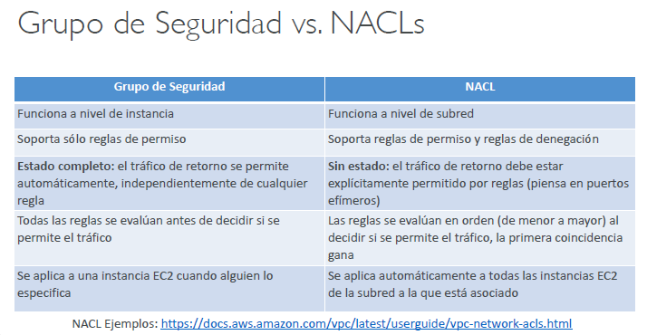  
> Si en NACL de red ponemos por ejemplo una prioridad 80 de denegar trafico http, cuando queramos entrar a la instancia no nos dejará, ya que la NACL por defecto que entra y sale es 100, cumplirá la regla de más prioridad.  
> Si en un Security group le quitamos todo el trafico de entrada o de salida, por defecto nos dejará desde fuera por la NACL, pero si desde dentro de la instancia miramos la conexion http, nos dará error por la regla quitada.

## VPC PEERING

+ Conecta de forma privada dos VPC utilizando la red de AWS
+ Haz que se comporten como si estuvieran en la misma red
+ No deben tener CIDRs solapados
+ La VPC Peering connection NO es transitiva (debe establecerse para cada VPC que necesite comunicarse entre sí)
+ Debes actualizar las tablas de rutas en las subredes de cada VPC para garantizar que las instancias EC2 puedan comunicarse entre sí
+ Puedes crear VPC Peering connection entre VPCs en diferentes cuentas/regiones de AWS
+ Puedes hacer referencia a un grupo de seguridad en una VPC peered (funciona entre cuentas - misma región)

+ PRÁCTICA: queremos conectar la VPC demo con la VPC por defecto de Amazon. Para ello tenemos que crear unas Interconexiones (peering) entre las las dos redes para que instancias de cada Red se puedan comunicar (creamos una instancia demo que sea de la red por defecto para la prueba). Después tenemos que cambiar las tablas de enrutamiento de cada red para decirle que cuando vaya a la red de destino, pase por la interconexión que hemos creado.  
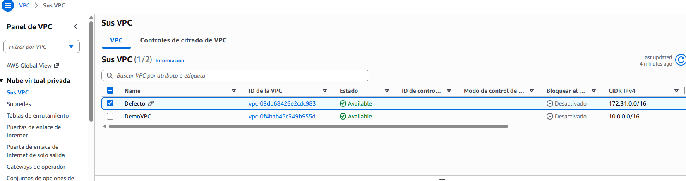  
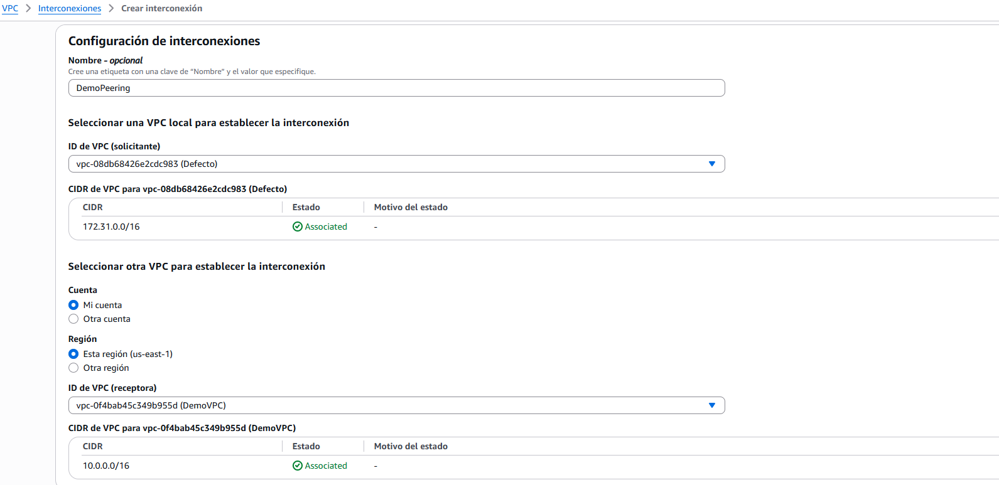  
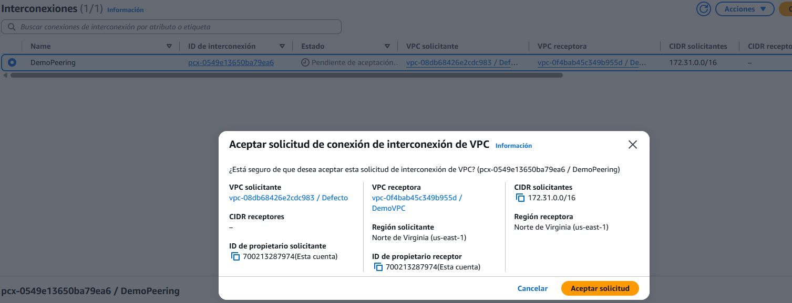  
> Se ha de aceptar la solicitud para que funcione el peering.  

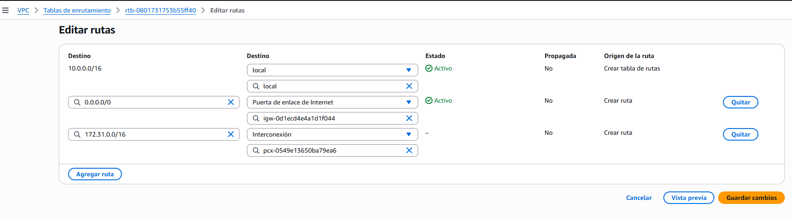  
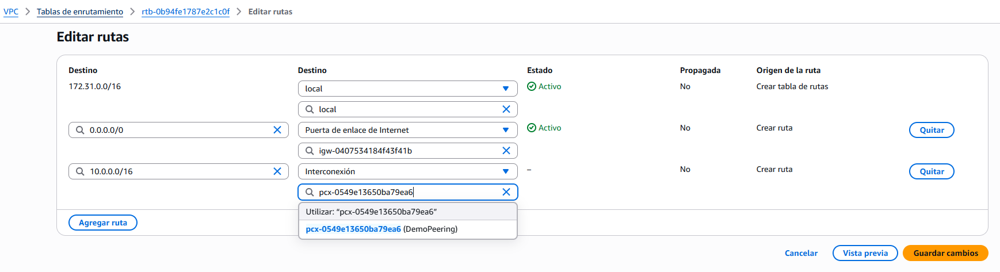  
> De cada VPC (la pública y la de defecto) añadimos la red de la otra VPC y que pase por el peering creado  

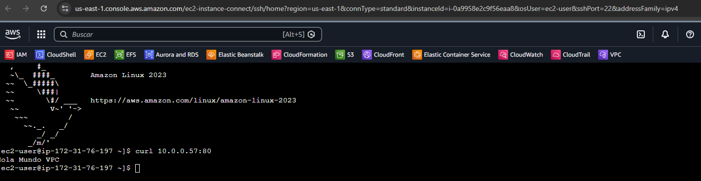  
> Ahora probamos desde la instancia de la red por Defecto y vemos que hace conexión con la instancia de la VPC Demo

## VPC ENDPOINTS

+ Los endpoints de la VPC (con tecnología AWS PrivateLink) te permiten conectarte a los servicios de AWS mediante una red privada en lugar de utilizar la Internet pública
+ Tipos de endpoints
    - Endpoints de interfaz (alimentados por PrivateLink)
        - Proporciona una ENI (dirección IP privada) como punto de entrada (debe adjuntar un Grupo de Seguridad)
        - Soporta la mayoría de los servicios de AWS
        - $ por hora + $ por GB de datos procesados
    - Gateway Endpoints
        - Proporciona un Gateway y debe utilizarse como destino en una tabla de rutas (no utiliza grupos de seguridad)
        - Soporta tanto S3 como DynamoDB
        - Gratis

+ PRÁCTICA: ahora de la instancia privada quitamos en las tablas de enrutamiento el NAT gateway. Creamos un EndPoint / punto de conexión con un rol de IAM de leer S3 de las Ec2 en la instancia privada. Lo asignamos a la tabla privada y vemos que sin internet, tendrá acceso a los servicios s3 con este endpoint creado
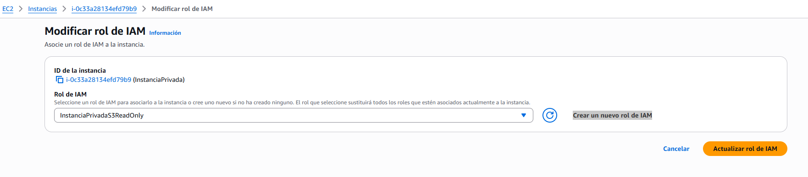  
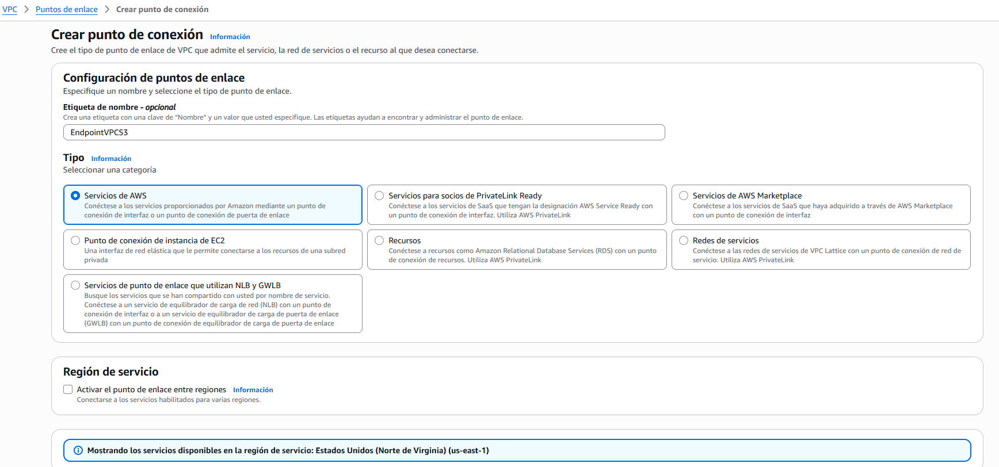  
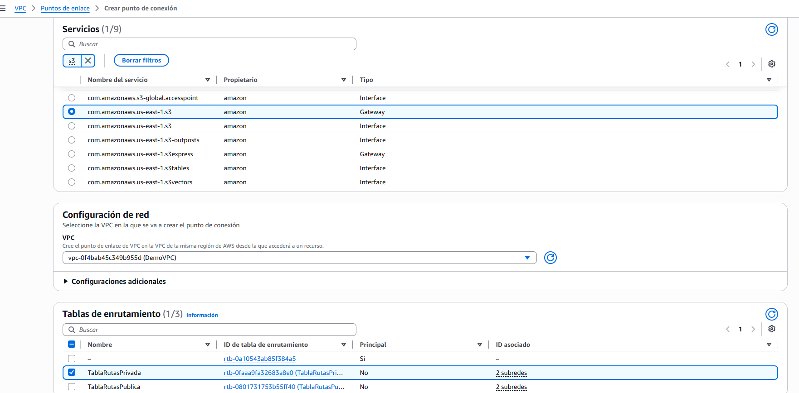  
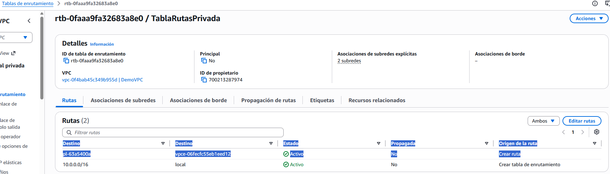  

## LOGS DE FLUJO

+ Captura información sobre el tráfico IP que entra en tus interfaces:
    + Logs de flujo de VPC
    + Logs de flujo de subred
    + Logs de flujo de Elastic Network Interface (ENI)
+ Ayuda a supervisar y solucionar problemas de conectividad
+ Los datos de los logs de flujo pueden ir a S3 / CloudWatch Logs
+ Captura también información de red de las interfaces gestionadas por AWS ELB, RDS, ElastiCache, Redshift, WorkSpaces, NATGW, Transit Gateway...

+ Las peticiones de NACL son SIN ESTADO, es decir, se filtra tanto la entrada como la salida. Las peticiones de SECURITY GROUP son con estado, solo se filtra al entrar y no se tiene en cuenta la salida. Por lo tanto, si la entrada es OK y hay un log de fallo en la salida, solo puede ser peticion de NACL y no de SG.

## IPV6
+ IPv4 se diseñó para proporcionar 4.300 millones de direcciones (se agotarán pronto)
+ IPv6 es el sucesor de IPv4
+ IPv6 está diseñado para proporcionar 3.4 x 10^38 direcciones IP únicas
+ Cada dirección IPv6 es pública y enrutable por Internet (no hay rango privado)
+ No se puede deshabilitar IPv4 para tu VPC y subredes
+ Puedes habilitar IPv6 (son direcciones IP públicas) para funcionar en modo dual stack
+ Tus instancias EC2 tendrán al menos una IPv4 interna privada y una IPv6 pública
+ Pueden comunicarse utilizando IPv4 o IPv6 a Internet a través de un Gateway de Internet
+ No se puede deshabilitar IPv4 para tu VPC y subredes
+ Por tanto, si no puedes lanzar una instancia EC2 en tu subred
    + no es porque no pueda adquirir una IPv6 (el espacio es muy grande)
    + Es porque no hay IPv4 disponibles en tu subred

## RESUMEN VPC

+ CIDR - Rango IP
+ VPC - Virtual Private Cloud => definimos una lista de CIDR IPv4 & IPv6
+ Subredes - vinculadas a una AZ, definimos un CIDR
+ Gateway de Internet - a nivel de VPC, proporciona acceso a Internet IPv4 e IPv6
+ Tablas de rutas - deben editarse para añadir rutas desde subredes al IGW, VPC Peering connection, VPC endpoint, ...
+ Bastion Host - instancia EC2 pública a la que acceder mediante SSH, que tiene conectividad SSH a instancias EC2 en subredes privadas.
+ Instancias NAT - da acceso a Internet a instancias EC2 en subredes privadas. Antiguo, debe configurarse en una subred pública, desactivar la bandera de comprobación Origen / Destino
+ Gateways NAT - gestionados por AWS, proporcionan acceso escalable a Internet a instancias EC2 privadas, sólo IPv4
+ DNS privado + Route 53 - habilita la Resolución DNS + Nombres de host DNS (VPC)

+ NACL - sin estado, reglas de subred para entrantes y salientes, no olvides los Puertos Efímeros
+ Grupos de Seguridad - con estado, operan a nivel de instancia EC2
+ Analizador de alcanzabilidad - realiza pruebas de conectividad de red entre recursos AWS
+ VPC Peering - conecta dos VPC con CIDR no solapados, no transitivos
+ VPC Endpoints - proporcionan acceso privado a los servicios de AWS (S3, DynamoDB, CloudFormation, SSM) dentro de una VPC
+ Logs de flujo VPC - puede configurarse a nivel de VPC / subred / ENI, para tráfico de ACEPTACIÓN y RECHAZO, ayuda a identificar ataques, analizar utilizando Athena o CloudWatch Logs Insights
+ VPN Site-to-Site - configura una Customer Gateway en DC, una Virtual Private Gateway en VPC y una VPN Site-to-Site a través de Internet pública.
+ AWS VPN CloudHub - modelo VPN hub-and-spoke para conectar tus sitios

+ Direct Connect - configura una Virtual Private Gateway en la VPC y establece una conexión privada directa con una ubicación de AWS Direct Connect
+ Direct Connect Gateway - configura una Direct Connect a muchas VPC en diferentes regiones de AWS
+ Servicios AWS PrivateLink / VPC Endpoint:
+ Conecta servicios de forma privada desde tu VPC de servicios a la VPC de clientes
+ No necesita VPC Peering, Internet pública, Gateways NAT, Tablas de Ruta
+ Debe utilizarse con Network Load Balancer y ENI
+ ClassicLink - conecta instancias EC2-Classic EC2 de forma privada a tu VPC
+ Transit Gateway - conexiones peering transitivas para VPC, VPN y DX
+ Traffic Mirroring / Duplicación del tráfico - copia el tráfico de red de las ENI para su posterior análisis
+ Gateway de Internet sólo de salida - como un NAT Gateways, pero para IPv6

## FIREWALL VPC

+ Firewall de red de AWS
    - Protege toda tu Amazon VPC
    - Protección de Capa 3 a Capa 7
    - En cualquier dirección, puedes inspeccionar:
        - Tráfico de VPC a VPC
        - Saliente a Internet
        - Entrante desde Internet
        - Hacia / desde Direct Connect y VPN Site-to-Site (Sitio a Sitio)
    - Internamente, el AWS Network Firewall utiliza el AWS Gateway Load Balancer
    - Las reglas se pueden gestionar de forma centralizada entre cuentas mediante AWS Firewall Manager para aplicarlas a muchas VPCs
+ Soporta 1000s de reglas
+ Filtrado de tráfico: Permitir, descartar o alertar del tráfico que coincida con las reglas
+ Inspección de flujo activo para proteger contra amenazas de red con funciones de prevención de intrusiones (como Gateway Load Balancer, pero todo gestionado por AWS)
+ Envía logs de las coincidencias de las reglas a Amazon S3, CloudWatch Logs, Kinesis Data Firehose

## RESUMEN

+ La arquitectura típica de empresa:
    - Subnet pública → recursos que necesitan internet (ALB, NAT Gateway, Bastion Host)
    - Subnet privada → recursos que NO deben ser accesibles desde internet (EC2, RDS, Lambda)
    - Internet Gateway → la puerta de salida a internet de la VPC
    - Route Table → el mapa que dice a cada subnet por dónde enviar el tráfico

+ NAT Gateway vs NAT Instance:
    - Caso real: tienes instancias EC2 en subnet privada que necesitan descargar actualizaciones de internet, pero no quieres que internet pueda acceder a ellas directamente.
        - NAT Gateway → gestionado por AWS, altamente disponible, sin mantenimiento. El que siempre debes usar.
        - NAT Instance → una EC2 que hace de NAT manualmente. Más barata pero requiere gestión. El examen la pone como opción incorrecta en la mayoría de casos.
        > Regla: siempre NAT Gateway salvo que el escenario diga "mínimo coste" o "gestión propia".

+ Bastion Host:
    - Caso real: tienes instancias EC2 en subnet privada y necesitas conectarte por SSH para administrarlas. No puedes hacerlo directamente desde internet. El Bastion Host es una instancia EC2 en la subnet pública que actúa de puente — te conectas al Bastion por SSH y desde ahí saltas a las instancias privadas.
> Palabra clave: "acceso SSH a instancias privadas" → Bastion Host.

+ Security Groups vs NACLs:
    - Caso real NACLs: quieres bloquear una IP maliciosa específica para toda una subnet. Con Security Groups no puedes hacer Deny explícito — con NACLs sí.
> Palabra clave: "bloquear IP específica" → NACL. "controlar acceso a una instancia" → Security Group.

+ VPC Peering:
    - Conecta dos VPCs para que se comuniquen como si fueran la misma red. Puede ser en la misma cuenta, distinta cuenta o distinta región.
    - Limitación importante del examen: no es transitivo. Si VPC-A está conectada con VPC-B y VPC-B con VPC-C, VPC-A NO puede hablar con VPC-C automáticamente. Necesitas un peering directo entre A y C.
> Palabra clave: "comunicar dos VPCs" → VPC Peering. Si son muchas VPCs → Transit Gateway.

+ VPC Endpoints:
    - Permiten que recursos en tu VPC accedan a servicios AWS (S3, DynamoDB) sin salir a internet público. El tráfico va por la red interna de AWS.
    - Caso real: tienes instancias EC2 en subnet privada que necesitan acceder a S3. Sin endpoint, el tráfico saldría a internet. Con VPC Endpoint el tráfico va directo por la red de AWS — más seguro y sin coste de transferencia.
    - Dos tipos:
        - Gateway Endpoint → solo para S3 y DynamoDB. Gratis.
        - Interface Endpoint → para todos los demás servicios AWS. De pago.
> Palabra clave: "acceder a S3/DynamoDB desde VPC privada sin internet" → VPC Gateway Endpoint.

+ VPN Site-to-Site — conectar oficina con AWS:
    - Exactamente lo que describes de tu empresa pero a nivel de red completa. La oficina de Barcelona tiene sus servidores físicos y quiere conectarlos con la VPC de AWS.
    - Componentes:
        - Virtual Private Gateway (VGW) → el extremo AWS de la VPN, se adjunta a la VPC
        - Customer Gateway (CGW) → el router físico o virtual de la empresa (tu FortiGate de Fortinet, por ejemplo)
        - El túnel VPN cifrado va entre los dos
    - Caso real: tu empresa tiene servidores on-premise con bases de datos legacy y la nueva infraestructura en AWS. Site-to-Site VPN los conecta de forma segura.
    - Limitación: va por internet público aunque cifrado — puede tener latencia variable.

+ Direct Connect:
    - Como Site-to-Site VPN pero en vez de internet, es una conexión física dedicada entre la empresa y AWS. Un cable físico desde el datacenter de la empresa hasta el datacenter de AWS.
    - Ventajas: latencia consistente, más velocidad, más estable.
    - Desventaja: tarda semanas o meses en instalarse y es caro.
    - Cuándo usar cada uno:
        - "conexión rápida de implementar", "coste bajo" → Site-to-Site VPN
        - "latencia consistente", "mucho ancho de banda", "conexión dedicada" → Direct Connect
        - "backup de Direct Connect" → Site-to-Site VPN como respaldo

+ Transit Gateway:
    - Cuando tienes muchas VPCs y muchas conexiones on-premise y el peering individual se vuelve inmanejable. Transit Gateway es un hub central que conecta todo.
    - Sin Transit Gateway con 5 VPCs necesitas 10 peerings individuales. Con Transit Gateway solo 5 conexiones al hub.
> Palabra clave: "hub and spoke", "conectar muchas VPCs", "simplificar conectividad" → Transit Gateway.

+ VPC Flow Logs:
    - Registra todo el tráfico de red que entra y sale de tu VPC. Útil para debugging de conectividad y análisis de seguridad.
    - Caso real: una instancia no puede conectarse a otra y no sabes por qué. Activas VPC Flow Logs y ves exactamente qué tráfico está siendo bloqueado y por qué.
> Palabra clave: "auditar tráfico de red", "debug de conectividad", "análisis de seguridad de red" → VPC Flow Logs.

## CUESTIONARIO

**Pregunta 1:** ¿A qué corresponde el CIDR 10.0.4.0/28?  
> 10.0.4.0 a 10.0.4.15" es correcta porque el CIDR "10.0.4.0/28" permite un rango de 16 direcciones IP, desde la dirección base 10.0.4.0 hasta 10.0.4.15, ya que solo se puede variar el último octeto

**Pregunta 2:** Tienes una red corporativa de tamaño 10.0.0.0/8 y una oficina satélite de tamaño 192.168.0.0/16. ¿Qué CIDR es aceptable para tu VPC de AWS si piensas conectar tus redes más adelante?  
> "172.16.0.0/16" es correcta porque se encuentra en el rango de direcciones privadas que no se solapan con las redes "10.0.0.0/8" y "192.168.0.0/16", permitiendo así una conexión exitosa en el futuro sin conflictos de direccionamiento. Además, cumple con el tamaño máximo de CIDR permitido en AWS, que es /16.

**Pregunta 3:** Tienes previsto crear una subred y quieres que tenga al menos capacidad para 28 instancias EC2. ¿Cuál es el tamaño mínimo que debes tener para tu subred?  
> "/26" es correcta porque proporciona 64 direcciones IP en total, lo que es suficiente para crear al menos 28 instancias EC2, considerando que algunas direcciones son reservadas por AWS. 

**Pregunta 4:** Los Grupos de Seguridad operan a nivel de ................. mientras que las NACL operan a nivel de ..................  
> "Instancia EC2, subred" es correcta porque los Grupos de Seguridad se aplican a instancias EC2, controlando el tráfico hacia y desde ellas, mientras que las Listas de Control de Acceso (NACL) operan a nivel de la subred, afectando a todo el tráfico que entra o sale de ella. 

**Pregunta 5:** Has conectado una Gateway de Internet a tu VPC, pero tus instancias EC2 siguen sin tener acceso a Internet. ¿Qué NO es un posible problema?  
> "El Grupo de Seguridad no permite el tráfico" porque los grupos de seguridad son estatales; si el tráfico puede salir de una instancia EC2, automáticamente puede volver a entrar, lo que elimina esta opción como un posible problema para la falta de acceso a Internet.

**Pregunta 6:** Te gustaría proporcionar acceso a Internet a tus instancias EC2 en subredes privadas con IPv4, asegurándote al mismo tiempo de que esta solución requiere la menor cantidad de administración y se escala sin problemas. ¿Qué deberías utilizar?  
> "Los Gateways NAT" porque permiten que tus instancias EC2 en subredes privadas accedan a Internet para actualizaciones y otros servicios, sin requerir la gestión de instancias NAT individuales ni complicar la escalabilidad. 

**Pregunta 7:** Se ha habilitado el VPC Peering entre la VPC A y la VPC B, y se han actualizado las tablas de rutas para la VPC A. Pero, las instancias EC2 no pueden comunicarse. ¿Cuál es el problema más probable?  
> "Comprueba las tablas de rutas en la VPC B" porque, tras habilitar el VPC Peering, es necesario actualizar las tablas de rutas en ambas VPCs para permitir la comunicación entre ellas.

**Pregunta 8:** Has configurado una conexión de Conexión Directa entre tu centro de datos corporativo y tu VPC A en tu cuenta de AWS. También necesitas acceder a la VPC B en otra región de AWS desde tu centro de datos corporativo. ¿Qué debes hacer?  
> "Utiliza una Gateway de Direct Connect" porque este tipo de gateway permite la conexión directa entre tu centro de datos y múltiples VPC en diferentes regiones, facilitando el acceso a la VPC B desde tu infraestructura local.

**Pregunta 9:** Al utilizar VPC Endpoints, ¿cuáles son los dos únicos servicios de AWS que tienen un Gateway Endpoint disponible?  
> "Amazon S3, DynamoDB" porque estos son los únicos servicios de AWS que tienen un Gateway Endpoint disponible, lo que permite una conexión más directa y segura dentro de tu VPC. 

**Pregunta 10:** AWS reserva 5 direcciones IP cada vez que creas una nueva subred en una VPC. Cuando creas una subred con CIDR 10.0.0.0/24, se reservan las siguientes direcciones IP, EXCEPTO ....................  
> "10.0.0.4" porque esta dirección IP está reservada para el uso del router dentro de la subred, a diferencia de las otras direcciones que son reservadas para diversas funciones como la dirección de red y la dirección de broadcast.

**Pregunta 11:** Tienes 3 VPCs A, B y C. Quieres establecer una VPC Peering connection entre las 3 VPCs. ¿Qué debes hacer?  
> "Establece 3 VPC Peering connection (A-B, A-C, B-C)" porque para que todas las VPC se comuniquen entre sí, es necesario establecer conexiones directas entre cada par de VPCs; el VPC Peering no es transitivo, lo que significa que un peering entre A y B no automáticamente permite la comunicación entre A y C o B y C. 

**Pregunta 12:** ¿Cómo puedes capturar información sobre el tráfico IP dentro de tus VPCs?  
> "Habilita los logs de flujo de la VPC" porque esta función te permite capturar y analizar información detallada sobre el tráfico IP que entra y sale de las interfaces de red de tu VPC, lo cual es esencial para la supervisión y la seguridad en la nube.

**Pregunta 13:** Si quieres una conexión de conexión directa (Direct Connect) de 500 Mbps entre tu centro de datos corporativo y AWS, elegirías una conexión ...................  
> "Alojada" porque esta conexión soporta velocidades de 50 Mbps, 500 Mbps y hasta 10 Gbps, lo que se ajusta a tus necesidades de conexión directa entre tu centro de datos y AWS.

**Pregunta 14:** Cuando configuras una conexión VPN de sitio a sitio de AWS entre tu centro de datos corporativo en las instalaciones y las VPC en el Cloud de AWS, ¿cuáles son los dos componentes principales que quieres configurar para esta conexión?  
> "Gateway virtual y Gateway del cliente" porque estos son los dos componentes esenciales para establecer una conexión VPN de sitio a sitio en AWS; el Gateway del cliente representa tu red local y el Gateway virtual actúa como el extremo remoto en AWS, permitiendo así la comunicación segura entre ambos.

**Pregunta 15:** Tu empresa tiene varias sedes locales en Estados Unidos. Estas sedes están actualmente enlazadas mediante conexiones privadas, pero tu proveedor de conexiones privadas ha sido recientemente bastante inestable, lo que ha hecho que tu arquitectura de IT esté parcialmente desconectada. Te gustaría crear una conexión de reserva que utilizara la Internet pública para enlazar tus sedes locales, y que pudieras recuperar en caso de problemas con tu proveedor. ¿Qué recomiendas?  
> "AWS VPN CloudHub" porque esta solución permite establecer conexiones seguras entre varias sedes locales utilizando la infraestructura de VPN de AWS, lo que es ideal para tu necesidad de una conexión de respaldo que funcione a través de Internet pública. 

**Pregunta 16:** Tienes que establecer una conexión dedicada entre tu centro de datos corporativo local y AWS Cloud. Esta conexión debe ser privada, consistente, y el tráfico no debe viajar a través de Internet. ¿Qué servicio de AWS debes utilizar?  
> "AWS Direct Connect" porque es la opción adecuada para establecer una conexión dedicada, privada y consistente entre tu centro de datos y la nube de AWS, evitando que el tráfico viaje a través de Internet pública.

**Pregunta 17:** Utilizando una conexión de Conexión Directa, puedes acceder tanto a los recursos públicos como a los privados de AWS.  
> "Verdadero" porque, efectivamente, con AWS Direct Connect puedes acceder tanto a los recursos públicos como a los privados de AWS. Esto permite una conectividad más eficiente y segura entre tu red local y los servicios de AWS, cumpliendo así con el objetivo de mejorar la integración de recursos en la nube.

**Pregunta 18:** Quieres aumentar el rendimiento de una conexión VPN de sitio a sitio de AWS, establecida entre tus datos locales y la Cloud de AWS, más allá del límite máximo de 1,25 Gbps de un único túnel IPsec. ¿Qué debes hacer?  
> "Utilizar Transit Gateway" porque este servicio permite conectar múltiples VPCs y otras conexiones, incluidos túneles VPN, facilitando el aumento del rendimiento de la conexión y permitiendo una gestión centralizada del tráfico, a diferencia de otros métodos que no proporcionan la misma escalabilidad y flexibilidad.

**Pregunta 19:** Tienes una VPC en tu cuenta de AWS que se ejecuta en modo de doble stack. Intentas continuamente lanzar una instancia EC2, pero falla. Tras una investigación más profunda, has descubierto que ya no tienes direcciones IPv4 disponibles. ¿Qué debes hacer?  
> "Añade un CIDR IPv4 adicional a tu VPC" porque esta opción te permite expandir el rango de direcciones IPv4 disponibles en tu Virtual Private Cloud (VPC), lo que resolverá el problema de falta de direcciones y te permitirá lanzar instancias EC2 sin inconvenientes. 

**Pregunta 20:** El backend de una aplicación web está alojado en instancias de EC2 en subredes privadas, con un Load Balancer de aplicaciones en subredes públicas. Es necesario dar a algunos de los desarrolladores acceso a las instancias EC2 del backend, pero sin exponer las instancias EC2 del backend a Internet. Has creado una instancia EC2 de host bastión en la subred pública y has configurado el Grupo de Seguridad de las instancias EC2 backend para permitir el tráfico desde el host bastión. ¿Cuál de las siguientes es la mejor configuración para el Grupo de Seguridad del host bastión para hacerlo seguro?  
>  "Permite el tráfico sólo en el puerto 22 desde el CIDR público de la empresa" como respuesta correcta porque esta configuración permite a los desarrolladores acceder de manera segura a las instancias EC2 del backend a través de SSH, sin exponer las instancias a Internet, lo que mantiene la seguridad de tu infraestructura.

**Pregunta 21:** Una empresa ha configurado una conexión de Conexión Directa entre su centro de datos corporativo y AWS. Es necesario preparar una conexión de respaldo segura y rentable en caso de que haya problemas con esta conexión de Conexión Directa. ¿Cuál es la solución más rentable y segura que recomiendas?  
> "Configura una conexión VPN Site-to-Site como respaldo" porque es una solución rentable y segura que te permite mantener una conexión a AWS incluso si falla tu Conexión Directa, utilizando Internet para establecer un túnel seguro. Esta opción te ofrece redundancia sin los costos y la complejidad asociados con múltiples conexiones Direct Connect.

**Pregunta 22:** ¿Qué servicio de AWS te permite proteger y controlar el tráfico en tu VPC desde la capa 3 hasta la capa 7?  
> "AWS Network Firewall" porque este servicio te permite proteger y controlar el tráfico en tu VPC desde la capa 3 hasta la capa 7, proporcionando una solución integral para implementar políticas de seguridad y filtrar el tráfico de red en tu infraestructura.

## PREGUNTAS TIPO EXAMEN

**Pregunta 1**: Una empresa tiene instancias EC2 en subnets privadas que necesitan descargar parches de seguridad de internet. No deben ser accesibles desde internet. ¿Qué servicio colocan en la subnet pública?  
A) Internet Gateway  
B) Bastion Host  
**C) NAT Gateway**  
D) VPC Endpoint  
> C) NAT Gateway en subnet pública con ruta desde la subnet privada hacia él. El flujo es: instancia privada → NAT Gateway → Internet Gateway → internet. La instancia privada nunca es accesible desde fuera porque el NAT solo permite tráfico saliente iniciado desde dentro.

**Pregunta 2**: Un equipo de administración necesita conectarse por SSH a instancias EC2 en subnets privadas desde internet. ¿Qué arquitectura usan?  
A) Abrir el puerto 22 directamente en las instancias privadas  
**B) Bastion Host en subnet pública + SSH desde Bastion a instancias privadas**  
C) NAT Gateway con puerto 22 abierto  
D) Direct Connect con acceso SSH  
> B) El Bastion Host es el puente estándar para administración SSH. En el mundo real con FortiClient lo que describes es similar — te conectas a un punto de entrada seguro y desde ahí accedes a los recursos internos. El Bastion hace lo mismo pero para SSH en AWS.

**Pregunta 3:** Una empresa quiere bloquear explícitamente todas las peticiones desde una IP específica conocida como maliciosa para toda una subnet. ¿Qué usan?  
A) Security Group con regla Deny  
B) WAF  
**C) NACL con regla Deny**  
D) GuardDuty  
> C) NACL con regla Deny: Security Groups no tienen reglas Deny explícitas, solo Allow. Si necesitas bloquear una IP específica necesitas NACL obligatoriamente. WAF también podría bloquear IPs pero opera a nivel de aplicación HTTP, no a nivel de red.

**Pregunta 4**: Una empresa tiene 10 VPCs en distintas regiones y necesita que todas se comuniquen entre sí y con su datacenter on-premise de forma centralizada. ¿Qué servicio usan?  
A) VPC Peering entre todas  
B) Direct Connect para cada VPC  
**C) Transit Gateway**  
D) VPN Site-to-Site para cada VPC  
> C) Transit Gateway: Con 10 VPCs, VPC Peering requeriría 45 conexiones individuales (n*(n-1)/2). Transit Gateway lo reduce a 10 conexiones al hub central. Además Transit Gateway puede conectar simultáneamente VPCs y on-premise — es el hub universal de conectividad.

**Pregunta 5**: Una empresa necesita que sus instancias EC2 en subnet privada accedan a S3 sin que el tráfico salga a internet. ¿Qué configuran?  
A) NAT Gateway  
B) VPC Interface Endpoint  
**C) VPC Gateway Endpoint para S3**  
D) Internet Gateway  
> C) Gateway Endpoint de Interface Endpoint. Para S3 y DynamoDB siempre Gateway Endpoint — es gratis y más simple. Interface Endpoint es para todos los demás servicios AWS y tiene coste por hora y por GB transferido.

**Pregunta 6**: Una empresa necesita conectar su datacenter on-premise con AWS urgentemente esta semana. Necesitan cifrado pero la latencia puede ser variable. ¿Qué eligen?  
A) Direct Connect  
**B) Site-to-Site VPN**  
C) Transit Gateway  
D) AWS Client VPN  
> B) Site-to-Site VPN: Esta semana" + "cifrado" + "latencia variable aceptable" = Site-to-Site VPN. Direct Connect tarda semanas o meses en instalarse físicamente. VPN se configura en horas.

**Pregunta 7:** Una empresa financiera necesita una conexión con AWS de latencia consistente y predecible para transferir grandes volúmenes de datos continuamente. El tiempo de instalación no es problema. ¿Qué eligen?  
A) Site-to-Site VPN  
B) AWS Client VPN  
C) VPC Peering  
**D) Direct Connect**  
> D) Direct Connect: Latencia consistente" + "grandes volúmenes" + "tiempo de instalación no importa" = Direct Connect siempre. Es una conexión física dedicada que no comparte infraestructura con internet público — por eso la latencia es predecible y estable.