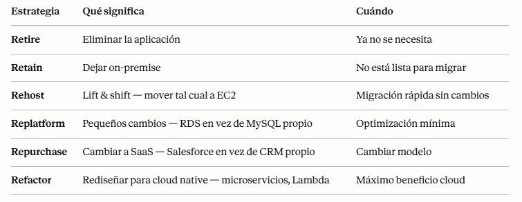

# RECUPERACIÓN DESASTRES

+ ¿Qué tipo de recuperación ante desastres?
    - En las instalaciones => En las instalaciones: DR tradicional, y muy cara
    - En las instalaciones => Cloud de AWS: recuperación híbrida
    - Región A de AWS Cloud => Región B de AWS Cloud
+ Necesidad de definir dos términos:
    - RPO: Objetivo de Punto de Recuperación: cantidad de pérdida de datos que estamos dispuesto a perder. Es decir, del punto donde tenemos backup a lo nuevo que no tenemos backup
    - RTO: Objetivo de Tiempo de Recuperación: tiempo de inactividad desde el desastre hasta que vuelve la infraestructura a funcionar.

## ESTRATEGIAS DE RECUPERACIÓN DE DESASTRES
+ Estrategias de recuperación en caso de catástrofe: 
    - Copia de seguridad y restauración: es el que tiene RPO más alto, es decir, tenemos mucha más cantidad de datos perdidos
    - Luz piloto / Pilot Light: 
        - Una pequeña versión de la aplicación se ejecuta siempre en el Cloud
        - Útil para el núcleo crítico (piloto)
        - Muy similar a Copia de Seguridad y Restauración (Backup & Restore)
        - Más rápido que Copia de Seguridad y Restauración, ya que los sistemas críticos ya están en marcha
    - Espera caliente/ Warm Standby:
        - El sistema completo está en funcionamiento, pero con un tamaño mínimo
        - En caso de desastre, podemos escalar a la carga de producción
    - Enfoque Hot Site / Multi Site
        - RTO muy bajo (minutos o segundos) - muy caro
        - La escala de producción completa se ejecuta en AWS y en las instalaciones

## CONSEJOS DE RECUPERACIÓN DE DESASTRE
+ Copias de seguridad
    - Los Snapshots de EBS, copias de seguridad automáticas de RDS / Snapshots, etc...
    - Envíos regulares a S3 / S3 IA / Glacier, Política de ciclo de vida, Replicación entre regiones
    - Desde las instalaciones: Snowball o Storage Gateway
+ Alta disponibilidad
    - Utiliza Route53 para migrar DNS de una región a otra
    - RDS Multi-AZ, ElastiCache Multi-AZ, EFS, S3
    - VPN Site-to-Site como recuperación de Direct Connect
+ Replicación
    - Replicación RDS (entre regiones), AWS Aurora + bases de datos globales
    - Replicación de bases de datos desde las instalaciones a RDS
    - Gateway de almacenamiento
+ Automatización
    - CloudFormation / Elastic Beanstalk para volver a crear un entorno completamente nuevo
    - Recuperar / Reiniciar instancias EC2 con CloudWatch si fallan las alarmas
    - Funciones AWS Lambda para automatizaciones personalizadas
+ Caos
    - Netflix tiene un "ejército de simios" que termina EC2 aleatoriamente

## DMS - Servicio de Migración de Bases de Datos

+ Migra bases de datos a AWS de forma rápida y segura, resiliente y autorreparable
+ La base de datos de origen sigue disponible durante la migración
+ Soporta:
    + Migraciones homogéneas: por ejemplo, de Oracle a Oracle
    + Migraciones heterogéneas: ex Microsoft SQL Server a Aurora
+ Replicación continua de datos mediante CDC
+ Debes crear una instancia EC2 para realizar las tareas de replicación

## Herramienta de conversión de esquemas de AWS (SCT)
+ Convierte el esquema de tu base de datos de un motor a otro
+ Ejemplo OLTP: (SQL Server u Oracle) a MySQL, PostgreSQL, Aurora
+ Ejemplo OLAP: (Teradata u Oracle) a Amazon Redshift
+ Prefiere instancias de cálculo intensivo para optimizar las conversiones de datos
+ No necesitas usar SCT si estás migrando el mismo motor de BD

## AWS Backup
+ Servicio totalmente gestionado
+ Administra y automatiza centralmente las copias de seguridad en todos los servicios de AWS
+ Sin necesidad de crear scripts personalizados ni procesos manuales
+ Servicios soportados:
    + Amazon EC2 / Amazon EBS
    + Amazon S3
    + Amazon RDS (todos los motores de BD) / Amazon Aurora / Amazon DynamoDB
    + Amazon DocumentDB / Amazon Neptune
    + Amazon EFS / Amazon FSx (Lustre y Servidor de archivos de Windows)
    + AWS Storage Gateway (Volume Gateway)
+ Soporta backups entre regiones
+ Soporta backups entre cuentas
+ Soporta PITR para los servicios soportados
+ Copias de seguridad bajo demanda y programadas
+ Políticas de copia de seguridad basadas en etiquetas
+ Creas políticas de copia de seguridad conocidas como Planes de copia de seguridad

+ AWS Backup Vault Lock
+ Aplica un estado WORM (Write Once Read Many) a todos los backups que almacenes en tu bóveda de backups de AWS
+ Capa adicional de defensa para proteger tus copias de seguridad contra:
    + Operaciones de borrado inadvertidas o malintencionadas
    + Actualizaciones que acorten o alteren los periodos de retención
+ Ni siquiera el usuario root puede borrar copias de seguridad cuando está activado

## AWS Application Discovery Service
+ Planificar los proyectos de migración recopilando información sobre los centros de datos locales
+ Los datos de utilización de los servidores y la asignación de dependencias son importantes para las migraciones
+ Descubrimiento sin agente (conector de descubrimiento sin agente de AWS)
+ Descubrimiento basado en agentes (AWS Application Discovery Agent)
+ Los datos resultantes pueden verse en el AWS Migration Hub

## AWS Application Migration Service (MGN)
+ Solución Lift-and-shift que simplifica la migración de aplicaciones a AWS
+ Convierte tus servidores físicos, virtuales y basados en la nube para que se ejecuten de forma nativa en AWS
+ Soporta una amplia gama de plataformas, sistemas operativos y bases de datos

## Transferir grandes cantidades de datos a AWS
+ A través de Internet / VPN Site-to-Site (Sitio a Sitio):
    + Configuración inmediata
    + Tardará 200(TB)*1000(GB)*1000(MB)*8(Mb)/100 Mbps = 16.000.000s = 185d
+ Sobre Direct Connect 1Gbps:
    + Mucho tiempo para la configuración única (más de un mes)
    + Llevará 200(TB)*1000(GB)*8(Gb)/1 Gbps = 1.600.000s = 18,5d
+ Sobre Snowball:
    + Llevará de 2 a 3 Snowballs en paralelo
    + La transferencia de extremo a extremo tarda aproximadamente 1 semana
    + Puede combinarse con DMS
+ Para replicación / transferencias en curso: VPN Site-to-Site o DX con DMS o DataSync

## VMware Cloud en AWS
+ Algunos clientes utilizan VMware Cloud para gestionar su Centro de Datos local

## RESUMEN

+ El escenario real que debes tener en la cabeza:
    - Imagina que eres Cloud Engineer en una empresa de e-commerce española. Tienes toda la infraestructura en AWS eu-west-1 (Irlanda). Un día a las 3am hay un fallo catastrófico en esa región — la web cae completamente. 
    - ¿Cuánto tiempo puedes estar caído? 
    - ¿Cuántos datos puedes perder?
    > Esas dos preguntas son exactamente RPO y RTO — los conceptos más importantes de esta sección.

+ RPO (Recovery Point Objective) → ¿cuántos datos puedes permitirte perder? Si haces backup cada 24h y hay un fallo, pierdes hasta 24h de datos. Si tu RPO es 1h, necesitas backup cada hora.
+ RTO (Recovery Time Objective) → ¿cuánto tiempo puedes estar caído? Si tu RTO es 4h, tienes 4h para restaurar el servicio antes de que el impacto sea inaceptable.
> Regla general: menor RPO y RTO = más caro. El examen siempre te pide elegir la estrategia que cumple los requisitos con el mínimo coste.

+ Las 4 estrategias de Disaster Recovery — de más barata a más cara:
    1. Backup & Restore — la más barata, RTO/RPO altos
    - Haces backups periódicos a S3 y cuando hay un desastre, restauras desde cero.
    - Caso real: una empresa pequeña hace backup de su RDS cada noche a S3. Si hay un fallo, tarda 4-8h en restaurar todo. Pierden hasta 24h de datos.
    - Cuándo elegirla: cuando el negocio puede permitirse horas de caída y pérdida de datos. Startups, sistemas no críticos.
    > Palabra clave examen: "mínimo coste", "puede tolerar horas de caída" → Backup & Restore.

    2. Pilot Light — el motor encendido, RTO/RPO medios
    - Tienes una versión mínima de tu infraestructura corriendo en la región de DR — solo los componentes críticos (base de datos replicada). Cuando hay un desastre, enciendes el resto rápidamente.
    - Caso real: la empresa replica su RDS a eu-central-1 (Frankfurt) continuamente. Si Irlanda cae, en 30-60 minutos lanzan las instancias EC2 y el ALB en Frankfurt y apuntan el DNS allí.
    - Analogía: el piloto de un avión — siempre encendido pero no produce calor hasta que lo necesitas.
    - Cuándo elegirla: sistemas importantes pero no críticos al segundo.
    > Palabra clave examen: "replicación de base de datos activa", "recuperación en minutos", "coste moderado" → Pilot Light.

    3. Warm Standby — versión reducida activa, RTO/RPO bajos
    - Una versión reducida pero completamente funcional de tu infraestructura corriendo en la región de DR. En vez de 10 instancias EC2, tienes 2. Cuando hay un desastre, escala automáticamente.
    - Caso real: la empresa tiene en Frankfurt un ALB + 2 EC2 + RDS réplica siempre corriendo. Si Irlanda cae, Route 53 redirige el tráfico a Frankfurt en minutos y el ASG escala de 2 a 10 instancias automáticamente.
    - Cuándo elegirla: sistemas importantes que necesitan recuperación rápida pero no instantánea.
    > Palabra clave examen: "versión reducida activa", "escala en el desastre", "recuperación en minutos" → Warm Standby.

    4. Multi-Site Active-Active — la más cara, RTO/RPO casi cero
    - Tu infraestructura completa corre simultáneamente en múltiples regiones. El tráfico se reparte entre ellas. Si una cae, la otra absorbe todo sin interrupción.
    - Caso real: Amazon.com, Netflix, Stripe. No pueden permitirse ni un segundo de caída. Todo corre en paralelo en múltiples regiones y el usuario ni nota si una región falla.
    - Cuándo elegirla: sistemas críticos donde cada segundo de caída cuesta mucho dinero.
    > Palabra clave examen: "cero tiempo de inactividad", "RTO casi cero", "activo en múltiples regiones" → Multi-Site Active-Active.

+ DMS (Database Migration Service) → migrar bases de datos a AWS sin parar el servicio. Puedes migrar de Oracle on-premise a Aurora, de MySQL a PostgreSQL, etc. Soporta migración continua mientras la BD sigue activa.
    - Caso real: una empresa quiere migrar su Oracle on-premise a Aurora PostgreSQL. Con DMS hacen la migración en caliente — la BD sigue funcionando mientras se migra.
> Palabra clave: "migrar base de datos a AWS", "migración continua", "cambiar motor de BD" → DMS.

+ AWS Backup → servicio centralizado para gestionar todos los backups de AWS desde un solo lugar. EC2, RDS, EFS, DynamoDB, S3 — todo desde una consola única con políticas y retención configurables.
> Palabra clave: "backup centralizado", "política de retención unificada" → AWS Backup.

+ Application Migration Service (MGN) → migrar servidores físicos o virtuales on-premise a AWS. Replica el servidor continuamente y cuando estás listo, haces el corte.
> Palabra clave: "migrar servidores on-premise a AWS", "lift and shift" → MGN.

+ Los 6 Rs de migración — el examen los pregunta:
  

## CUESTIONARIO

**Pregunta 1:** Como parte de tu plan de recuperación de desastres, te gustaría tener sólo la infraestructura crítica en funcionamiento en AWS. No te importa un Objetivo de Tiempo de Recuperación (RTO) más largo. ¿Qué estrategia de RD recomiendas?  
> "Luz piloto" es correcta porque esta estrategia permite mantener la infraestructura crítica en funcionamiento con bajos costos, ya que solo se ejecutan los servicios esenciales y se puede escalar a medida que sea necesario, lo que se alinea con tu objetivo de un RTO más largo.

**Pregunta 2:** Te gustaría obtener la estrategia de Recuperación de Desastres con el menor Objetivo de Tiempo de Recuperación (RTO) y Objetivo de Punto de Recuperación (RPO), independientemente del coste. ¿Qué DR deberías elegir?  
> "Multisitio" es correcta porque esta estrategia permite tener copias de los servicios en múltiples ubicaciones, lo que proporciona la más alta disponibilidad y el menor tiempo de recuperación, alineándose perfectamente con tu objetivo de minimizar el RTO y RPO sin preocuparte por el coste.

**Pregunta 3:** ¿Cuál de las siguientes estrategias de Recuperación de Desastres tiene un Objetivo de Punto de Recuperación (RPO) y un Objetivo de Tiempo de Recuperación (RTO) potencialmente altos?  
> "Copia de seguridad y restauración (Backup & Restore)" es correcta porque esta estrategia generalmente implica tiempos de recuperación más largos y mayores puntos de recuperación, lo que puede resultar en un RPO y un RTO más altos en comparación con otras opciones más avanzadas. 

**Pregunta 4:** Quieres hacer un plan de Recuperación de Desastres en el que tengas una versión reducida de tu sistema en funcionamiento, y cuando ocurra un desastre, se amplíe rápidamente. ¿Qué estrategia de RD debes elegir?  
> "Espera caliente" es correcta porque esta estrategia permite mantener una versión reducida de tu sistema en funcionamiento, y al experimentar un desastre, puedes ampliar rápidamente los recursos, lo que se alinea con tu objetivo de un plan de recuperación eficiente.

**Pregunta 5:** Tienes una base de datos Oracle local que quieres migrar a AWS, concretamente a Amazon Aurora. ¿Cómo harías la migración?  
> AWS Schema Conversion Tool (AWS SCT) permite convertir el esquema de tu base de datos Oracle a uno compatible con Amazon Aurora, y posterior a eso, el Servicio de Migración de Bases de Datos de AWS (AWS DMS) se encarga de migrar los datos de manera eficiente. 

**Pregunta 6:** Tienes archivos y documentos sensibles on-premise que quieres sincronizar regularmente a AWS para mantener otra copia. ¿Qué servicio de AWS puede ayudarte con eso?  
> "AWS DataSync" porque este servicio facilita de manera efectiva la sincronización de archivos y documentos desde tu almacenamiento local a AWS, asegurando que siempre tengas copias actualizadas en la nube.

**Pregunta 7:** AWS DataSync soporta las siguientes ubicaciones, EXCEPTO ....................  
> "Amazon EBS" como respuesta correcta porque AWS DataSync no soporta directamente esta opción para la transferencia de datos, ya que su enfoque está en servicios de almacenamiento de archivos, como Amazon S3 y Amazon EFS.

**Pregunta 8:** Estás ejecutando muchos recursos en AWS, como instancias EC2, volúmenes EBS, tablas DynamoDB... Quieres una forma fácil de gestionar las copias de seguridad de todos estos servicios de AWS desde un único lugar. ¿Qué oferta de AWS facilita este proceso?  
> "AWS Backup" porque este servicio te permite centralizar y automatizar la gestión de copias de seguridad para varios recursos de AWS, lo que te ayuda a cumplir con las políticas de protección de datos de tu empresa de manera eficiente. Esto simplifica tu tarea de protección de datos al gestionar todo desde un solo lugar.  

**Pregunta 9:** Una empresa planea migrar sus sitios web, aplicaciones, servidores, máquinas virtuales y datos existentes a AWS. Quieren hacer una migración con un tiempo de inactividad mínimo y costes reducidos. ¿Qué servicio de AWS puede ayudar en este escenario?  
>  "AWS Application Migration Service" porque este servicio permite migrar aplicaciones de forma eficiente y con un tiempo de inactividad mínimo, ideal para escenarios donde se busca reducir costos y mantener la continuidad del negocio durante la transición a AWS.

**Pregunta 10:** Una empresa utiliza VMware en su centro de datos local para gestionar su infraestructura. Se necesita ampliar su centro de datos y su infraestructura a AWS, pero seguir utilizando el stack tecnológico que usan, que es VMware. ¿Qué servicio de AWS pueden utilizar?  
> "VMware Cloud de AWS" porque este servicio permite a las empresas que utilizan VMware en sus centros de datos locales extender su infraestructura a AWS, facilitando la continuidad del uso de sus herramientas y procesos existentes en la nube. 

**Pregunta 11:** Una empresa utiliza RDS para MySQL como base de datos principal, pero últimamente se enfrenta a problemas de gestión de la base de datos, de rendimiento y de escalabilidad. Y han decidido utilizar Aurora para MySQL en su lugar para obtener un mejor rendimiento, menos complejidad y menos tareas administrativas necesarias. ¿Cuál es la mejor manera y la más rentable de migrar de RDS para MySQL a Aurora para MySQL?  
> "Crear un Snapshot de RDS para MySQL y restaurarla en Aurora para MySQL" porque este método es el más eficiente y rentable para migrar tu base de datos. Un snapshot permite capturar el estado actual de tu base de datos en RDS y, al restaurarlo en Aurora, te beneficias de las capacidades mejoradas de rendimiento y escalabilidad, al tiempo que reduces la complejidad de la gestión que enfrentabas.

**Pregunta 12:** ¿Qué servicio de AWS puedes utilizar para automatizar la copia de seguridad en diferentes servicios de AWS como RDS, DynamoDB, Aurora y los sistemas de archivos EFS y volúmenes EBS?  
> "Copia de seguridad de AWS (AWS Backup)" porque este servicio permite automatizar y centralizar las copias de seguridad de múltiples servicios de AWS, ofreciendo una solución integral y fácil de usar para proteger tus datos en RDS, DynamoDB, Aurora, EFS y volúmenes EBS

**Pregunta 13:** Estás trabajando en una aplicación sin servidor en la que quieres procesar objetos subidos a un bucket de S3. Has configurado S3 Events en tu bucket de S3 para invocar una función Lambda cada vez que se sube un objeto. Quieres asegurarte de que los eventos que no se pueden procesar se envíen a una cola de letra muerta (DLQ) para su posterior procesamiento. ¿Qué servicio de AWS debes utilizar para configurar la DLQ?  
> "Función Lambda" porque al hacer uso de eventos asíncronos desde S3, es necesario configurar la cola de letra muerta (DLQ) directamente en la función Lambda, asegurando que los eventos que no se pueden procesar se envíen allí para su posterior manejo. 

**Pregunta 14:** Como Arquitecto de Soluciones, has creado una arquitectura para una empresa que incluye los siguientes servicios de AWS CloudFront, Web Application Firewall (AWS WAF), AWS Shield, Application Load Balancer e instancias EC2 gestionadas por un Auto Scaling Group. A veces, la empresa recibe solicitudes maliciosas y quiere bloquear estas direcciones IP. Según tu arquitectura, ¿dónde deberías hacerlo?  
> "AWS WAF" porque es el servicio diseñado específicamente para filtrar y proteger aplicaciones web contra solicitudes maliciosas, lo que te permite bloquear direcciones IP indeseadas de manera efectiva. 

**Pregunta 15:** Tus instancias EC2 están desplegadas en un Grupo de Colocación de Clústeres para llevar a cabo una Computación de Alto Rendimiento (HPC). Te gustaría maximizar el rendimiento de la red entre tus instancias EC2. ¿Qué deberías utilizar?  
> "Elastic Fabric Adapter" porque este adaptador está diseñado específicamente para proporcionar una red de alto rendimiento y baja latencia entre instancias EC2 en un grupo de colocación de clústeres, lo que maximiza el rendimiento en aplicaciones de computación de alto rendimiento (HPC). Esto se alinea con el objetivo de optimizar la conectividad de red en tu infraestructura.

## PREGUNTAS TIPO EXAMEN

+ **Pregunta 1:** Una empresa de medios de comunicación necesita que si su región AWS principal falla, el servicio se restaure en menos de 15 minutos con pérdida de datos máxima de 5 minutos. El coste no es prioritario. ¿Qué estrategia DR eligen?  
A) Backup & Restore  
B) Pilot Light  
**C) Warm Standby**  
D) Multi-Site Active-Active  
> C) Warm Standby: 

+ **Pregunta 2:** Una startup tiene una web no crítica y quiere la estrategia de DR más barata posible aunque tarde varias horas en recuperarse. ¿Qué estrategia eligen?  
A) Warm Standby  
B) Pilot Light  
C) Multi-Site Active-Active  
**D) Backup & Restore**  
> D) Backup & Restore: "Más barata" + "puede tolerar horas de caída" = Backup & Restore siempre. Es la estrategia más simple y económica, ideal para sistemas no críticos.

+ **Pregunta 3:** Una empresa quiere migrar su base de datos Oracle on-premise a Amazon Aurora PostgreSQL con el mínimo tiempo de inactividad posible durante la migración. ¿Qué servicio usan?  
A) AWS Backup  
B) Snowball  
**C) DMS**  
D) MGN  
> C) DMS: "Mínimo tiempo de inactividad" + "migrar base de datos" = DMS. La clave es que DMS replica continuamente mientras la BD sigue activa — el corte final es de minutos, no de horas.

+ **Pregunta 4:** Una empresa quiere migrar 50 servidores físicos on-premise a EC2 sin rediseñar las aplicaciones — exactamente como están ahora. ¿Qué estrategia de migración y servicio usan?  
A) Refactor con Lambda  
**B) Rehost con MGN**  
C) Replatform con DMS  
D) Repurchase con SaaS  
> B) Rehost con MGN: "Sin rediseñar" + "exactamente como están" = Rehost (lift & shift). MGN es exactamente el servicio para eso — replica el servidor tal cual y lo convierte en una instancia EC2.

+ **Pregunta 5:** Un banco necesita que su aplicación de pagos esté disponible al 100% aunque falle una región AWS completa, sin ningún tiempo de inactividad perceptible para los usuarios. ¿Qué estrategia DR usan?  
A) Pilot Light  
B) Warm Standby  
C) Backup & Restore  
**D) Multi-Site Active-Active**  
> D) Multi-Site Active-Active: "100% disponible" + "sin tiempo de inactividad perceptible" + "banco" = Multi-Site Active-Active. Un banco de pagos no puede permitirse ni segundos de caída — justifica el coste más alto