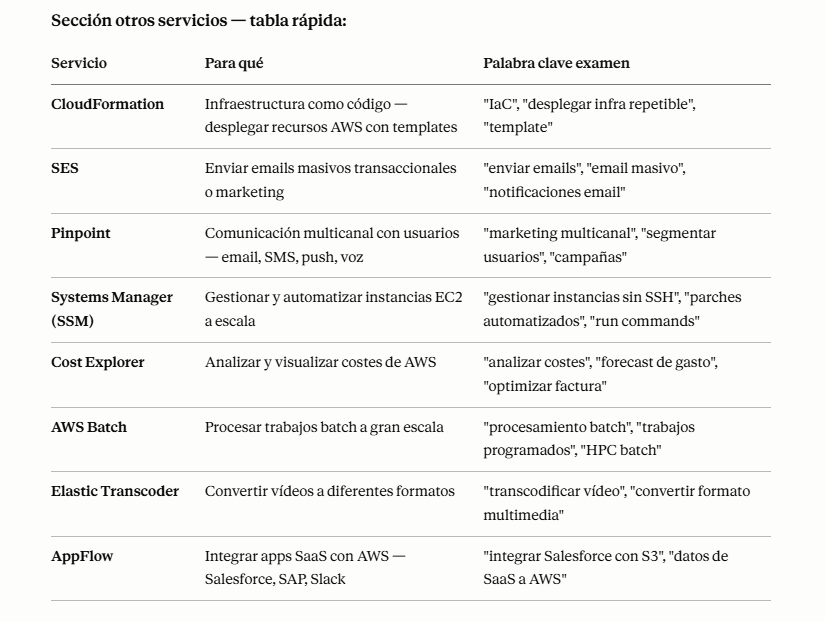

# AWS - Otros Servicios

## AWS CloudFormation
- AWS CloudFormation permite definir y desplegar infraestructura como código mediante plantillas YAML o JSON. Con CloudFormation se crean stacks para provisionar recursos AWS de forma repetible y controlada, gestionar actualizaciones mediante cambios de stack, y detectar desviaciones (drift) entre la plantilla y la infraestructura real.
- CloudFormation es una forma declarativa de esbozar tu infraestructura de AWS, para cualquier recurso (la mayoría de ellos son compatibles).
- CloudFormation los crea por ti, en el orden correcto, con la configuración exacta que especifiques
- Infraestructura como código:
    + No se crean recursos manualmente, lo que es excelente para el control
    + Los cambios en la infraestructura se revisan a través del código
    + Cada recurso dentro de la pila está etiquetado con un identificador para que puedas ver fácilmente cuánto te cuesta una pila
    + Posibilidad de destruir y volver a crear una infraestructura en el Cloud sobre la marcha
    + Generación automatizada de diagramas para tus plantillas

## Amazon SES
- Amazon Simple Email Service (SES) es un servicio de envío y recepción de email en la nube. Se usa para correos transaccionales, notificaciones y newsletters. Incluye verificación de dominios y direcciones, gestión de cuotas de envío, plantillas de correo, y opciones para mejorar la entregabilidad.
- Servicio totalmente gestionado para enviar correos electrónicos de forma segura, global y a escala
- Permite correos electrónicos entrantes/salientes
- Dashboards de reputación, perspectivas de rendimiento, información antispam
- Proporciona estadísticas como entregas de correos electrónicos, rebotes, resultados del bucle de retroalimentación, correos electrónicos abiertos
- Soporta DomainKeys Identified Mail (DKIM) y Sender Policy Framework (SPF)
- Despliegue de IP flexible: IP compartida, dedicada y propiedad del cliente
- Envía correos electrónicos con tu aplicación utilizando la consola de AWS, las API o SMTP
- Casos de uso: comunicaciones transaccionales, de marketing y masivas por correo electrónico

## Amazon Pinpoint
- Amazon Pinpoint es una plataforma de comunicaciones multicanal para enviar notificaciones por email, SMS, push y mensajes in-app. Permite crear segmentos de usuarios, campañas personalizadas, analíticas de interacción y pruebas A/B para optimizar el alcance.
- Servicio escalable de comunicaciones de marketing bidireccional (saliente/entrante)
- Soporta correo electrónico, SMS, push, voz y mensajería inapp
- Posibilidad de segmentar y personalizar los mensajes con el contenido adecuado para los clientes
- Posibilidad de recibir respuestas
- Escala a miles de millones de mensajes al día
- Casos de uso: realiza campañas enviando mensajes SMS de marketing, masivos y transaccionales

## AWS Systems Manager (SSM)
- AWS Systems Manager centraliza la administración de instancias EC2 y servidores on-premises. Incluye Automation para tareas repetitivas, Run Command para ejecutar comandos remotos, Parameter Store para almacenar configuraciones y secretos, Session Manager para sesiones seguras sin SSH, y gestión de parches e inventario.
- Te ayuda a gestionar tus sistemas EC2 y On-Premises a escala
- Otro servicio híbrido de AWS
- Obtén información operativa sobre el estado de tu infraestructura
- Conjunto de más de 10 productos
- Las características más importantes son:
- Automatización de parches para mejorar la normativa
- Ejecuta comandos en toda una flota de servidores
- Almacena la configuración de los parámetros con el almacén de parámetros SSM
- Funciona tanto para el sistema operativo Windows como para el Linux
- Necesitamos instalar el agente SSM en los sistemas que controlamos

+ Systems Manager es muy usado en empresas reales. Te permite gestionar cientos de instancias EC2 sin conectarte por SSH a cada una. Casos reales:
    - Session Manager → conectarte a una instancia EC2 privada sin Bastion Host ni puerto 22 abierto. Más seguro.
    - Parameter Store → ya lo viste en la sección de seguridad
    - Patch Manager → aplicar parches de seguridad automáticamente a todas las instancias
    - Run Command → ejecutar un script en 100 instancias a la vez sin SSH
> Palabra clave: "gestionar instancias sin SSH", "parches automáticos", "acceso seguro sin Bastion" → SSM.  

## AWS Cost Explorer
- AWS Cost Explorer facilita el análisis y visualización de costes y uso de AWS. Permite generar informes personalizados, explorar tendencias de gasto, identificar costos elevados, analizar el uso de reservas y reportar el gasto por servicio, cuenta o etiqueta.
- Visualiza, entiende y gestiona tus costes y uso de AWS a lo largo del tiempo
- Crea informes personalizados que analicen los datos de costes y uso.
- Analiza tus datos a alto nivel: costes totales y uso en todas las cuentas
- O con granularidad mensual, por horas, a nivel de recursos
- Elige un Plan de Ahorro óptimo (para reducir los precios de tu factura)
- Prevé el uso hasta 12 meses basándote en el uso anterior

## Amazon Elastic Transcoder
- Amazon Elastic Transcoder es un servicio de transcodificación de video y audio. Se usa para convertir archivos multimedia a formatos adecuados para dispositivos móviles y web, aplicando presets de calidad, definiendo jobs de transcodificación y generando salidas en diferentes resoluciones y contenedores.
- Elastic Transcoder se utiliza para convertir los archivos multimedia almacenados en S3 en archivos multimedia en los formatos requeridos por los dispositivos de reproducción de los consumidores (teléfonos, etc.)
- Fácil de usar
- Altamente escalable - puede manejar grandes volúmenes de archivos multimedia y archivos de gran tamaño
- Rentable: modelo de precios basado en la duración
- Totalmente gestionado y seguro, paga por lo que usas

## AWS Batch
- AWS Batch gestiona la ejecución de trabajos por lotes en la nube. Define colas de trabajo, entornos de cómputo y definiciones de jobs que pueden ejecutarse en EC2 o Fargate. AWS Batch escala automáticamente los recursos según la demanda y facilita el procesamiento masivo de datos y tareas en paralelo.
- Procesamiento por lotes totalmente gestionado a cualquier escala
- Ejecuta eficientemente 100.000 trabajos de computación por lotes en AWS
- Un trabajo "por lotes" es un trabajo con un inicio y un final (en contraposición a uno continuo)
- Batch lanzará dinámicamente instancias EC2 o Spot Instances
- AWS Batch proporciona la cantidad adecuada de computación / memoria
- Tú envías o programas los trabajos por lotes y AWS Batch se encarga del resto
- Los trabajos por lotes se definen como imágenes Docker y se ejecutan en ECS
- Útil para optimizar los costes y centrarse menos en la infraestructura

## Amazon AppFlow
- Amazon AppFlow es un servicio de integración que conecta aplicaciones SaaS con servicios AWS. Permite crear flujos de datos bidireccionales entre Salesforce, Slack, Google Analytics, y AWS services como S3 o Redshift, con transformaciones, mapeo de campos y triggers basados en eventos o programaciones.
- Servicio de integración totalmente gestionado que te permite transferir datos de forma segura entre aplicaciones de software como servicio (SaaS) y AWS
- Fuentes: Salesforce, SAP, Zendesk, Slack y ServiceNow
- Destinos: Servicios AWS como Amazon S3, Amazon Redshift o no AWS como SnowFlake y Salesforce
- Frecuencia: programada, en respuesta a eventos o bajo demanda
- Capacidades de transformación de datos como filtrado y validación
- Cifrado a través de Internet público o privado a través de AWS PrivateLink
- No pierdas tiempo escribiendo las integraciones y aprovecha las API inmediatamente

## RESUMEN

  

## PREGUNTAS TIPO EXAMEN

+ **Pregunta 1:** Una empresa quiere bloquear una IP maliciosa específica antes de que el tráfico llegue siquiera a sus instancias EC2, operando a nivel de subnet. ¿Qué usan?  
A) Security Group  
B) WAF  
**C) NACL**  
D) GuardDuty  
> NACL opera a nivel de subnet y tiene reglas Deny explícitas — exactamente lo que necesitas para bloquear una IP antes de que llegue a las instancias. Security Group no tiene Deny y opera a nivel de instancia, no de subnet.

+ **Pregunta 2:** Un equipo de DevOps necesita aplicar parches de seguridad automáticamente a 200 instancias EC2 sin conectarse manualmente a cada una. ¿Qué servicio usan?  
A) CloudFormation  
B) AWS Batch  
**C) Systems Manager Patch Manager**  
D) CloudWatch  
> SSM Patch Manager es el servicio específico para automatizar parches a escala. En empresas reales es muy común tener una política de parcheo automático semanal gestionada desde SSM sin tocar ninguna instancia manualmente.

+ **Pregunta 3:** Una empresa quiere desplegar la misma infraestructura AWS (VPC, EC2, RDS, ALB) en múltiples entornos (dev, staging, prod) de forma repetible y automatizada. ¿Qué servicio usan?  
A) AWS Batch  
**B) CloudFormation**  
C) Cost Explorer  
D) AppFlow  
> CloudFormation es exactamente para eso — defines tu infraestructura en un template JSON/YAML y lo despliegas en cualquier entorno de forma idéntica y repetible. Es el Terraform nativo de AWS.

+ **Pregunta 4:** Una plataforma de vídeo necesita convertir vídeos subidos por usuarios a múltiples formatos (720p, 1080p, 4K) automáticamente. ¿Qué servicio usan?  
A) AWS Batch  
B) Lambda  
**C) Elastic Transcoder**  
D) MediaConvert  
> Elastic Transcoder es el servicio específico para conversión de vídeo. AWS Batch sería para procesamiento batch genérico, no específicamente multimedia

+ **Pregunta 5:** Una empresa quiere conectarse a instancias EC2 en subnets privadas de forma segura sin abrir el puerto 22 ni usar un Bastion Host. ¿Qué servicio usan?  
A) Direct Connect  
**B) SSM Session Manager**  
C) VPC Endpoint  
D) AWS Client VPN  
> SSM Session Manager es una de las mejoras de seguridad más importantes en AWS — elimina la necesidad de tener el puerto 22 abierto y de gestionar un Bastion Host. Todo el acceso va por el agente SSM instalado en la instancia, cifrado y auditado en CloudTrail.