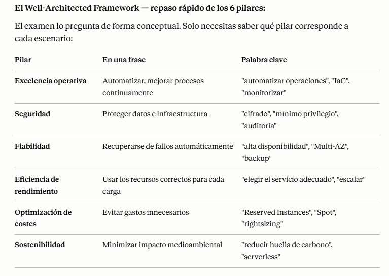

# AWS Whitepapers y Well-Architected Framework

## Whitepapers clave de AWS

- AWS Well-Architected Framework
- AWS Security Best Practices
- AWS Operational Excellence Pillar
- AWS Reliability Pillar
- AWS Performance Efficiency Pillar
- AWS Cost Optimization Pillar
- AWS Sustainability Pillar
- AWS Cloud Adoption Framework

## Resumen del Well-Architected Framework

+ El AWS Well-Architected Framework te ayuda a diseñar, construir y operar sistemas confiables, seguros, eficientes y rentables en la nube.
+ [AWS Well-Architected Framework](https://aws.amazon.com/architecture/well-architected)  
+ Deja de adivinar tus necesidades de capacidad
+ Prueba sistemas a escala de producción
+ Automatiza para facilitar la experimentación arquitectónica
+ Permite arquitecturas evolutivas
+ Diseña en función de los requisitos cambiantes
+ Impulsa las arquitecturas utilizando datos
+ Mejorar mediante días de juego
+ Simular aplicaciones para días de venta flash

### 6 pilares

- Excelencia operacional
- Seguridad
- Fiabilidad
- Eficiencia del rendimiento
- Optimización de costos
- Sostenibilidad

  

## AWS Well-Architected Tool
+ Herramienta gratuita para revisar tus arquitecturas según los 6 pilares de Well-Architected Framework y adoptar las mejores prácticas de arquitectura.
+ ¿Cómo funciona?
    + Selecciona tu carga de trabajo y responde a las preguntas
    + Revisa tus respuestas comparándolas con los 6 pilares
    + Obtén asesoramiento: obtén vídeos y documentación, genera un informe, ve los resultados en un dashboards
+ Echemos un vistazo https://console.aws.amazon.com/wellarchitected

## Trusted Advisor
+ Sin necesidad de instalar nada - evaluación de alto nivel de la cuenta de AWS
+ Analiza tus cuentas de AWS y proporciona recomendaciones en 5 categorías
+ Optimización de costes
+ Rendimiento
+ Seguridad
+ Tolerancia a los fallos
+ Límites del servicio

## EJEMPLOS DE ARQUITECTURAS
+ Si quieres ver más arquitecturas de AWS:
    - [Arquitecturas](https://aws.amazon.com/architecture/)  
    - [Soluciones](https://aws.amazon.com/solutions/)  

+ Hemos explorado los patrones de arquitecturas más importantes:
    - Clásico: EC2, ELB, RDS, ElastiCache, etc...
    - Sin servidor: S3, Lambda, DynamoDB, CloudFront, API Gateway, etc...

## Uso

- Revisa los whitepapers relevantes de AWS para obtener orientación de arquitectura.
- Utiliza la herramienta AWS Well-Architected para evaluar cargas de trabajo.
- Aplica las mejores prácticas de cada pilar para mejorar la arquitectura en la nube.

## Enlaces a Whitepapers

1. Arquitectura para el Cloud: https://d1.awsstatic.com/whitepapers/AWS_Cloud_Best_Practices.pdf (Archivado)

2. Los Whitepapers relacionados con well-architected framework se mencionan aquí: https://aws.amazon.com/blogs/aws/aws-well-architected-framework-updated-white-papers-tools-and-best-practices/

3. Whitepaper de recuperación ante catástrofes: https://d1.awsstatic.com/whitepapers/aws-disaster-recovery.pdf (Archivado)

4. AWS recomienda ahora un Whitepaper de framework well-architectedr: https://d1.awsstatic.com/whitepapers/architecture/AWS_Well-Architected_Framework.pdf
