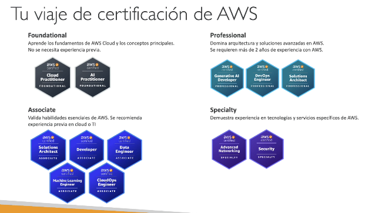

# PREPARACIÓN EXAMEN

+ [WEB PARA LA CERTIFICACIÓN](https://aws.amazon.com/certification/certified-solutions-architectassociate/)  

+ PREGUNTAS:
    + La mayoría de las preguntas se basarán en situaciones hipotéticas.
    + Para todas las preguntas, descarta las respuestas que sepas con certeza que son incorrectas
    + Para las respuestas restantes, entiende cuál tiene más sentido
    + Hay muy pocas preguntas trampa
    + No le des demasiadas vueltas
    + Si una solución parece factible pero muy complicada, probablemente sea errónea

+ [Ejemplo VER FAQS](https://aws.amazon.com/vpc/faqs/)  

+ ¿Cómo funcionará el examen?
    - Tendrás que inscribirte en línea en: https://www.aws.training/
    - La tasa del examen es de 150 USD
    - Proporciona un documento de identidad (DNI, Pasaporte, los detalles están en los correos electrónicos que te enviamos...)
    - No se permiten notas, ni bolígrafo, ni hablar
    - Se harán 65 preguntas en 130 minutos
    - Utiliza la función "Marcar" para marcar las preguntas que quieras volver a revisar
    - Al final puedes revisar opcionalmente todas las preguntas / respuestas
    - Para aprobar necesitas una puntuación mínima de 720 sobre 1000
    - Sabrás en un plazo de 5 días si has aprobado / suspendido los exámenes (la mayoría de las veces menos)
    - Sabrás la puntuación global unos días después (notificación por correo electrónico)
    - No sabrás qué respuestas eran correctas / incorrectas
    - Si suspendes, puedes volver a hacer el examen 14 días después

+ [EXAMENES DE PRUEBA](https://www.udemy.com/course/examenes-aws-solutions-architect-associate/?couponCode=JULIO2026)  

+ RUTAS:
  